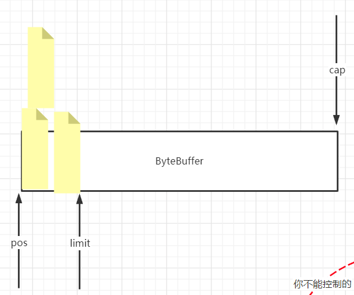

**系统IO原理:linux**

VFS FD

pagecache

【java】相关

1文件系统的io

2内存和io关系

3网络io

# Linux 基础

`VFS` `df` `inode`  `pagecache` `dirty`

flush / 时机/ 针对一个文件/

 读写文件的过程:文件 -》 pagecache -》 提供程序使用 df seek ,多个文件读写共享同一个pageCache，使用fd和seek区分，通过seek 各读取自己的位置，如果修改同一个位置，就要枷锁；


**VFS（Virtual Filesystem Switch）**：虚拟文件系统，是一个目录树。树上不同的节点可以映射到物理的文件地址，可以挂载。
相当于一个解耦层，在具体的文件系统之上抽象的一层，为能够给各种文件系统提供一个通用的接口，使上层的应用程序能够使用通用的接口访问不同文件系统、不同的驱动。

**inode号**：文件打开的时候有一个inode号，读到pagecache页缓存中。
两个程序如果打开的是同一文件，共享的是同一个pagecache 4k。但是fd中的偏移(seek)不一样
如果后续我们对pagecache进行了修改，会产生脏数据，这时候需要使用flush刷新到磁盘中去。“脏”这个标识是内核对于上层打开的文件的一个统一的管理，并不是针对某一个文件。内核会根据自己的设定，把数据写入到磁盘中去。如果你在5秒钟内产生了3.8G数据，又恰好没有触发内核的写磁盘操作，这时候突然断电会导致你这些数数据的丢失。

如果两个线程同时修改同一块数据，会加锁。

Redis的持久化，也是受操作系统内核这种机制的约束。

## 虚拟目录树


**boot目录在分区3中，其他目录都在分区1中。**
计算机引导的时候，先挂载了3分区，又挂载了1分区。新的挂载覆盖了原有的boot目录

**虚拟文件系统进行了一个抽象**：一切接文件。**他是怎么抽象出来的？？**
磁盘文件、摄像头、打印机，都被看做是文件，基于文件的这种抽象，就可以应用到IO流了。
那么如何区分这些不同的文件？我们引入文件类型：


**硬链接**
两个变量名指向了同一个物理位置
无论是硬链接还是软连接，如果修改任意一方，另外一个文件也会看到这个变化。
如果删掉了其中一个文件，另外一方还能找到这个文件。相当于只是删除了一个引用。


**软链接**


软链接是两个独立的文件（inode号不一样）。修改任意一个文件，另一个文件能看到这个变化。
如果删除原有的`msb.txt`，则`xxoo.txt`找不到链接了，会标红报错。


虚拟文件系统：ll
`df -h`
// 分区和虚拟文件系统的映射关系，单独将一个硬盘映射到一个目录，

目录取向稳定，所以将分区映射到文件，这样对上层屏蔽下层的变化；文件夹也是一种文件类型


## 证明一切皆文件

> 下面我们开始搞事情，做一个小实验，

用dd命令生成一个空的mydisk.img文件


挂载到虚拟的环回设备上，挂载之后进行格式化


把新的loop0挂载到原来的/mnt/ooxx目录中去


现在/mnt/ooxx是空的


我们希望用子目录模仿根目录里面的目录结构，以及程序的摆放位置。

1、找到bash所在位置，拷贝过来


2、将bash需要动态链接的文件，也拷贝过来


将根目录切换到当前目录，并将当前目录下的bin下的bash启动


在当前bash中输出“hello mashibing”，重定向到根目录下的abc,txt文件中


可以看到abc.txt被输出到新的根目录下。

那么Docker呢？也是这个原理吗？
这个实验不同于Docker，Docker更加复杂，它不只是文件系统的命名空间的一个子域。

Docker复用的是物理机的内核，Docker里面跑的是进程，先有镜像，有了img镜像之后，才有container容器的概念。
源于整个虚拟文件系统的支撑。

---

https://hanquan.blog.csdn.net/article/details/106744323

文件类型

b:块设备
c:字符设备，键盘，tty等等

`stat malone.txt` 查看文件信息

```sehll
[root@sec ~]# stat malone.txt 
  File: ‘malone.txt’
  Size: 0         	Blocks: 0          IO Block: 4096   regular empty file
Device: fd00h/64768d	Inode: 33817114    Links: 1
Access: (0644/-rw-r--r--)  Uid: (    0/    root)   Gid: (    0/    root)
Context: unconfined_u:object_r:admin_home_t:s0
Access: 2021-03-03 08:37:11.090931984 +0800
Modify: 2021-03-03 08:37:11.090931984 +0800
Change: 2021-03-03 08:37:11.090931984 +0800
 Birth: -
```

硬链接

- 两个变量指向同一个物理位置，只是描述的路径唯一，但是inode号一样
- 修改其中一个另一个也能看到，，删除一个文件，只是减少links值，没有删除文件

 软连接

`ln -s `

软连接 ，链接数量不增加，生成一个单独的文件，inode不一样，删除文件，链接报错

生成快设别方法

`dd  if=/dev/zero of=mydisk.img bs=1048576 count=100` 备份等等

`ldd` // 可以分析当前程序依赖其他程序

> `ll`
>
> `ll -h`  文件大小转化为人比较容易看懂的

`chroot ./`  修改root
`lsof - p $$` 查看进程打开的文件

`exec 6< ~/malone.txt `

```
[root@sec ~]# exec 6< ~/malone.txt 
[root@sec ~]# lsof -p $$
COMMAND   PID USER   FD   TYPE DEVICE  SIZE/OFF     NODE NAME
bash    31293 root  cwd    DIR  253,0       187 33574977 /root
bash    31293 root  rtd    DIR  253,0       224       64 /
bash    31293 root  txt    REG  253,0    964536 50333926 /usr/bin/bash
bash    31293 root  mem    REG  253,0 106176928 50333903 /usr/lib/locale/locale-archive
bash    31293 root  mem    REG  253,0     61560    82849 /usr/lib64/libnss_files-2.17.so
bash    31293 root  mem    REG  253,0   2156344    80514 /usr/lib64/libc-2.17.so
bash    31293 root  mem    REG  253,0     19248    80521 /usr/lib64/libdl-2.17.so
bash    31293 root  mem    REG  253,0    174576    82494 /usr/lib64/libtinfo.so.5.9
bash    31293 root  mem    REG  253,0    163312    65896 /usr/lib64/ld-2.17.so
bash    31293 root  mem    REG  253,0     26970 33761667 /usr/lib64/gconv/gconv-modules.cache
bash    31293 root    0u   CHR  136,0       0t0        3 /dev/pts/0
bash    31293 root    1u   CHR  136,0       0t0        3 /dev/pts/0
bash    31293 root    2u   CHR  136,0       0t0        3 /dev/pts/0
bash    31293 root    6r   REG  253,0         0 33817114 /root/malone.txt
bash    31293 root  255u   CHR  136,0       0t0        3 /dev/pts/0
```

`$$` 代表当前进程

`/proc` 文件映射了内核中的属性
`/proc/$$` // $$ 当前交互的进程Id
`/proc/$$/df` // 当前进程中有$$ 中的fd 
`lsof -op pid` // 看到pid打开的文件描述符的具体情况
`cd $$ `
`cd pid`pwd


## 文件描述符


**1、lsof命令**
lsof是list open files的简称，它的作用主要是列出系统中打开的文件，基本上linux系统中所有的对象都可以看作文件，lsof可以查看用户和**进程操作了哪些文件**，也可以查看系统中网络的使用情况，以及设备的信息。


创建一个文件描述符8，用来读取ooxx.txt
NODE列：表示Inode号
如果lsof加上-o参数的话，会显示一列**OFFSET**,偏移,seek，表示当前读文件位置的指针。


使用read读文件：


新开了一个bash标签页，用一个新的文件描述符6，去读取ooxx.txt
证明两个进程读取文件时，不会相互影响：


我们可以得出这个结论，内核为每一个进程各自维护了一套数据，包括fd文件描述符。
**fd维护了一些关于文件的偏移、Inode号，以及元数据信息等**。 //TODO

> 这些内容看起来和Java没什么关系，但是在使用Java进行文件IO时，关系到每种不同的写法的成本。所以还是很重要的~

## Socket 文件类型示例

用文件描述符8，指向一个socket连接


## 关于/proc目录

与其它常见的文件系统不同的是，/proc是一种伪文件系统（也即虚拟文件系统），存储的是当前内核运行状态的一系列特殊文件


`/proc/$$` 是当前bash的文件
`$$` `BASHPID`是当前bash的pid
`/proc/$$/fd`是当前程序的所有的文件描述符，也可以使用`lsof -op $$`看见当前进程的文件描述符的细节，包括偏移量、指针等等。

## 关于 `0`标准输入 `1`标准输出

`<`表示输入 `>`表示输出

**ls 命令的标准输出**
`ls ./ 1> ls.out`将ls的标准输出1重定向到ls.out


**cat 命令的标准输入、标准输出**
`cat 0< test.txt 1> cat.out` 将cat的标准输入重定向为 test.txt , 将其标准输出重定向为 cat.out

**read命令的标准输入、标准输出**


## 重定向操作符`<` `>`的对接

让两个流写到**不同的文件**中去：


让两个流写到**相同的文件**中去


## 管道命令`|`

`head` 默认读前 10 行
`head -3` 读前 3 行

`tail` 默认读后 10 行
`tail -3` 读后 3 行

`head -8 test.txt | tail -1` 通过管道，让**左面的输出**流入**右面的输入**，实现仅输出第 8 行

## Linux 前置知识

#### 进程之间的父子关系

当前所在的bash的进程id号


在当前bash中新开一个bash，打印新开的bash的进程id号


使用`pstree`查看进程关系


使用`exit`，又回到了11053


#### 关于变量

父进程定义的变量x，不能在子进程取到，除非使用`export`
这也是为什么在`/etc/profile/`配环境变量的时候，要添加`export`的原因


### 关于代码块、管道开启的子进程

在一个花括号中，所有的指令在同一个进程中执行。

bash是解释执行的，如果看到管道，会将管道`左侧`的命令独立`开启一个子进程`，管道`右侧`的命令独立`开启一个子进程`，用管道进行对接。而进程的隔离级别很高，所以在新开启的进程中对变量a的修改，不会影响父进程a的值。

`$$`的优先级高于|，`BASHPID`的优先级高于|


看一下进程号，可以发现**管道两侧**开启的是**独立的子进程**


实际上，我们进行的是如下管道操作：


下面这个图可以看到，**管道左侧的进程**和**右侧的进程**通过管道被**对接**起来


我们也可以使用
`lsof -op 4512`
`lsof -op 4513`
这两个命令，看到两个子进程中正在开启的管道。


## PageCache

做完上面的铺垫，我们可以先对PageCache做一个粗俗的理解了


事实上，在很多地方都有缓存：

- 应用程序中：在application中可以有缓冲区（比如我们在Java中常用的BufferXXX IO）
- 内核中的页缓存
- 硬盘上的缓冲区

如果每次应用程序想要读数据的时候，都要通过cpu去取的话，效率会很低，于是我们了加入协处理器。

#### 下面我们搞一个事情,加深对pageCache理解


写一个mysh小脚本，待会儿使用的时候参数传给`0`


OSFileIO

```java 
public class OSFileIO {

    static byte[] data = "123456789\n".getBytes();
    static String path =  "/root/testfileio/out.txt";

    public static void main(String[] args) throws Exception {
        switch ( args[0]) {
            case "0" :
                testBasicFileIO();
                break;
            case "1":
                testBufferedFileIO();
                break;
            case "2" :
                testRandomAccessFileWrite();
            case "3":
//                whatByteBuffer();
            default:
        }
    }


    //最基本的file写
    public static  void testBasicFileIO() throws Exception {
        File file = new File(path);
        FileOutputStream out = new FileOutputStream(file);
        while(true){
//            Thread.sleep(10);
            out.write(data);
        }
    }

    //测试buffer文件IO
    //  jvm  8kB   syscall  write(8KBbyte[])

    public static void testBufferedFileIO() throws Exception {
        File file = new File(path);
        BufferedOutputStream out = new BufferedOutputStream(new FileOutputStream(file));
        while(true){
            Thread.sleep(10);
            out.write(data);
        }
    }
    
//...
```

用上面的`mysh`启动，传参为0，也就是执行了`testBasicFileIO()`这个方法
测试突然断电。断电前我们看到，out.txt文件在不断增大：


断电后重启，文件大小都是0


上面这个测试说明了**缓冲区的存在**。在一段时间内，并没有进行磁盘的刷写

## 重定向

**重定向 不是命令是一种机制**

**IO 的输入和输出** 
0 1 2 // 每个程序都有三个fd，分别数标准输入、标准输出、错误输出
`< `为输入` >` 输出

`ls ./ > ~/out.text`  将ls的标准输出重定向到out.text

`cat 0< xx.text 1> xx.text`

`read a 0< cat.out` // 将read 的标准输出重定向到 cat.out

> `fd+<>` // 之间不能有空格
> // 重定向操作符的基本用法
>
> 
>
> `ls ./ /fasfasd 1> 01.out 2>& 1`
>
> 

## 管道 

`head tail`

`head -8 test.text | tail -1` // 通过组合获取第八行

`yum -y install psmisc`

`pstree `

父子进程 // 变量隔离 只有export变量

```
[root@sec ~]# { a=9;echo "aaa";}|cat
aaehco a
```

创建子进程执行管道两个的程序，通过管道链接第一个输出到第二个输入，所以当前线程时访问不到a=9

$$ 的优先级高于 | ,在创建子进程执行之前已经将$$ 替换成当前线程pid。但$BASHPID不一样

**管道有坑**,

```
[root@sec ~]# echo $$
31293
[root@sec ~]# { echo $$;}|{ echo $$;}
31293
[root@sec ~]# { echo $BASHPID;}|{ echo $BASHPID;}
33534
```

验证父进程是否有两个子进程，ps -ef | grep pid
cd /proc/pid/df 
lsof  -op pid 
// 主要是为了查看pipe文件类型，管道是通过pipe连接的。

管道和重定向的使用方法

# PageCache 


>  AKF 拆分原则

`pcsta`t // 查看pagecache 的状态,缓存的比例等等;可执行文件，在当前文件夹中

内存管理 // 4k page 和 pageCache

不同的程序共享 pageCache, 通过fd和seek区分

`pageCache` 中间层 , 文件从硬盘到pageCache，写从用户空间到pageCache，而不是直接写盘

`systemctl -a`

`sysctl -a | grep dirty` // 查看和pageCache相关的配置或者刷盘相关配置

`vim /etc/sysctl.conf  `// 修改配置

```
[root@sec ~]# sysctl -a | grep dirty
sysctl: reading key "net.ipv6.conf.all.stable_secret"
sysctl: reading key "net.ipv6.conf.default.stable_secret"
sysctl: reading key "net.ipv6.conf.ens33.stable_secret"
sysctl: reading key "net.ipv6.conf.lo.stable_secret"
vm.dirty_background_bytes = 0
vm.dirty_background_ratio = 10
vm.dirty_bytes = 0
vm.dirty_expire_centisecs = 3000
vm.dirty_ratio = 30
vm.dirty_writeback_centisecs = 500
[root@sec ~]# sysctl -a | grep dirty
sysctl: reading key "net.ipv6.conf.all.stable_secret"
sysctl: reading key "net.ipv6.conf.default.stable_secret"
sysctl: reading key "net.ipv6.conf.ens33.stable_secret"
sysctl: reading key "net.ipv6.conf.lo.stable_secret"
vm.dirty_background_bytes = 0
vm.dirty_background_ratio = 10 // 触发磁盘同步的百分比
vm.dirty_bytes = 0
vm.dirty_expire_centisecs = 3000
vm.dirty_ratio = 30			 // 阻塞线程，同步磁盘
vm.dirty_writeback_centisecs = 500

[root@sec ~]# vim /etc/sysctl.conf
```

`ll -h && pcstat out.txt`

> 通过上面的命令，编写入数据到out.txt，同时查看pageCache的变化

**Buffer IO 为什么块**

JVM 8k数组，满了，调用一次scall， **strace** 直接能看到，系统调用的过程。一次scall，传递更多的数据，减少scall，有一个通过减少scall，提高性能的例子

`strace ` 可以跟踪系统调用

`pageCache`和 `Redis`的数据丢失，不能交给内核同步到磁盘,需要自己关注

pageCache 初衷是优化IO性能，但是会丢失数据，先写内存，并没有同步磁盘，所以有只要直接断电，丢失数据。

> 可以通过虚拟机实验，在pageCache中，但是没有写磁盘，直接断电，再次打开写入的数据没有了

pageCache的创建、dirty、同步到磁盘

# 内存管理

1. 线性地址和物理地址的映射
2. 文件从磁盘到内存加载的过程
3. 磁盘4K对齐，内存4K page
4. 访问内存，缺页异常，触发加载数据，从文件到物理内存
5. 应用在系统中的内存结构，代码段、数据段，堆，stack

> 应用对文件的读写都是要经过os，os都是要经过pageCache

> pageCache是文件在内存中的缓存，有缓存就有可能丢数据，是对IO 的优化

> pageCache有dirty特性和LRU

# ByteBuffer 

1. 文件是块设备，可以随机读写，就是可以跳转读写的位置，依靠fd的seek，**偏移，有实验**
2.  只有文件才有Map方法 产生 `MappedByteBuffer`，是因为文件是`块设备`，可以`随机读写`


1. MappedByteBuffer 分配在堆外，是JVM 堆外
2. 文件是块设备，可以随机读写，但是还是和`pageCache`有关
3. `Direct IO`，可以跳过 `pageCache`，但是只是将这个工作交给应用自己做；os的pageCache是全局的，交给应用可以缩小范围，跟精确
4. JVM 不支持direct IO，只能JNI

## 各种堆的总结
0. 你就想成，jvm的堆再java的堆里，（`JVM 堆`数在整个Java堆的堆中，如图）
1. 堆内：说的jvm的堆里的字节数组
2. 堆外：多的是jvm堆外，也就是**java进程的堆**里的
3. mapped映射：是mmap调用的一个`进程和内核共享的内存区域`，`减少scall` 且这个内存区域是pagecache/到文件的映射

`on heap  <  off heap  <  mapped  (file)` 访问的速度

`netty  (on heap , off heap)`

`kafka  log :  mmap`

---


**OS 没有觉得数据可靠性
为什么设计pagecache ，减少  硬件 IO 调用，提速，优先使用内存**

**即便你想要可靠性，调成最慢的方式
但是单点问题会让你的性能损耗，一毛钱收益都没有**

**主从复制，主备HA
kafka/ES 副本(socket io)  （同步/异步）。。。**

## java 中个内存区域的关系和Buffer的关系




```java
  @Test
    public  void whatByteBuffer(){

//        ByteBuffer buffer = ByteBuffer.allocate(1024);
        ByteBuffer buffer = ByteBuffer.allocateDirect(1024);


        System.out.println("postition: " + buffer.position());
        System.out.println("limit: " +  buffer.limit());
        System.out.println("capacity: " + buffer.capacity());
        System.out.println("mark: " + buffer);

        buffer.put("123".getBytes());

        System.out.println("-------------put:123......");
        System.out.println("mark: " + buffer);

        buffer.flip();   //读写交替

        System.out.println("-------------flip......");
        System.out.println("mark: " + buffer);

        buffer.get();

        System.out.println("-------------get......");
        System.out.println("mark: " + buffer);

        buffer.compact();

        System.out.println("-------------compact......");
        System.out.println("mark: " + buffer);

        buffer.clear();

        System.out.println("-------------clear......");
        System.out.println("mark: " + buffer);

    }
```


# TCP 参数 和 基本概念

使用的相关的命令

`lsof -p`：查看和某个进程相关的文件fd

`netstat -natp` //查看端口的变化，在服务端listen某个端口，服务端接受链接的状况，是否将一个OS建立的链接分配给某个程序，也就是内核建立的socket是否分配个指定的某个程序，也就是程序调用了accept方法，程序返回了socket，也就是和四元组对应的fd，对应到Java中就是socket

`tcpdump -nn -i eth0 port 9090` // 观察TCP报文的传输和三次握手 查看网卡数据


## socket 的理解

**四元组**，客户端可以，表示唯一的一个链接，表示客户端和服务端的链接的建立，以后可以在这个链接上传递数据。


## TCP 配置参数讲解 

>  参数配置TCP 协议的行为，报文传递的时机，传递报文的大小等等

**BACK_LOG**:的意义，就是内核完成三次握手，建立连接，但是应用没有接受这个socket，最多只能有指定数量个，`如果多于，服务端就不接受了，是在服务端的`，设计负载均衡

**SO_TIMEOUT**: 服务端，accept ，等待时间。服务端，如果超时，抛出异常，但是还可以继续等待；客户端也一样

**窗口概念**:

数据包多大，MTU每个包的大小/MSS 报文数据大小

ifconfig 可以查看MTU

**拥塞控制：**

**NO_DELAY**: true ,就是不积攒，接收到直接发送

**keepalive**:定期发包

# 网络IO 变化 模型

`同步` `异步` `阻塞` `非阻塞`

`strace  -ff -o out cmd` 内核调用追踪，主要是观察服务端监听端口调用的系统调用，socket创建、接受、读写等等。


使用strace 查看Java程序对内核有哪些系统调用


## BIO 
其中包括，两个地方阻塞，
1. 服务端接受端口，等待客户端的链接，阻塞，
2. 链接建立，等待读取客户端发送的数据，阻塞

为了接受更多的客户端链接，在接受客户端链接是，新建一个线程等待客户端发送数据，读取；监听线程继续接受下一个客户端的链接


## NIO C10K


11w的链接

## BIO 的弊端是什么
阻塞，说的问题，内核提供的API是阻塞的


## NIO 
man 2 socket 
JDK NEW io
OS noBlocking
> 实例代码 SocketNIO
> 

在代码中， read 和 accept 都不会阻塞，可以和BIO 比较

**不阻塞，就可以在同一个线程中，及接受链接，也可以读写数据**，阻塞就不可以，因为线程被阻塞了
所以，当一个线程没有阻塞，**就可以执行后面的内容**

**在非阻塞的状态中， accept返回的是-1**。在起动服务端的时候，可以使用strace命令，跟踪发现在调用accept时有的直接返回 -1， 是没有客户端链接，如果有客户端链接，就直接返回fd，也就是四元组在用户空间的代表。

ServerSocket和Socket，这两个都可以Blocking false 第一个是accept不阻塞，第二个是读写不阻塞

`nc localhost 9090` 链接服务端的Linux命令


`ulimit -a`

`ulimit -SHn 50000` 修改，解决上面的问题，每个进程打开的文件数的限制


实例说明，windows中线性的创建链接

**多路复用器是NIO衍生**，连接创建的速度比之前的要快

```java 
public class SocketNIO {

    //  what   why  how
    public static void main(String[] args) throws Exception {

        LinkedList<SocketChannel> clients = new LinkedList<>();

        ServerSocketChannel ss = ServerSocketChannel.open();  //服务端开启监听：接受客户端
        ss.bind(new InetSocketAddress(9090));
        ss.configureBlocking(false); //重点  OS  NONBLOCKING!!!  //只让接受客户端  不阻塞

//        ss.setOption(StandardSocketOptions.TCP_NODELAY, false);
//        StandardSocketOptions.TCP_NODELAY
//        StandardSocketOptions.SO_KEEPALIVE
//        StandardSocketOptions.SO_LINGER
//        StandardSocketOptions.SO_RCVBUF
//        StandardSocketOptions.SO_SNDBUF
//        StandardSocketOptions.SO_REUSEADDR
        while (true) {
            //接受客户端的连接
            Thread.sleep(1000);
            SocketChannel client = ss.accept(); //不会阻塞？  -1 NULL
            //accept  调用内核了：1，没有客户端连接进来，返回值？在BIO 的时候一直卡着，但是在NIO ，不卡着，返回-1，NULL
            //如果来客户端的连接，accept 返回的是这个客户端的fd  5，client  object
            //NONBLOCKING 就是代码能往下走了，只不过有不同的情况

            if (client == null) {
             //   System.out.println("null.....");
            } else {
                client.configureBlocking(false); //重点  socket（服务端的listen socket<连接请求三次握手后，往我这里扔，我去通过accept 得到  连接的socket>，连接socket<连接后的数据读写使用的> ）
                int port = client.socket().getPort();
                System.out.println("client..port: " + port);
                clients.add(client);
            }

            ByteBuffer buffer = ByteBuffer.allocateDirect(4096);  //可以在堆里   堆外

            //遍历已经链接进来的客户端能不能读写数据
            for (SocketChannel c : clients) {   //串行化！！！！  多线程！！
                int num = c.read(buffer);  // >0  -1  0   //不会阻塞
                if (num > 0) {
                    buffer.flip();
                    byte[] aaa = new byte[buffer.limit()];
                    buffer.get(aaa);

                    String b = new String(aaa);
                    System.out.println(c.socket().getPort() + " : " + b);
                    buffer.clear();
                }


            }
        }
    }

}

```
BIO 

``` java 
public class SocketIO {


    public static void main(String[] args) throws Exception {
        ServerSocket server = new ServerSocket(9090,20);

        System.out.println("step1: new ServerSocket(9090) ");

        while (true) {
            Socket client = server.accept();  //阻塞1
            System.out.println("step2:client\t" + client.getPort());

            new Thread(() -> {
                InputStream in = null;
                try {
                    in = client.getInputStream();
                    BufferedReader reader = new BufferedReader(new InputStreamReader(in));
                    while(true){
                        String dataline = reader.readLine(); //阻塞2

                        if(null != dataline){
                        System.out.println(dataline);
                        }else{
                            client.close();
                            break;
                        }
                    }
                    System.out.println("客户端断开");

                } catch (IOException e) {
                    e.printStackTrace();
                }


            }).start();

        }
    }


}
```

### 参考

1. http://www.kegel.com/c10k.html
2. https://zhuanlan.zhihu.com/p/61785349


# Eppol 多路复用器

> 1. `yum -y install man-pages` // 学习和IO 相关的API,需要安装man-page
> 2. `man 2 select` // 查询api


1. IO 发生在内核
2. 多路指，多个IO
3. 当前的多路复用，`selet`，`poll`，`epoll`，都是同步模型，同步就是`读写过程是需要app自己完成`的都是同步模型
> 总体的过程
> 1. 询问内核**有状态**的IO，fd
> 2. 对有查询有状态的IO，**发起读写**

## NIO select epoll
1. 其实：无论NIO,SELECT,POLL都是要遍历所有的IO，`询问状态`但是NIO:这个遍历的过程`本在用户态内核态切换`

2. 多路复用器 select，poll：,复用一次系统调用，知道所有IO状态，就是所谓的复用。
这个遍历的过程触发了`一次系统调用`，用户态内核态的切换，过程中，把fds传递给内核，内核重新根据用户这次调用传过来的fds，遍历,发生在内核，修改状态
   
    

**多路复用器：select poll的弊端**

1. 每次都要重新，重复传递全量的fds  (内核开辟空间)
2. 每次，内核被调了之后，针对这次调用，触发一个遍历fds全量的复杂度

升级版的epoll，是在内核中处理IO中断中，**将有状态变化的IO fd，挑选到一个链表中**，当用户调用selec时，`直接将fds返回`，省去便利；将时间`均摊`到每个IO callback中。


## IO 和 中断
IO 中断，导致操作系统将网络数据，从网卡Buffer，搬运到系统内核的Buffer中。

> 1. **时钟中断：线程切换关系**，中断刺激，CPU，
> 2. 自己打断自己，`int 80`,到内核


最终：中断->回调 callback event 事件 ->回调处理事件
大小，复杂度
在EPOLL之前的cb：只是完成了将网卡发来的数据，走内核网络协议栈（2,3,4）最终关联到FD的buffer
所以，你某一时间如果从APP询问内核某一个或者某些FD是有可R/W，会有状态返回如果内核在CB处理中再加入（对 IO fd 的整理）

## 同步 异步 阻塞 非阻塞

> 只关注IO：不关注从IO读写完之后的事情,就是IO环节的`同步或者异步`,和应用程序的同步、异步不一样；

- 同步：app自己R/W
- 异步：kernel完成:R/W  没有访问IO，buffer  win：iocp
- 阻塞：BLOCKING
- 非阻塞：NONBLOCKING
> linux,以及成熟的框架netty，都是同步IO 
- 同步阻塞:同步：`程序自己读取`,IO读写还是需要应用程序自己完成，调用了方法一直等待有效返回结果
- 同步非阻塞：程序自己读取，调用方法一瞬间，给出是否读到（自己要解决下一次啥时候在去读）
- 异步：尽量不要去讨论，因为现在我们只讨论IO模型下，**linux，目前 没有通用内核的异步处理方案**
- 异步：阻塞？   【异步非阻塞】

> 多条路(IO)通过一个系统调用，获得其中的IO状态然后，由程序自己对着有状态的IO 进行R/W,都是同步IO，也就是IO读写是由IO层发起，都是同步IO模型，SELECT  POSIX POLL EPOLL kqueue

## Epoll的工作过程


## Epoll 相关的系统调用

epoll_create 创建保存fd的
epool_ctl，传递df以及对fd感兴趣的事件
epoll_wait，获取有状态的fd

epoll_wait 约等于 select 
epoll_wait 不传递fd，且有状态的fd已经准备好了


每一个TCP链接对应一个buffer，有读队列和写队列


为什么提出了 `IO Thread`


```java 
package com.bjmashibing.system.io;

import java.io.IOException;
import java.net.InetSocketAddress;
import java.nio.ByteBuffer;
import java.nio.channels.*;
import java.util.HashMap;
import java.util.Iterator;
import java.util.Set;

public class SocketMultiplexingSingleThreadv1 {

    //马老师的坦克 一 二期
    private ServerSocketChannel server = null;
    private Selector selector = null;   //linux 多路复用器（select poll    epoll kqueue） nginx  event{}
    int port = 9090;

    public void initServer() {
        try {
            server = ServerSocketChannel.open();
            server.configureBlocking(false);
            server.bind(new InetSocketAddress(port));


            //如果在epoll模型下，open--》  epoll_create -> fd3
            selector = Selector.open();  //  select  poll  *epoll  优先选择：epoll  但是可以 -D修正

            //server 约等于 listen状态的 fd4
            /*
            register
            如果：
            select，poll：jvm里开辟一个数组 fd4 放进去
            epoll：  epoll_ctl(fd3,ADD,fd4,EPOLLIN
             */
            server.register(selector, SelectionKey.OP_ACCEPT);


        } catch (IOException e) {
            e.printStackTrace();
        }
    }

    public void start() {
        initServer();
        System.out.println("服务器启动了。。。。。");
        try {
            while (true) {  //死循环

                Set<SelectionKey> keys = selector.keys();
                System.out.println(keys.size()+"   size");


                //1,调用多路复用器(select,poll  or  epoll  (epoll_wait))
                /*
                select()是啥意思：
                1，select，poll  其实  内核的select（fd4）  poll(fd4)
                2，epoll：  其实 内核的 epoll_wait()
                *, 参数可以带时间：没有时间，0  ：  阻塞，有时间设置一个超时
                selector.wakeup()  结果返回0

                懒加载：
                其实再触碰到selector.select()调用的时候触发了epoll_ctl的调用

                 */
                while (selector.select() > 0) {
                    Set<SelectionKey> selectionKeys = selector.selectedKeys();  //返回的有状态的fd集合
                    Iterator<SelectionKey> iter = selectionKeys.iterator();
                    //so，管你啥多路复用器，你呀只能给我状态，我还得一个一个的去处理他们的R/W。同步好辛苦！！！！！！！！
                    //  NIO  自己对着每一个fd调用系统调用，浪费资源，那么你看，这里是不是调用了一次select方法，知道具体的那些可以R/W了？
                    //幕兰，是不是很省力？
                    //我前边可以强调过，socket：  listen   通信 R/W
                    while (iter.hasNext()) {
                        SelectionKey key = iter.next();
                        iter.remove(); //set  不移除会重复循环处理
                        if (key.isAcceptable()) {
                            //看代码的时候，这里是重点，如果要去接受一个新的连接
                            //语义上，accept接受连接且返回新连接的FD对吧？
                            //那新的FD怎么办？
                            //select，poll，因为他们内核没有空间，那么在jvm中保存和前边的fd4那个listen的一起
                            //epoll： 我们希望通过epoll_ctl把新的客户端fd注册到内核空间
                            acceptHandler(key);
                        } else if (key.isReadable()) {
                            readHandler(key);  //连read 还有 write都处理了
                            //在当前线程，这个方法可能会阻塞  ，如果阻塞了十年，其他的IO早就没电了。。。
                            //所以，为什么提出了 IO THREADS
                            //redis  是不是用了epoll，redis是不是有个io threads的概念 ，redis是不是单线程的
                            //tomcat 8,9  异步的处理方式  IO  和   处理上  解耦
                        }
                    }
                }
            }
        } catch (IOException e) {
            e.printStackTrace();
        }
    }

    public void acceptHandler(SelectionKey key) {
        try {
            ServerSocketChannel ssc = (ServerSocketChannel) key.channel();
            SocketChannel client = ssc.accept(); //来啦，目的是调用accept接受客户端  fd7
            client.configureBlocking(false);

            ByteBuffer buffer = ByteBuffer.allocate(8192);  //前边讲过了

            // 0.0  我类个去
            //你看，调用了register
            /*
            select，poll：jvm里开辟一个数组 fd7 放进去
            epoll：  epoll_ctl(fd3,ADD,fd7,EPOLLIN
             */
            client.register(selector, SelectionKey.OP_READ, buffer);
            System.out.println("-------------------------------------------");
            System.out.println("新客户端：" + client.getRemoteAddress());
            System.out.println("-------------------------------------------");

        } catch (IOException e) {
            e.printStackTrace();
        }
    }

    public void readHandler(SelectionKey key) {
        SocketChannel client = (SocketChannel) key.channel();
        ByteBuffer buffer = (ByteBuffer) key.attachment();
        buffer.clear();
        int read = 0;
        try {
            while (true) {
                read = client.read(buffer);
                if (read > 0) {
                    buffer.flip();
                    while (buffer.hasRemaining()) {
                        client.write(buffer);
                    }
                    buffer.clear();
                } else if (read == 0) {
                    break;
                } else {
                    client.close();
                    break;
                }
            }
        } catch (IOException e) {
            e.printStackTrace();

        }
    }

    public static void main(String[] args) {
        SocketMultiplexingSingleThreadv1 service = new SocketMultiplexingSingleThreadv1();
        service.start();
    }
}
```
# SocketMultiplexingSingleThreadv1 追踪系统调用
> Java中将各种的多路复用器抽象为selector，但是具体底层用什么实现，可以是用参数配置
```
-Djava.nio.channels.spi.SelectorProvider=sun.nio.ch.EPollSelectorProvider
 strace -ff -o out java -Djava.nio.channels.spi.SelectorProvider=sun.nio.ch.PollSelectorProvider -cp /root/netty-all-
4.1.48.Final.jar:.  NettyIO
```
追踪服务


为什么会出现很多的close_wait 

客户端发起断开，服务端close_wait
服务端 FIN_ACK

谁发起，谁进入time_wait 2MSL


**Poll中register 并没有系统调用，还是在用户空间，攒着**

**对上面Java代码 strace 追踪的结果分析如下**

同一套代码： java  NIO  selector：
poll
epoll
的不同底层实现

---
OS:POLL  **jdk  native 用户空间 保存了fd**

socket(PF_INET, SOCK_STREAM, IPPROTO_IP) = 4
fcntl(4, F_SETFL, O_RDWR|O_NONBLOCK)    = 0   //**server.configureBlocking(false)**;
bind(4, {sa_family=AF_INET, sin_port=htons(9090)
listen(4, 50)

 poll([{fd=5, events=POLLIN}, {fd=4, events=POLLIN}], 2, -1) = 1 ([{fd=4, revents=POLLIN}])  
//  while (selector.select() > 0) {

accept(4,    = 7  //新的客户端,这时候客户端有连接进来

fcntl(7, F_SETFL, O_RDWR|O_NONBLOCK) // 对新连接设置非阻塞

poll([{fd=5, events=POLLIN}, {fd=4, events=POLLIN}, {fd=7, events=POLLIN}], 3, -1)  = 1（一个fd有事件） -1（非阻塞下，没有事件）

**第三个参数 -1 表示永久阻塞，man 2 poll可以查到**


---

EPOLL 分析

---

OS:EPOLL

socket(PF_INET, SOCK_STREAM, IPPROTO_IP) = 4
fcntl(4, F_SETFL, O_RDWR|O_NONBLOCK)    = 0
bind(4, {sa_family=AF_INET, sin_port=htons(9090)
listen(4, 50)

epoll_create(256)                       = 7 (epfd)
epoll_ctl(7, EPOLL_CTL_ADD, 4, // **将4 添加到epoll中**

epoll_wait(7, {{EPOLLIN, {u32=4, u64=2216749036554158084}}}, 4096, -1) = 1 
//  while (selector.select() > 0) {

accept(4  =8 //client的fd

fcntl(8, F_SETFL, O_RDWR|O_NONBLOCK)  
epoll_ctl(7, EPOLL_CTL_ADD, 8, {EPOLLIN,

epoll_wait(7,

---
**epoll 也是一个文件也是一个文件，在epoll_create时创建**，也就是7


主要说明在Java中select，对应的Linux中系统底层的系统调用。**可以推测底层对获取有状态IO的过程处理的不通过**

**写事件，只要send-queue，select就返回写事件**，比较特殊

**单线程和 多线程中，对客户端链接和读写的处理的不同**

在多线程中，在一个线程中接受链接，判断是否有读事件，在其他的线程中处理读取，**这时候要将当前读写的额IO从select中删除**，如果没有下次select时，还会获取当前的key，不断的吊起读；
这是因为时间差，select和读之间的事件差；

但是每次都从select中删除key，也就是多路复用器中删除，增加了**系统调用**，这个需要处理

**所以使用多个select和线程处理，所以不能将相关的读写，分配到不同的线程，在同一个线程，就不存在这个问题**，netty的原理，减少系统调用

所以在一个线程中，都是同步的不存在时间差，所以不用删除key，减少系统调用；

为什么netty是单线程，单select，

fd == channel


上图解释在普通的多线程中，会出现的问题，读写会多次调用；是因为一个fd分布在多个线程处理，时间差导致，我们必须从select中删除相关的fd，才能解决重复吊起的问题，**但是这样增加了系统调用**；所以寻找其他的模型，也就推到出netty的模型，单线程、单select；减少系统调用，线程内先行的调用，也就是读完之后，才继续往下执行，不能重复执行；

黄色部分表示问题

下面是单线程，不用删除key，也就是fd

```java 
package com.bjmashibing.system.io;

import java.io.IOException;
import java.net.InetSocketAddress;
import java.nio.ByteBuffer;
import java.nio.channels.SelectionKey;
import java.nio.channels.Selector;
import java.nio.channels.ServerSocketChannel;
import java.nio.channels.SocketChannel;
import java.util.Iterator;
import java.util.Set;

public class SocketMultiplexingSingleThreadv1_1 {

    private ServerSocketChannel server = null;
    private Selector selector = null;   //linux 多路复用器（select poll epoll） nginx  event{}
    int port = 9090;

    public void initServer() {
        try {
            server = ServerSocketChannel.open();
            server.configureBlocking(false);
            server.bind(new InetSocketAddress(port));
            selector = Selector.open();  //  select  poll  *epoll
            server.register(selector, SelectionKey.OP_ACCEPT);
        } catch (IOException e) {
            e.printStackTrace();
        }
    }

    public void start() {
        initServer();
        System.out.println("服务器启动了。。。。。");
        try {
            while (true) {
//                Set<SelectionKey> keys = selector.keys();
//                System.out.println(keys.size()+"   size");
                while (selector.select() > 0) {
                    Set<SelectionKey> selectionKeys = selector.selectedKeys();
                    Iterator<SelectionKey> iter = selectionKeys.iterator();
                    while (iter.hasNext()) {
                        SelectionKey key = iter.next();
                        iter.remove();
                        if (key.isAcceptable()) {
                            acceptHandler(key);
                        } else if (key.isReadable()) {
//                            key.cancel();
                            readHandler(key);  //只处理了  read  并注册 关心这个key的write事件

                        } else if(key.isWritable()){  //我之前没讲过写的事件！！！！！
                            //写事件<--  send-queue  只要是空的，就一定会给你返回可以写的事件，就会回调我们的写方法
                            //你真的要明白：你想什么时候写？不是依赖send-queue是不是有空间（多路复用器能不能写是参考send-queue有没有空间）
                            //1，你准备好要写什么了，这是第一步
                            //2，第二步你才关心send-queue是否有空间
                            //3，so，读 read 一开始就要注册，但是write依赖以上关系，什么时候用什么时候注册
                            //4，如果一开始就注册了write的事件，进入死循环，一直调起！！！
//                            key.cancel();
                            writeHandler(key);
                        }
                    }
                }
            }
        } catch (IOException e) {
            e.printStackTrace();
        }
    }

    private void writeHandler(SelectionKey key) {

            System.out.println("write handler...");
            SocketChannel client = (SocketChannel) key.channel();
            ByteBuffer buffer = (ByteBuffer) key.attachment();
            buffer.flip();
            while (buffer.hasRemaining()) {
                try {

                    client.write(buffer);
                } catch (IOException e) {
                    e.printStackTrace();
                }
            }
            try {
                Thread.sleep(2000);
            } catch (InterruptedException e) {
                e.printStackTrace();
            }
            buffer.clear();
            key.cancel();
            try {
                client.close();
            } catch (IOException e) {
                e.printStackTrace();
            }


    }

    public void acceptHandler(SelectionKey key) {
        try {
            ServerSocketChannel ssc = (ServerSocketChannel) key.channel();
            SocketChannel client = ssc.accept();
            client.configureBlocking(false);
            ByteBuffer buffer = ByteBuffer.allocate(8192);
            client.register(selector, SelectionKey.OP_READ, buffer);
            System.out.println("-------------------------------------------");
            System.out.println("新客户端：" + client.getRemoteAddress());
            System.out.println("-------------------------------------------");

        } catch (IOException e) {
            e.printStackTrace();
        }
    }

    public void readHandler(SelectionKey key) {

            System.out.println("read handler.....");
            SocketChannel client = (SocketChannel) key.channel();
            ByteBuffer buffer = (ByteBuffer) key.attachment();
            buffer.clear();
            int read = 0;
            try {
                while (true) {
                    read = client.read(buffer);
                    if (read > 0) {
                        client.register(key.selector(),SelectionKey.OP_WRITE,buffer);
                        //关心  OP_WRITE 其实就是关系send-queue是不是有空间
                    } else if (read == 0) {
                        break;
                    } else {
                        client.close();
                        break;
                    }
                }
            } catch (IOException e) {
                e.printStackTrace();
            }


    }

    public static void main(String[] args) {
        SocketMultiplexingSingleThreadv1_1 service = new SocketMultiplexingSingleThreadv1_1();
        service.start();
    }
}
```

下面是多线程版本,需要删除`key.cancel`,调用的系统调用就是`epoll_ctl(fd,del)`,但是这种的添加和删除，增加了系统调用的次数，降低了系统性能；

写事件需要特殊注意

- 写事件不能获取到fd之后，就直接注册写事件，否则导致写事件重复获取，因为select获取写事件是`send-q`有空间就返回
- 当我们需要的时候，注册写事件，也就是当我们写的数据准备好了；`fd.register(selectror,w)`

```java 
package com.bjmashibing.system.io;

import java.io.IOException;
import java.net.InetSocketAddress;
import java.nio.ByteBuffer;
import java.nio.channels.*;
import java.util.Iterator;
import java.util.Set;

public class SocketMultiplexingSingleThreadv2 {

    private ServerSocketChannel server = null;
    private Selector selector = null;   //linux 多路复用器（select poll epoll） nginx  event{}
    int port = 9090;

    public void initServer() {
        try {
            server = ServerSocketChannel.open();
            server.configureBlocking(false);
            server.bind(new InetSocketAddress(port));
            selector = Selector.open();  //  select  poll  *epoll
            server.register(selector, SelectionKey.OP_ACCEPT);
        } catch (IOException e) {
            e.printStackTrace();
        }
    }

    public void start() {
        initServer();
        System.out.println("服务器启动了。。。。。");
        try {
            while (true) {
//                Set<SelectionKey> keys = selector.keys();
//                System.out.println(keys.size()+"   size");
                while (selector.select(50) > 0) {
                    Set<SelectionKey> selectionKeys = selector.selectedKeys();
                    Iterator<SelectionKey> iter = selectionKeys.iterator();
                    while (iter.hasNext()) {
                        SelectionKey key = iter.next();
                        iter.remove();
                        if (key.isAcceptable()) {
                            acceptHandler(key);
                        } else if (key.isReadable()) {
//                            key.cancel();  //现在多路复用器里把key  cancel了
                            System.out.println("in.....");
                            key.interestOps(key.interestOps() | ~SelectionKey.OP_READ);

                            readHandler(key);//还是阻塞的嘛？ 即便以抛出了线程去读取，但是在时差里，这个key的read事件会被重复触发

                        } else if(key.isWritable()){  //我之前没讲过写的事件！！！！！
                            //写事件<--  send-queue  只要是空的，就一定会给你返回可以写的事件，就会回调我们的写方法
                            //你真的要明白：什么时候写？不是依赖send-queue是不是有空间
                            //1，你准备好要写什么了，这是第一步
                            //2，第二步你才关心send-queue是否有空间
                            //3，so，读 read 一开始就要注册，但是write依赖以上关系，什么时候用什么时候注册
                            //4，如果一开始就注册了write的事件，进入死循环，一直调起！！！
//                            key.cancel();
                            key.interestOps(key.interestOps() & ~SelectionKey.OP_WRITE);


                            writeHandler(key);
                        }
                    }
                }
            }
        } catch (IOException e) {
            e.printStackTrace();
        }
    }

    private void writeHandler(SelectionKey key) {
        new Thread(()->{
            System.out.println("write handler...");
            SocketChannel client = (SocketChannel) key.channel();
            ByteBuffer buffer = (ByteBuffer) key.attachment();
            buffer.flip();
            while (buffer.hasRemaining()) {
                try {

                    client.write(buffer);
                } catch (IOException e) {
                    e.printStackTrace();
                }
            }
            try {
                Thread.sleep(2000);
            } catch (InterruptedException e) {
                e.printStackTrace();
            }
            buffer.clear();
//            key.cancel();

//            try {
////                client.shutdownOutput();
//
////                client.close();
//
//            } catch (IOException e) {
//                e.printStackTrace();
//            }
        }).start();

    }

    public void acceptHandler(SelectionKey key) {
        try {
            ServerSocketChannel ssc = (ServerSocketChannel) key.channel();
            SocketChannel client = ssc.accept();
            client.configureBlocking(false);
            ByteBuffer buffer = ByteBuffer.allocate(8192);
            client.register(selector, SelectionKey.OP_READ, buffer);
            System.out.println("-------------------------------------------");
            System.out.println("新客户端：" + client.getRemoteAddress());
            System.out.println("-------------------------------------------");

        } catch (IOException e) {
            e.printStackTrace();
        }
    }

    public void readHandler(SelectionKey key) {
        new Thread(()->{
            System.out.println("read handler.....");
            SocketChannel client = (SocketChannel) key.channel();
            ByteBuffer buffer = (ByteBuffer) key.attachment();
            buffer.clear();
            int read = 0;
            try {
                while (true) {
                    read = client.read(buffer);
                    System.out.println(Thread.currentThread().getName()+ " " + read);
                    if (read > 0) {
                        key.interestOps(  SelectionKey.OP_READ);

                        client.register(key.selector(),SelectionKey.OP_WRITE,buffer);
                    } else if (read == 0) {

                        break;
                    } else {
                        client.close();
                        break;
                    }
                }
            } catch (IOException e) {
                e.printStackTrace();
            }
        }).start();

    }

    public static void main(String[] args) {
        SocketMultiplexingSingleThreadv2 service = new SocketMultiplexingSingleThreadv2();
        service.start();
    }
}
```

---

我们为啥提出这个模型（netty对IO读写的处理）？考虑资源利用，充分利用cpu核数考虑有一个fd执行耗时，在一个线性里会阻塞后续FD的处理

当有N个fd有R/W处理的时候：
将N个FD 分组，每一组一个selector，将一个selector压到一个线程上 
最好的线程数量是：cpu  cpu*2

其实但看一个线程：里面有一个selector，有一部分FD，且他们是线性的
多个线程，他们在自己的cpu上执行，代表会有多个selector在并行，且线程内是线性的，最终是并行的fd被处理
但是，你得明白，还是一个selector中的fd要放到不同的线程并行，从而造成canel调用嘛？  不需要了！！！

上边的逻辑其实就是分治，我的程序如果有100W个连接，如果有4个线程（selector），每个线程处理 250000

那么，可不可以拿出一个线程的selector就只关注accpet ，然后把接受的客户端的FD，分配给其他线程的selector

上面的话解释下面图中netty的IO架构或者线程模型，或者为什么采用单线程，单select的模型，减少系统调用


---

IO 一路飘过来，从Java NIO，也就是非阻塞IO;

- 多路复用，select epoll epoll，从网络IO的四元组，映射到用户空间的fd，用户空间在使用这些fd，调用select获取有状态fd，让后在fd上w/R
- 不同的IO模型有不同的处理办法，有全量每次传递fd的，有分批传递到内核空间，内核空间记录，并在事件发生的时候，将有状态的fd保存在链表中，select的时候直接返回，不用便利

# 多线程 多selector netty 189 全手写急速理解Netty模型及IO模型应用实战 地址

selector  wakeup 导致我们


# 191 Netty之IO模型开发本质手写部分实现推导篇 地址

Buffer 缓存 byteBuffer

`nc -l  ip port `

创建客户端的内容

---

在客户端和listen中，在channel中读到的内容不一样，有的是数据，有的是SocketChannel

**@ChannelHandler.Sharable，为了让每个channal都有自己的handler，防止多线线程问题**


## BIO NIO select poll epoll
 1. 网络四元组
 2. fd
 3. 系统调用
 4. fd socket 状态
 5. 网络IO 读写

## select channel buffer
1. socketChannel
2. serverSocketChannel
3. select

## eventLoop channalHandler buffer
1. eventLoop NioEventLoopGroup
2. channalHandler NioServerSocketChannel SocketChannel
3. buffer

---
Nio或者多路复用的思想
多个网络IO复用一个selector
1. ServerSocketChannel或者SocketChannel，都是创建之后，
2. register到一个selector上，说明感兴趣的事件
3. 由selector负责获取channel获取有事件，并分发处理
> 所以说是基于事件，事件指网络IO事件，用户空间有专门的线程获取事件，让后处理事件，这些处理事件的逻辑都是提前配置好的。

```
    目的：前边 NIO 逻辑
    恶心的版本---依托着前面的思维逻辑
    channel  bytebuffer  selector
    bytebuffer   bytebuf【pool】
```

  ## Buffer
  1. 运行观察属性
  2. 可读、可写的字节数组、以及长度
  3. buffer的类型，池化的、非池化的、直接内存或者非直接内存
  ```java
      @Test
    public void myBytebuf(){
//        ByteBuf buf = ByteBufAllocator.DEFAULT.buffer(8, 20);
        //pool
//        ByteBuf buf = UnpooledByteBufAllocator.DEFAULT.heapBuffer(8, 20); // 非池化
        ByteBuf buf = PooledByteBufAllocator.DEFAULT.heapBuffer(8, 20);
        print(buf);

        buf.writeBytes(new byte[]{1,2,3,4});
        print(buf);
         buf.writeBytes(new byte[]{1,2,3,4});
        print(buf);
         buf.writeBytes(new byte[]{1,2,3,4});
        print(buf);
         buf.writeBytes(new byte[]{1,2,3,4});
        print(buf);
         buf.writeBytes(new byte[]{1,2,3,4});
        print(buf);
        buf.writeBytes(new byte[]{1,2,3,4});
        print(buf);
    }

    public static void print(ByteBuf buf){
        System.out.println("buf.isReadable()    :"+buf.isReadable());
        System.out.println("buf.readerIndex()   :"+buf.readerIndex());
        System.out.println("buf.readableBytes() "+buf.readableBytes());
        System.out.println("buf.isWritable()    :"+buf.isWritable());
        System.out.println("buf.writerIndex()   :"+buf.writerIndex());
        System.out.println("buf.writableBytes() :"+buf.writableBytes());
        System.out.println("buf.capacity()  :"+buf.capacity());
        System.out.println("buf.maxCapacity()   :"+buf.maxCapacity());
        System.out.println("buf.isDirect()  :"+buf.isDirect());
        System.out.println("--------------");
    }
  ```
## 理解NioEventLoopGroup就是线程池
```java 
    @Test
    public void loopExecutor() throws Exception {
        //group  线程池
        NioEventLoopGroup selector = new NioEventLoopGroup(2);
        selector.execute(() -> {
            try {
                for (; ; ) {
                    System.out.println("hello world001");
                    Thread.sleep(1000);
                }
            } catch (InterruptedException e) {
                e.printStackTrace();
            }
        });
        selector.execute(() -> {
            try {
                for (; ; ) {
                    System.out.println("hello world002");
                    Thread.sleep(1000);
                }
            } catch (InterruptedException e) {
                e.printStackTrace();
            }
        });


        System.in.read();
    }
  
```
# 196 全手写基于Netty的RPC框架自定义协议，连接池 地址


- 简单的客户端和服务端通信，但是要解码发送的信息,引出下节课的**编解码**，
- 理解为什么会出现粘包，半包问题，以及怎么处理，
- 重点理解initChannel的作用

``` java 
 bind.sync().channel().closeFuture().sync(); // TODO 这种写发没有理解
```


# 198 全手写基于Netty的RPC框架 协议编解码问题 粘包拆包与内核关系 地址

可能是拆包或者粘包

拿到可能不是一个包

协议编解码问题 

粘包拆包与内核关系

构造一个buffer，构造返回的内容数组

返回requestId

IO 双相的，异步的

completeFuture.get 阻塞 
需要在其他地方complete 继续执行

---

- 测试在一个JVM，customer和provider
- 业务可以在自己的线程池处理，也可以在其他线程池中处理


> 1. RPC 中经常用到RPC netty环境的配置，服务端的监听配置，客户端链接处理，首先需要理解netty的 IO thread 模型
> 2. netty的 IO thread 模型理解的关键是：基于事件的多路复用器，epoll + 多线程 + 队列
> 3. 从创建ServerChannel，绑定，注册到一个selector，到接收到一个客户端链接，socketChannel到注册到另一个线程

`ServerBootstrapAcceptor` 


# 203 全手写基于Netty的RPC框架 provider端简单dispatcher实现RPC调用全流程 地址

- 连接复用，多个线程使用一个连接

## 端口绑定和handler之间的关系

**netty 多个端口实际走一套handler;**

**handler 和 sbs 对应**,


IO 


上面是解释为什么需要删除，key，或者`selectionKey`

## IO 密集


一个线程负责读取内核中的queue，其他负责计算；

分离开，减少一个线程即做IO，又做计算，耽误搬运速度，导致数据重传等等问题。

快速搬运主要是为了更多的数据进到应用，防止底层TCP的数据拒绝、重传等等。

网卡来的数据，需要快速搬运，才能让更多的数据进入应用；这样减少TCP层更多的数据拒绝、重传等等。

操作系统层通过关闭中断，快速搬运网卡中的数据。


上面说明select在Java中的过程，还是要讲内核中的有状态的fd搬运到app中，并删除有状态集合中的fd

## 接口和实现

spark endpoint
endpointRef

dubbo invoker
invokerref 


# 207 全手写基于Netty的RPC框架 简单重构框架分层及RPC传输的本质及有无状态的RPC区别

## RPC 有可能在本机或者local或者inJVM

## RPC 分层


- 代理生成，区分是否本地调用，不用netty

       // TODO  LOCAL REMOTE  实现：  用到dispatcher  直接给你返回，还是本地调用的时候也代理一下
       
1. 本地和远程都要走代理，可以增强，添加监控，统计等等，通过dispatch区分本地还是远程
2. 协议头有区别，但是协议提内容都是一样的。

**多连接问题？？** 一个IP 多个链接

LB，有服务实例级别，还是链接级别

**协议和IO链接模型关系，是否可以复用，是否有状态**

**无状态** 在连接池取连接，并锁定连接；发送和返回的生命周期里锁定；短连接

**有状态** consumer + provider端同步实现有状态协议(requestID)；发送和接受可以异步；连接可以共享使用；长连接

http也可以实现有状态

http 链接可以复用，连接可以“复用”，但是串行使用，也有**池**化的概念

**C+P端;遵从http约束**
报文的封装

是否断开连接

保障发送+返回为一个原子操作

TCP  连接


协议设计影响，连接模型，链接是否能复用，是否同步发送、请求；

compelteFuture 是否就是同步发送请求；

# 216 自定义HTTP协议解析和HTTPserver调用实现

使用http协议传输，作为传输载体

URL发起链接，每个一个链接；50个请求，50个链接

客户端 RPC URL NETTY
服务端：jetty tomcat / 通过http 运送 货物 


# 总结

## RPC客户端链接管理

## RPC 客户端、服务端拆包、协议

## 服务端业务处理、线程、completeFuture

# 参考
- https://zhuanlan.zhihu.com/p/340093507 从根上理解高性能、高并发(二)：深入操作系统，理解I/O与零拷贝技术
- http://www.52im.net/forum.php?mod=collection&action=view&ctid=28&fromop=all 网络编程(高阶)
- http://www.52im.net/forum.php?mod=collection&action=view&ctid=3&fromop=all
- https://blog.csdn.net/daaikuaichuan/article/details/83862311
- https://github.com/yanfeizhang/coder-kung-fu 介绍很多喝底层有关的知识