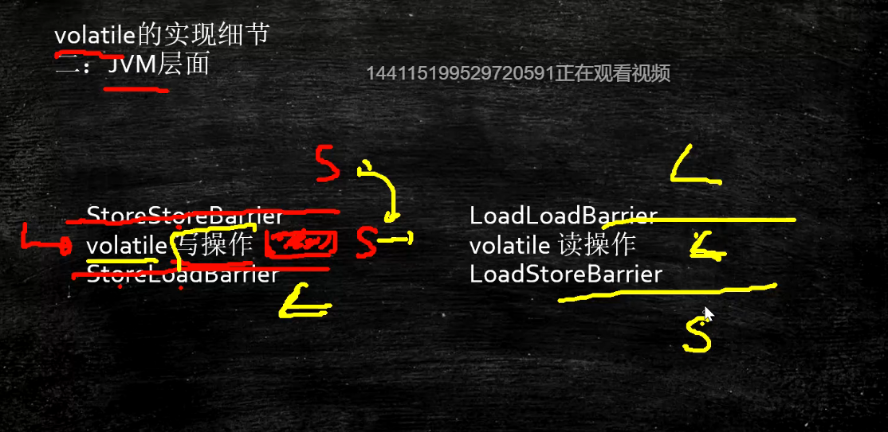
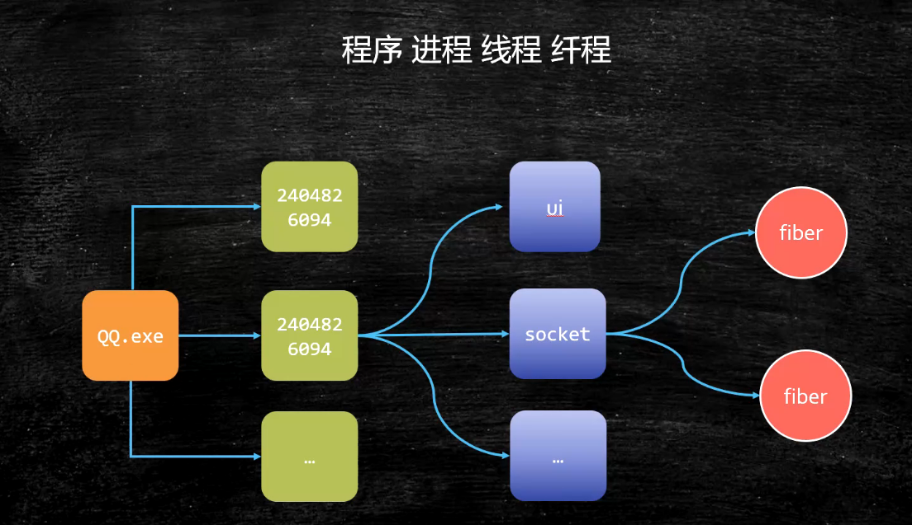

Java 相关的系统知识


# 第一课

1. 参考书
2. Java程序员，**适度打开底层**

## CPU的制作过程

Intel cpu的制作过程

[https://haokan.baidu.com/v?vid=11928468945249380709&pd=bjh&fr=bjhauthor&type=](https://haokan.baidu.com/v?vid=11928468945249380709&pd=bjh&fr=bjhauthor&type=video)[video](https://haokan.baidu.com/v?vid=11928468945249380709&pd=bjh&fr=bjhauthor&type=video)

 

CPU是如何制作的（文字描述）

[https](https://www.sohu.com/a/255397866_468626)[://www.sohu.com/a/255397866_468626](https://www.sohu.com/a/255397866_468626)

## CPU的原理

计算机需要解决的最根本问题：如何代表数字

晶体管是如何工作的：

[https://haokan.baidu.com/v?vid=16026741635006191272&pd=bjh&fr=bjhauthor&type=](https://haokan.baidu.com/v?vid=16026741635006191272&pd=bjh&fr=bjhauthor&type=video)[video](https://haokan.baidu.com/v?vid=16026741635006191272&pd=bjh&fr=bjhauthor&type=video)

晶体管的工作原理：

https://www.bilibili.com/video/av47388949?p=2


## 缓存


**硬盘到内存，内存到缓存，都是按块读取**


**缓存行大小**


**缓存行对齐**

缓存行对齐：对于有些特别敏感的数字，会存在线程高竞争的访问，为了保证不发生伪共享，可以使用缓存航对齐的编程方式

JDK7中，很多采用long padding提高效率

JDK8，加入了@Contended注解（实验）需要加上：JVM -XX:-RestrictContended

## 乱序执行

问题


**实现**


不能互换

指令2等待指令1完成


**JVM 规范**





**引用 volatile，实际是怎样的？？？**

读源码能知道他的实际做法？？


**是在什么情况下不能重排序**


**看上去是顺序执行的，没有乱序执行**

## NUMA


**numa** 就近访问原则

优先访问最近的内存


Non Uniform Memory Access

ZGC - NUMA aware 

分配内存会优先分配该线程所在CPU的最近内存

## OS


宏内核

微内核 进程调度


## 线程 进程 程序 前程




创建进程-分配**独立的内存地址空间**，重要的资源

线程是一个进程中的不同执行路劲

面试高频：进程和线程有什么区别？

答案：进程就是一个程序运行起来的状态，线程是一个进程中的不同的执行路径。

专业：进程是OS分配资源的基本单位，线程是执行调度的基本单位。

分配资源最重要的是：独立的内存空间，线程调度执行（线程共享进程的内存空间，没有自己独立的内存空间）


Java 中线程和os中一对一

<linux 内核设计与实现> 第三本28页，参考

linux 中线程就是一个**进程**，只是**共享内存空间**，没有独立内存空间

**fiber**

线程中的线程

**减少sc。**

用户空间的线程，JVM 自己切换，调度


纤程：用户态的线程，线程中的线程，切换和调度不需要经过OS

**优势：**

1：占有资源很少 OS : 线程1M Fiber：4K 

2：切换比较简单 

3：启动很多个10W+

目前2020 3 22支持内置纤程的语言：Kotlin Scala Go Python(lib)... 

Java? （open jdk : loom）

**Java fiber 实验**

HelloFiber

**Fiber 的实现，也就是在用户空间，实现不同方法的切换执行**

**现有的方案是怎么实现的？？**

减少SC，减少资源的浪费


**内核线程，内核需要工作的线程，例如TCP**


僵尸进程就是父进程还保持子进程PCB，但是子进程已经死亡

``` java 
#include <stdio.h>
#include <stdlib.h>
#include <unistd.h>
#include <string.h>
#include <assert.h>
#include <sys/types.h>
​
int main() {
        pid_t pid = fork();
​
        if (0 == pid) {
                printf("child id is %d\n", getpid());
                printf("parent id is %d\n", getppid());
        } else {
                while(1) {}
        }
}
```


孤儿进程，对系统没有影响，父进程已经死了，但是子进程还在运行,**换爹**

```java 
#include <stdio.h>
#include <stdlib.h>
#include <unistd.h>
#include <string.h>
#include <assert.h>
#include <sys/types.h>
​
int main() {
        pid_t pid = fork();
​
        if (0 == pid) {
                printf("child ppid is %d\n", getppid());
                sleep(10);
                printf("parent ppid is %d\n", getppid());
        } else {
                printf("parent id is %d\n", getpid());
                sleep(5);
                exit(0);
        }
}
​
```

## 进程调度


调度：谁改运行了，运行多长时间，

可以自己实现调用方案，**给进程配置调度方案**


实时进程

RR进程

## 中断


上半场和下半场

内核和app


软中断和硬中断

int 80H // 软中断


调用号 

**中断，软件打断os，硬件打断os**，是一个**信号**


硬件跟操作系统内核打交道的一种机制，中断向量表，告诉os需要处理什么事情，**硬件发出的是硬中断，软件发出的是软中断**

软中断（80中断） ==  系统调用，需要os做事，**调用系统功能**

系统调用：int 0x80 或者 **sysenter**【新的】原语

通过ax寄存器填入调用号

参数通过bx cx dx si di传入内核

返回值通过ax返回

java读网络 – jvm read() – c库read() - > 

内核空间 -> system_call() （系统调用处理程序）

-> sys_read()


## 从汇编角度理解软中断

yum install nasm

```
;hello.asm
;write(int fd, const void *buffer, size_t nbytes)
;fd 文件描述符 file descriptor - linux下一切皆文件

section data
    msg db "Hello", 0xA
    len equ $ - msg

section .text
global _start
_start:

    mov edx, len
    mov ecx, msg
    mov ebx, 1 ;文件描述符1 std_out
    mov eax, 4 ;write函数系统调用号 4
    int 0x80

    mov ebx, 0
    mov eax, 1 ;exit函数系统调用号
    int 0x80
```

编译：nasm -f elf  hello.asm -o hello.o

链接：ld -m elf_i386 -o hello hello.o

一个程序的执行过程，要么处于用户态，要么处于内核态

## 内存管理


1. 互相打扰
2. 内存撑爆

> 软硬件配合


分页，分页加载，整体的过程，什么时候到内存，什么时候交换出去

**性能测试**

DOS时代 - 同一时间只能有一个进程在运行（也有一些特殊算法可以支持多进程）

windows9x - 多个进程装入内存 1：内存不够用 2：互相打扰

为了解决这两个问题，诞生了现在的内存管理系统：虚拟地址 分页装入 软硬件结合寻址

1. **分页（内存不够用）**，内存中分成固定大小的页框（4K），把程序（硬盘上）分成4K大小的块，用到哪一块，加载那一块，加载的过程中，如果内存已经满了，会把最不常用的一块放到swap分区， 把最新的一块加载进来，这个就是著名的LRU算法
   1. LRU算法 LeetCode146题，头条要求手撕，阿里去年也要求手撕
   2. Least Recently Used 最不常用
   3. 哈希表（保证 查找操作O(1)） + 链表 （保证 排序操作和新增操作 O(1)））
   4. 双向链表 （保证 左边指针 指向右边块）
2. **虚拟内存**（**解决相互打扰问题**）**假的，增加一层，地址转化**
   1. DOS Win31 ... 互相干掉
   2. 为了保证互不影响 - 让进程工作在虚拟空间，程序中用到的空间地址不再是直接的物理地址，而是虚拟的地址，这样，A进程永远不可能访问到B进程的空间
   3. 虚拟空间多大呢？寻址空间 - 64位系统 2 ^ 64，比物理空间大很多 ，单位是byte
   4. 站在虚拟的角度，进程是独享整个系统 + CPU
   5. 内存映射：偏移量 + 段的基地址 = 线性地址 （虚拟空间）
   6. 线性地址通过 OS + MMU（硬件 Memory Management Unit）
3. 缺页中断（不是很重要）：
   1. 需要用到页面内存中没有，产生缺页异常（中断），由内核处理并加载


## ZGC

算法叫做：**Colored Pointer**

GC信息记录在指针上，不是记录在头部， **immediate memory use**

42位指针 寻址空间4T JDK13 -> 16T 目前为止最大16T 2^44

### CPU如何区分一个立即数 和 一条指令

总线内部分为：数据总线 地址总线 控制总线

地址总线目前：48位

颜色指针本质上包含了地址映射的概念


## 同步


VFS pagecache

**mmap 解释**

https://medium.com/@sasha_f/why-mmap-is-faster-than-system-calls-24718e75ab37

mmap为什么比read/write快(兼论buffercache和pagecache)

https://blog.csdn.net/kai8wei/article/details/77980201

数据从用户空间到内核空间的cpoy，互相copy

**内核态的程序能修改寄存器吗？也就是线程的切换？好像不行**

修改基址寄存器，就是程序的切换


---


计算机基本原理

指令相关

CPU 原理相关

