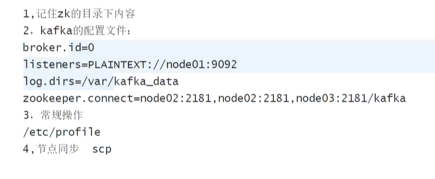

kafka 作为中间件，也是需要处理

1. 单点问题
2. 性能问题

AKF 拆分

topic -> paration

Z 轴是针对 Y 轴 细分， 分治理，类似redis

分治之后，消费的顺序性

> 分治，需要将无关的分开【并行处理】，有关的聚合，保证顺序

数据路由

 

Z轴拆分的原则如上

>  在同一个业务中

partition 0 ，1 ，2 是物理的对应

x 轴是可靠性的问题【出主机的】，有副本，网络可靠

顺序可靠

x轴可以读写分离，容易出现一致性问题，只能在主上进行W/R

---

分区内部是有序的，分区之外无序

**生产者提供数据的顺序**

**多个消费者，一个P，需要offset**

**为什么需要zk**

主从集群，分布式协调，选择controller，leader的过程中需要，强锁

broker【有角色】 on  JVM 进程 物理的

分区是物理的，topic是逻辑的，数据在P

producer为P提供数据，

新版本，**直接连接broker，不是从zk中获取**，为了减少ZK的网络负担【如果很多机器连接，早晨网卡打满】

将相关的元数据放在controller中，在同步到其他的broker；

导致在业务层次，不需要依赖zk，

注意分布式状态下，**producer，的顺序性，分布式锁**

一份cusumer 顺序的不怕

分区和consumer可以 1:1 n:1

**可不可以一个P让多个consumer处理呢？**

不能，不能保证有序性

offset上加锁或者排队，可以，但是性能不好，拖了裤子放屁

**出现另外一个consumer**，另一个小组开发

分组的概念，目标地址不一样。同一个分区，在不同的业务部门使用

组合组是隔离的，组内的分区是要完成，一个分区只能有一个consumer

同一个分区的数据可以分送给不同分组中的consumer

> 1. kafka broker的partition保存了producer发送来的数据，重点是数据，怎么用，可以重复的利用
> 2. 在单一的场景下，先要保证，即便追求性能，不能一个分区中有多个consumer对应P，不能保证顺序性
> 3. 但是不同的组，可以重复利用数据；数据的重复利用，是在组的概念上，但是组内要保证，一个P对应一个consumer，或者N对一

**consumer挂啦，消费的进度？重启之后从哪开始消费**

1. 丢失
2. 重复

> 围绕的是offset，消费的进度

出现这个问题之前，这个进度是怎么维护的。

consumer在runtime【内存中】的时候，在内存中为了offset。【持久化】

> 之前offset维护在zk中，但是zk不是db，是协调，不维护业务相关

> 之后kafka升级，维护一个topic，自己维护offset，维护其他P的offset，减轻了zk的负担

> offset 之前维护在zk中，新版中维护在自己的topic中

> offset还可以维护在第三方，redis

存储的位置

上面的问题节奏、频率、先后 ？

更新offset，

1. 异步的，5秒以内，先干活，持久化offset，有可能丢，重复消费
2. 同步的，业务操作，和offset的持久化
3. **丢失**是offset已经更新，但是业务没有完成，幂等可以解决重复，但是不能解决丢失

X设计一致性

分区的意义

分区内部有序，分区外部无序

offset 标识消费到哪了

zookeeper 协调者，不是存储

协调选主的过程用到了zookeeper

produce 获取broker ip

多个produce

分区和consumer 

分组概念，组内是不能1 -> N

但是在不同组中，能将一个p 到不同的组的consumer

消费的端点，或者业务的部门 MYSQL 和  ES

在一个业务线，中不能有多个consumer

但是在不同业务线，可以重复利用，是在不同组上，但是在组内不能重复

---

**消费的进度，重复消费，数据丢失**

> 围绕的是offset出现

出现问题之前offset是怎么维护的，consumer在运行时在内存中维护了自己的offset,在内存中，**offset需要持久化**;

> 老版本维护到zk中，但是zk是协调，不维护业务内容

后期的版本中自己维护了一个topic，维护offset，自己维护offset的topic

offset存储的时机，节奏，导致不同的问题

**丢失**：offset存储成功，但是业务执行失败
**重复**：异步同步offset，重复消费，幂等解决，**但是幂等解决不了数据丢失**

# kafka 磁盘与网卡【先不讲】

1. 搭建 演示

2. 面向kafka 的MQ，消息处理方式

   > 能写伪代码，怎么发，怎么消费

官网

1. 依赖zk,每个都要有自己的前缀
2. 下载安装包到本地
3. 修改配置文件

> broker.id = 0 
>
> log.dirs = /var/kafka_data

启动kafka

**创建topic**

**查看**

**消费者**

生产者

