## 7 编解码

客户端和客户端

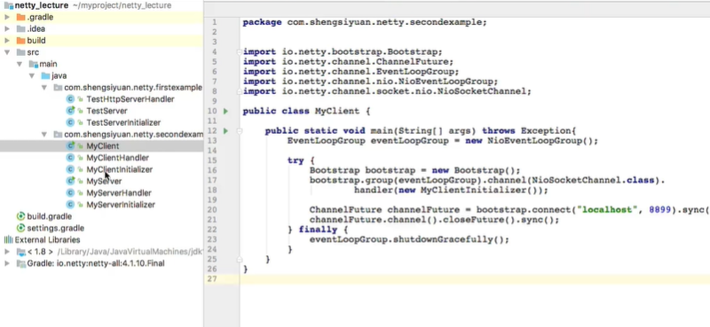


## 10 websokect ，

1. 学习一下协议 和 http 的区别或者关系
2. 

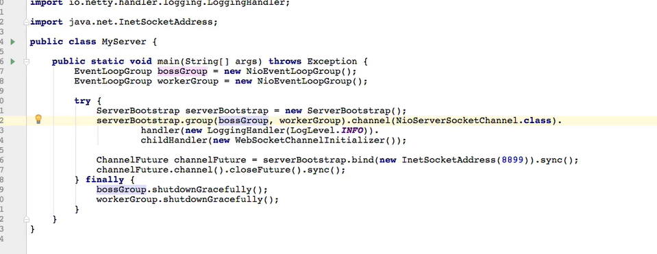


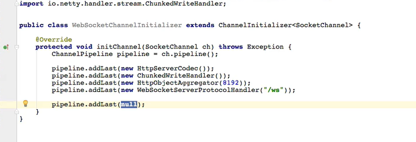


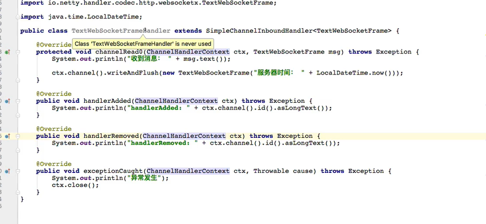


以上是服务端


通过html 编写客户端，浏览器支持websocket 协议


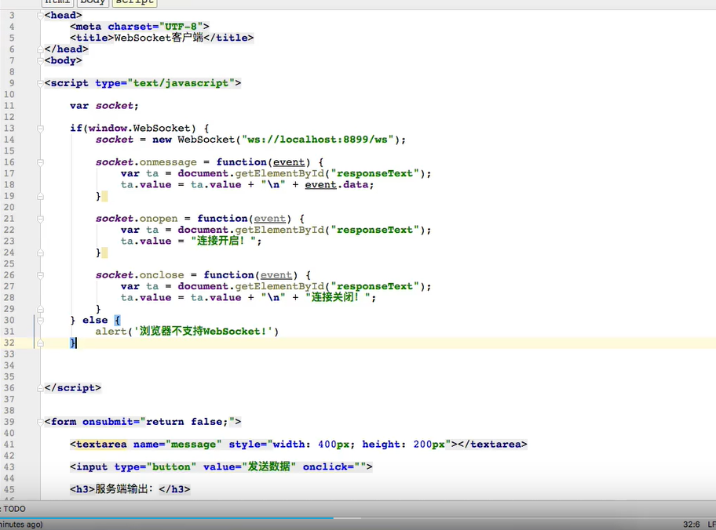


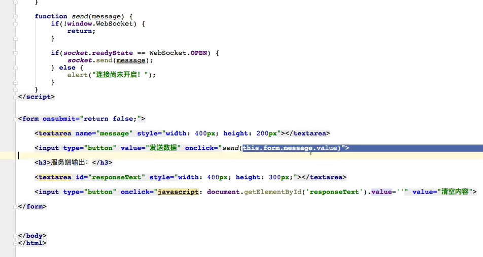


长连接支持

在浏览器中可以可以实验

长连接中的连接异常感知，心跳检测

## p 12 protobuff

RMI : 跨机器的调用

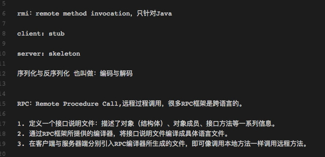

# 跳过 p13 - p31

# p 32


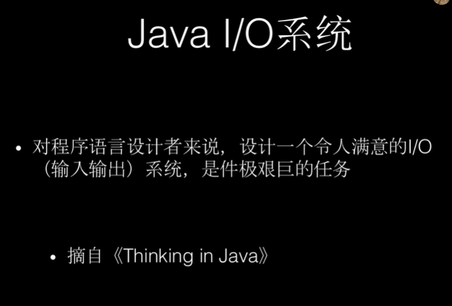


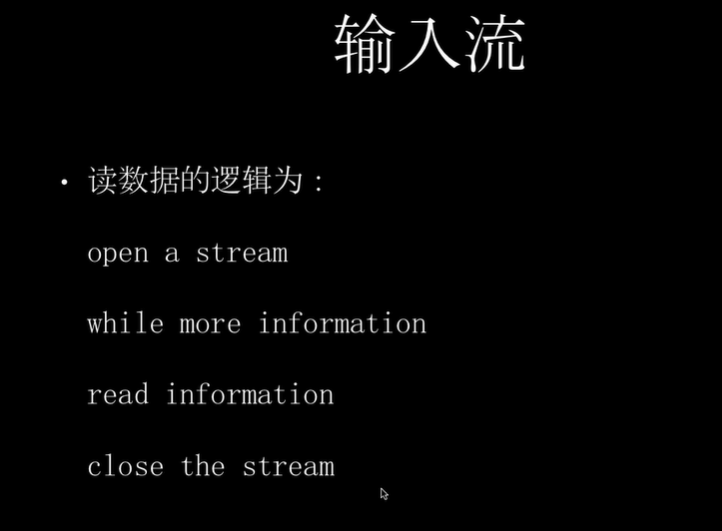


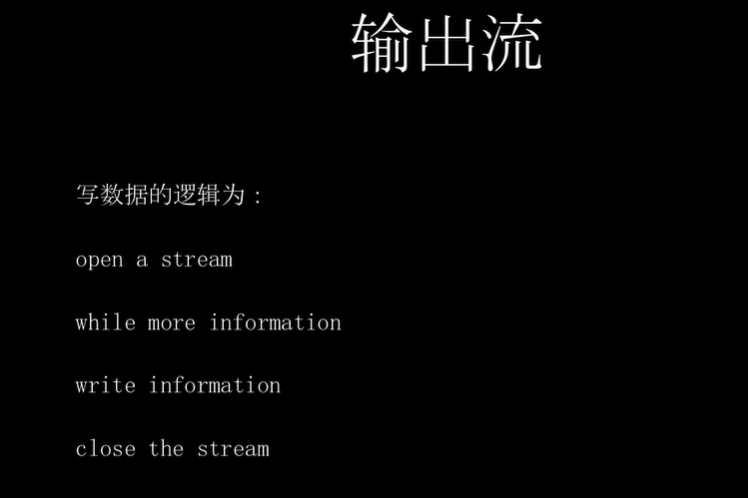


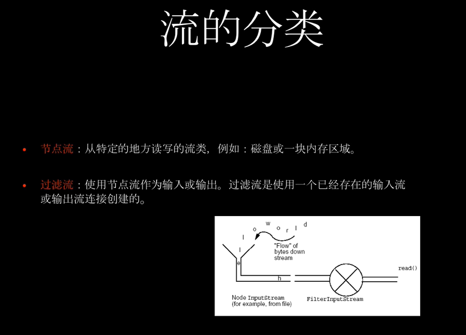


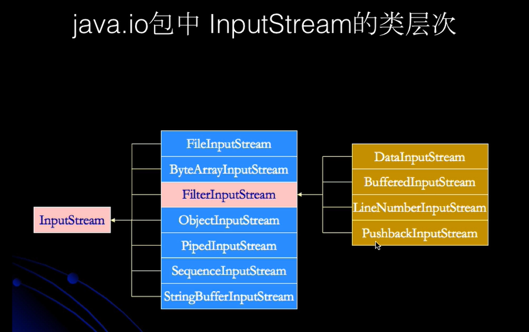

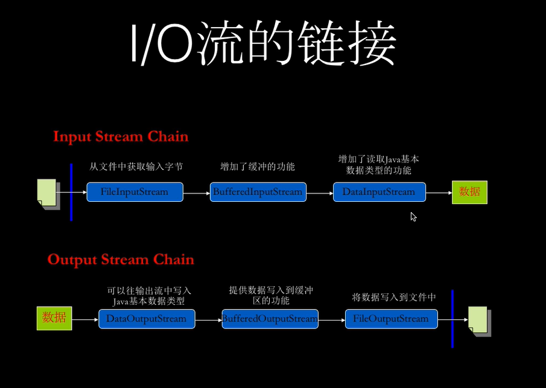


## IO 相关的设计模式，装饰模式

扩张类的功能

## 作业

实现装饰模式，

# P33 nio

java.io / java.nio

java.io 中最为核心的概念是流(Stream)，面向流的编程。Java中，一个流要么是输入流，要么是输出流。不可能既是输入流也是输出流。

java.nio 中拥有3个核心概念：Selector，Cahnnel，Buffer。在java.nio中，我们是面向块(Block)或者缓冲区(Buffer)编程的。Buffer本身就是一块内存，底层实现上，实际上是个数组，数据的读、写都是通过Buffer实现的。

**除了数组之外，Buffer还提供了对于数据的结构化方法方式，并且可以追踪到系统的读写过程**。？？

Java中的8种原生数据类型都有各自对应的Buffer类型，如IntBuffer，LongBuffer，ByteBuffer及CharBuffer等等。

Channel指的是可以向其写入数据或者从中读取数据的对象，类似java.io中的Stream。

所有数据的读写都是通过Buffer来进行的，永远不会有直接向Channel写入数据的情况，或是直接从Channel读取数据的情况。

与Stream不同的是，Channel是双向的，一个流不可能是InputStream还是OutputStream，Channel打开后则可以进行读取、写入或者读写。

由于Channel 是双向的，因此他能更好的反映出底层操作系统的真实情况；在Linux中，底层操作系统的通道就是双向的。

```java
/**
 * Nio 文件读取
 */
public class NioTest2 {
    public static void main(String[] args) throws Exception {
        FileInputStream fileInputStream = new FileInputStream("NioTest2.txt");
        FileChannel fileChannel = fileInputStream.getChannel();
        ByteBuffer byteBuffer = ByteBuffer.allocate(512);
        fileChannel.read(byteBuffer);

        byteBuffer.flip();

        while (byteBuffer.remaining() > 0) {
            byte b = byteBuffer.get();
            System.out.println("Character: " + (char) b);
        }
    }

    /**
     * Character: h
     * Character: e
     * Character: l
     * Character: l
     * Character: o
     * Character:  这两个字节是啥
     * Character:
     *
     * Character: n
     * Character: i
     * Character: h
     * Character: a
     * Character: o
     */
}
```

# P36 NIO 文件读取和写入 buffer clear方法

```java
public class NioTest4 {
    public static void main(String[] args) throws Exception {
        FileInputStream fileInputStream = new FileInputStream("input.txt");
        FileOutputStream fileOutputStream = new FileOutputStream("output.text");

        FileChannel inputChannel = fileInputStream.getChannel();
        FileChannel outputChannel = fileOutputStream.getChannel();

        ByteBuffer buffer = ByteBuffer.allocate(512);

        while (true) {
            buffer.clear(); // clear 方法注释，会有什么效果，并尝试解释

            int read = inputChannel.read(buffer);

            System.out.println("read:" + read);

            if (-1 == read) {
                break;
            }

            buffer.flip();
            outputChannel.write(buffer);
        }

        inputChannel.close();
        outputChannel.close();
    }
}
```

通过NIO 读取文件涉及三个步骤

1. 从FileInputStream获取到FileChannel对象
2. 创建buffer
3. 将数据从Channel读取到Buffer中

通过NIO 写入文件涉及三个步骤

1. 同FileOutputStream获取到FielChannel对象

2. 创建buffer

3. 将buffer中的数据写入Channel

   

# P37 

**类型化的get和put**

```java 
/**
 * 类型化的get和put
 * 方法中表示了获取数据的类型，也就是读取的字节数
 */
public class NioTest5 {
    public static void main(String[] args) throws Exception {
        ByteBuffer buffer = ByteBuffer.allocate(64);
        buffer.putInt(12);
        buffer.putLong(44444444L);
        buffer.putChar('你');
        buffer.putShort((short) 2);

        buffer.flip();

        System.out.println(buffer.getInt());
        System.out.println(buffer.getLong());
        System.out.println(buffer.getChar());
        System.out.println(buffer.getShort());
    }
}
```


**slice** 创建现有buffer的一部分作为一个写的buffer


```java
/**
 * test slice buffer
 *  从已有的buffer 创建另一个buffer
 *  两个buffer共享底层存储，互相影响
 */
public class NioTest6 {
    public static void main(String[] args) {
        ByteBuffer buffer = ByteBuffer.allocate(10);

        for (int i = 0; i < buffer.capacity(); ++i) {
            buffer.put((byte) i);
        }

        buffer.position(2);
        buffer.limit(6);

        ByteBuffer sliceBuffer = buffer.slice();

        for (int i = 0; i < sliceBuffer.capacity(); i++) {
            byte b = sliceBuffer.get(i);
            b *= 2;
            sliceBuffer.putShort(i, b);
        }

        buffer.position(0);
        buffer.limit(buffer.capacity());

        while (buffer.hasRemaining()) {
            System.out.println(buffer.get());
        }
    }
}
```

**只读buffer HeapByteBuffer**

```java 
/**
 * 只读 buffer
 */
public class NioTest7 {

    public static void main(String[] args) {
        ByteBuffer buffer = ByteBuffer.allocate(10);

        System.out.println(buffer.getClass());

        for (int i = 0; i < buffer.capacity(); ++i) {
            buffer.put((byte) i);
        }

        ByteBuffer readOnlyBuffer = buffer.asReadOnlyBuffer();

        System.out.println(readOnlyBuffer.getClass());

        readOnlyBuffer.position(0);

        //  readOnlyBuffer.put((byte) 2);

    }
}
```


## 了解

DireactByteBuffer 


# P38 

DireactBuffer 涉及 **native方法** **JNI** **内存模型** 区别于HeapByteBuffer


``` java 
 base = unsafe.allocateMemory(size); // native 方法
```

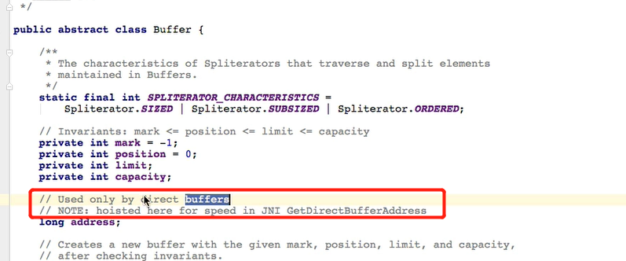

Buffer 中的address 属性就是指向堆外内存

HeapBuffer 多了一次数据copy的过程，从Java堆cpoy到堆外内存，使用这个内存和IO设备交互

**为什么OS不直接访问Java堆呢？**

GC的干扰,标记和压缩，地址变了；native的不能操作，需要地址不变

所以需要copy到堆外。地址固定之后，OS操作；copy的过程也是需要保证不发生GC

涉及**零copy**的概念，

## 作业

梳理，和图解以上概念

# P39 内存映射文件

MappedByteBuffer，映射文件的内存在**堆外**，通过操作内存操作文件

```java
/**
 * 内存映射文件由于直接在内存中操作文件
 * 将文件的内容映射到内存中，代表就是MappedByteBuffer
 * 通过buffer的方法操作，系统自动同步
 */
public class NioTest9 {

    public static void main(String[] args) throws Exception {
        RandomAccessFile randomAccessFile = new RandomAccessFile("NioTest9.txt", "rw");
        FileChannel fileChannel = randomAccessFile.getChannel();

        MappedByteBuffer mappedByteBuffer = fileChannel.map(FileChannel.MapMode.READ_WRITE, 0, 5);

        mappedByteBuffer.put(0, (byte) 'a');
        mappedByteBuffer.put(3, (byte) 'b');

        randomAccessFile.close();
    }
}
```


``` java 
/**
 * 文件锁，不常用
 */
public class NioTest10 {

    public static void main(String[] args) throws Exception {
        RandomAccessFile randomAccessFile = new RandomAccessFile("NioText10.txt", "rw");
        FileChannel fileChannel = randomAccessFile.getChannel();

        FileLock fileLock = fileChannel.lock(3, 6, true);
        System.out.println("valid: " + fileLock.isValid());
        System.out.println("lock type: " + fileLock.isShared());

        fileLock.release();
        randomAccessFile.close();
    }
}
```

**scattering 和 gathering**

读是传递一个buffer数组

写是传递一个buffer数组

一个网络程序

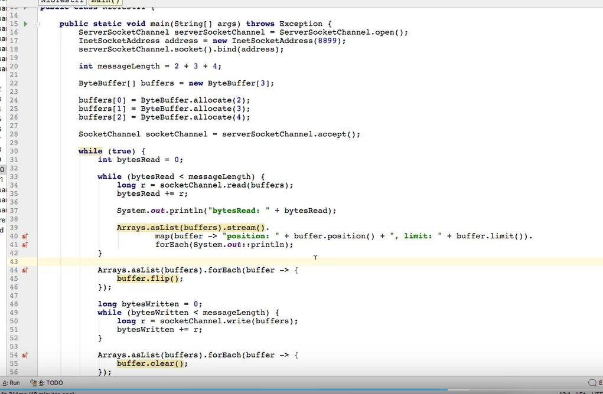

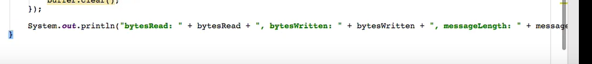

网络编程客户端：telnet 或者nc


# P40 Java 网络编程

传统的网络编程模型:服务端启动 accept阻塞,启动多个线程处理多个链接的客户端

Nio网络编程，`select` 阻塞，`keySet` 等概念

```java 
public class NioTest12 {
    public static void main(String[] args) throws IOException {
        // java selector
        int[] ports = new int[5];
        ports[0] = 5000;
        ports[1] = 5001;
        ports[2] = 5002;
        ports[3] = 5003;
        ports[4] = 5004;

        Selector selector = Selector.open();

        for (int i = 0; i < ports.length; ++i) {
            ServerSocketChannel serverSocketChannel = ServerSocketChannel.open();
            serverSocketChannel.configureBlocking(false);
            ServerSocket serverSocket = serverSocketChannel.socket();
            InetSocketAddress address = new InetSocketAddress(ports[i]);
            serverSocket.bind(address);

            serverSocketChannel.register(selector, SelectionKey.OP_ACCEPT);

            System.out.println("监听端口: " + ports[i]);

        }

        while (true) {
            int numbers = selector.select();
            System.out.println("numbers: " + numbers);
            Set<SelectionKey> selectionKeySet = selector.selectedKeys();
            System.out.println("selectedKeys: " + selectionKeySet);

            Iterator<SelectionKey> iterator = selectionKeySet.iterator();

            while (iterator.hasNext()) {
                SelectionKey selectionKey = iterator.next();
                if (selectionKey.isAcceptable()) {
                    ServerSocketChannel server = (ServerSocketChannel) selectionKey.channel();
                    SocketChannel socketChannel = server.accept();
                    socketChannel.configureBlocking(false);

                    socketChannel.register(selector, SelectionKey.OP_READ);
                    iterator.remove();
                    System.out.println("获得客户端链接： " + socketChannel);
                } else if (selectionKey.isReadable()) {
                    SocketChannel socketChannel = (SocketChannel) selectionKey.channel();
                    int byteRead = 0;
                    while (true) {
                        ByteBuffer byteBuffer = ByteBuffer.allocate(512);
                        byteBuffer.clear();
                        int read = socketChannel.read(byteBuffer);
                        if (read <= 0) {
                            break;
                        }
                        byteBuffer.flip();
                        socketChannel.write(byteBuffer);
                        byteRead += read;

                    }

                    selectionKey.readyOps(); // 消费之后删除
                    System.out.println("读取： " + byteRead + ",来自于：" + socketChannel);
                }
            }
        }


    }
}
```

 使用`nc`模拟客户端

NIO 监听多个端口，通过nc或者telnet链接，读写

1. 记得`remove` 已经处理的channel
2. 

# P 42 一个服务端多个客户端

chat 包,使用Nio 开发一个聊天群发

# P 46

**编码和解码，解码是从字节到字符，字符到字节是编码**

gbk/gb18030/big5

Unicode 使用 两个字节表示一个字符

存储是一个问题，巨大空间浪费

UTF-8 Unicode Translation Format 存储格式

Unicode  **编码方式** ，UTF **存储格式**，UTF-8 是Unicode的实现方式之一；

UTF-16LE (little endian) ，UTF16-BE(big endian)

Zero Width No-Break Space 0xFEFF(BE),0xFFFE

UTF-8 ,边长的字节表示形式，**中文使用三个字节**；最多使用6个字节表示

字节序,(Byte Order Mark)BOM, // 0xFEFF(BE),0xFFFE

# P47/48 总结 Nio

注意做笔记，记录/ 帮助回忆

# 49 Zero-Copy

磁盘上的文件读取到内存中，发送给用户；

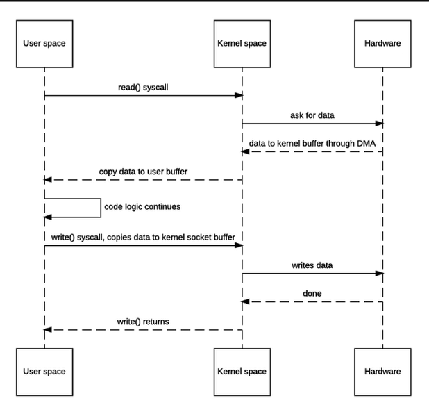

发送read调用，上下文切换

内核 -》 DMA  内核缓冲区

copy to 用户空间

用户空间逻辑继续

write copy to 内核空间缓冲区

写网络

---

用户空间，作为中转，没有对数据加工，内核到用户，又从用户空间copy到内核

减少两次上下文切换

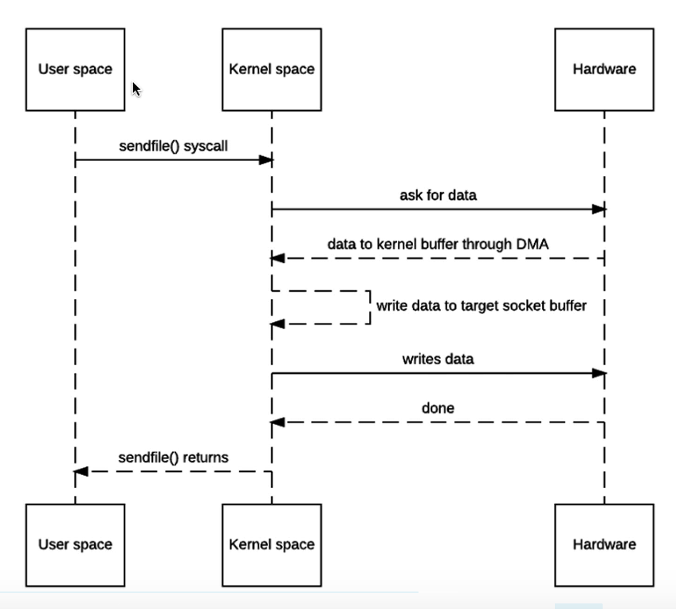


sendfile 系统调用，没有数据copy到用户空间，操作系统的zero-copy

将数据发送到目标socket buffer ，发送数据

减少上下文切换，都是在内核空间进行的

从内核buffer copy 到 socket buffer

问题: 能否之间将


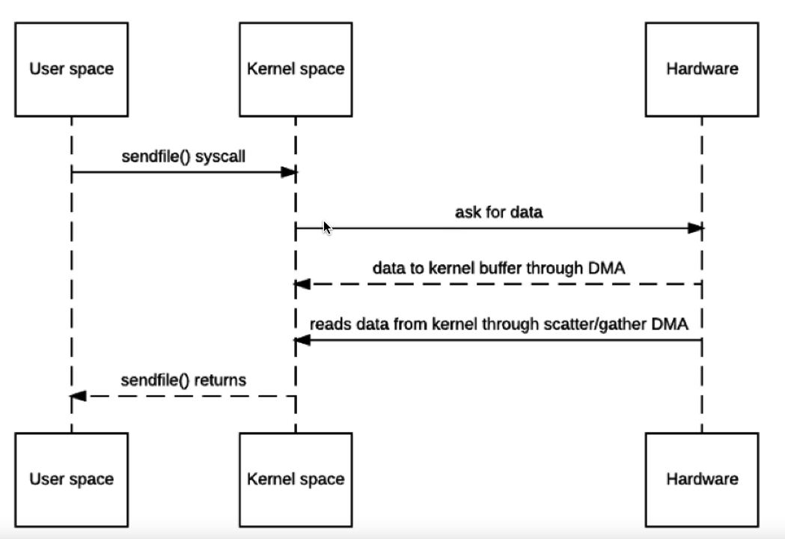


// 用户不能参与

需要内存映射文件，映射文件到内存，**在用户空间可以直接访问内核空间的文件**。Java中是MappedByteBuffer。

在Java中使用上面的Buffer，将一个文件映射到内存中，但是内核空间，但是这种特殊的技术，可以让用户直接访问内核空间的内存，也就是访问文件。

# P 50 Zero -copy

最主要关注

1. 和netty的关系
2. 通俗的解释

下面是两个参考文章

https://zhuanlan.zhihu.com/p/83398714

https://zhuanlan.zhihu.com/p/296207162


# P52 


# netty 闪电侠

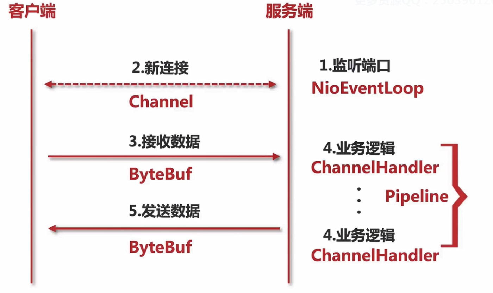


OIO vs netty

NIO vs netty

## netty 重要组件

NioEventLoop是发动机，Channel 对应这Socket，也就是网络通信的sub，在Channel中有对应的pipeline，ChannelHandler和ByteBuffer

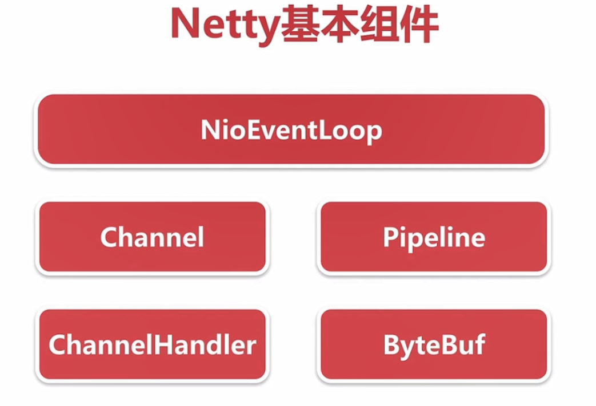

# 服务端启动

ServerBootstrap  主要是收集参数配置

bind() 才是真正进行**服务器端口绑定和启动的入口**

. Netty 自己实现的 Channel 与 JDK 底层的 Channel 是如何产生联系的？

. ChannelInitializer 这个特殊的 Handler 处理器的作用是什么？

. Pipeline 初始化的过程是什么样的？


# 编程学习资源

\1. 有效掌握编程的本质: The Little Schemer: https://amzn.to/2VOkezE
\2. 高效准备算法面试: AlgoExpert: https://algoexpert.io/schelley
\3. 后端开发: Designing Data-Intensive Applications: https://amzn.to/3eErpmx
\4. 高效准备系统设计面试: Grokking the System Design Interview: https://sourl.cn/wesSTV
5.a 前端开发之ReactJS实战: https://sourl.cn/V9TtbC
5.b 前端开发之JavaScript实战: https://sourl.cn/Mhya59

另外再推荐一门Python教程: 手把手教你用Python写出10个高大上的app (比如: 摄像头动作感应识别): https://sourl.cn/iXxf9T


# 资料

- 综述文章 https://zhuanlan.zhihu.com/p/48591893

- 张龙 netty 视频
- geektime netty 视频
- 占小狼 https://www.jianshu.com/nb/7269354 文章
- 拉钩 netty 文章
- 尼恩 https://www.cnblogs.com/crazymakercircle/p/9847501.html
- 韩顺平
https://s8jl-my.sharepoint.com/personal/atguigu_s8jl_onmicrosoft_com/_layouts/15/onedrive.aspx?id=%2Fpersonal%2Fatguigu%5Fs8jl%5Fonmicrosoft%5Fcom%2FDocuments%2F%E5%B0%9A%E7%A1%85%E8%B0%B7%20%E9%9F%A9%E9%A1%BA%E5%B9%B3%20Netty%E6%A0%B8%E5%BF%83%E6%8A%80%E6%9C%AF%E5%8F%8A%E6%BA%90%E7%A0%81%E5%89%96%E6%9E%90&originalPath=aHR0cHM6Ly9zOGpsLW15LnNoYXJlcG9pbnQuY29tLzpmOi9nL3BlcnNvbmFsL2F0Z3VpZ3VfczhqbF9vbm1pY3Jvc29mdF9jb20vRXZtX25pRk1oWEpLbVp1VGRWdlJpQklCTlFvemVDbHIwdkczcEN2WURxQWVaZz9ydGltZT1EcWtGbFA2eDJFZw