## 课程代码地址

https://github.com/bjmashibing/bjmashbing-sysio

https://medium.com/@copyconstruct/nonblocking-i-o-99948ad7c957

https://medium.com/@copyconstruct/the-method-to-epolls-madness-d9d2d6378642  重点辅助资料

参考笔记 

https://blog.csdn.net/sinat_42483341/category_10210911.html

## 寻找面试题


## 第二次课 page cache 文件IO

## 内容 

关键字：MMU，

**VFS** ，虚拟的文件系统，类似接口，将上次应用访问存储和实际的存储硬件隔离或者解耦，因为不同的存储系统需要不同的驱动。

**文件系统**，就是应用访问存储设备的接口，是由操作系统实现，应用系统使用的。数据库是这样吗？

VFS 树 inode

1. pageCahe【页缓存】，内存的管理，分页，缓存系统加载的内容，同一份数据，供多个应用访问

2. 从硬盘中加载的数据放置在pagecache中，程序写文件也是先写入到pagecache中，之后根据配置刷新到硬盘中 page的大小为4K,

3. 多个线程共享 pagecache，也就是文件缓存

4. 脏缓存【修改从硬盘中加载的数据】，Flush，什么时候和硬盘进行同步。脏页同步到硬盘，有可能丢数据，即没有处罚阈值和时间

5. linux 系统中将所有设备都抽象成文件，对设备的读写等于对文件的读写，例如网络和硬盘，监听和接受连接都是创建文件fd，文件df，有偏移

6. 文件描述符中维护这对文件操作的状态，例如文件读写的位置等等seek

7. 分区可以挂在到不同的文件夹中【需要详细的实验】，

   1. 分区挂在到一个文件夹，读写
   2. 读写满之后，换一个更大的

8. 几种常见的文件类型

   1. **-：普通文件（可执行，图片，文本）REG**

      d: 目录

      l：连接

      b：块设备，硬盘可以双向读写，

      c：字符设备 CHR，单向，不能来回

      s：socket，

      p: pipeline
      
      [epoolevent]
      
   2. 软连接和硬链接

      1. ln -s

      2. ln  

         > 双方修改都可以看到变化，
         >
         > stat 文件名，查看链接和inode的号

   3. 

   4. 

   5. 

   6. `whereis bash`

   `dd `

   > 运维中的命令

   `ldd bash`

   > 查看bash相关的依赖

   `lsof -op $$ ` 

   > 查看当前进程依赖的文件，打开的文件文件描述符 FD

   

   > DF中维护一个seek，指针，每个进程都有，表示文件读到哪了，帮助理解Java中文件读写
   >
   > 一个进程中DF不能重复

   > 每个线程都有以下文件描述符
   >
   > 0 标准输入 1 标准输出 2 错误输出

9. **/proc** 

   `/proc/$$`

   `$$` 表示 当前`bash`的`pid`

    `$BASHPID` 同样表示当前

   `cd /proc/$$/fd`   命令

   `lsof -op $$` 查看当前进程打开的文件

   重定向：不是命令，机制

   `& ` 的作用

   ​		输入，输出 I/O

   ​		<          >

   管道符  | 

一切皆文件，各种文件，文件描述符，socket也是


`lsof -op $$` 当前进程的df的详情

`/proc`  **映射内核参数变量**在内存中，一切皆文件

$$ 当前bash的pid

/proc/$$/fd 当前进程的文件描述符

**重定向：不是命令，机制**

`ls ./  1> ~/ls.out`

`read a 0<  cat.out`

`ls ./ /xxxxx 1>ls01.out 2> ls02.out`

`ls ./ /xxx 2>& 1  1> ls04.out`

`ls ./ /xxx   1> ls04.out 2>& 1`

**管道**

`head -1 test.txt`

`tail -1 test.txt`

`head -8 test.txt | tail -1 ` // 获取第8行

**父子进程**

pstree

父子进程访问变量，隔离

{很多指令} // 多恨的指令 ；


子进程  | 子进程

管道

进程隔离 ，a 父进程 ，子进程不能影响


$$ 的优先级高，比 | 高

$BASHPID进程并不高，正常执行，启动两个子进程

**验证管道类型** 文件类型


管道两边会启动两个子进程，上面语句会输出一个pid

在另一个ssh中，cd /proc/pid/df 查看管道

另一个是通过 lsof -op pid 查看pipe


中断，int80 ，态的切换，执行callback，保护现场

pstree

pcstat  /bin/bash

同一程序，多个实例，在page是一份，JavaIO 是pagecache 之上的东西

文件也是共享，多个实例，但是不同的线程，维护自己的seek【fd】，偏移量

**Page cache 是内核维护的中间层**，使用多大内存，是否淘汰，是否延时，是否丢数据

**IO 是依赖pageCache的**，**优化IO性能，但是会丢失数据**,设计内核和硬盘的同步

`sysctl -a | grep dirty` // 查看配置，os关于刷磁盘的配置

```
vm.dirty_background_ratio = 0
vm.dirty_background_bytes = 1048576
vm.dirty_ratio = 0
vm.dirty_bytes = 1048576
vm.dirty_writeback_centisecs = 5000
vm.dirty_expire_centisecs = 30000
```

**系统文件都是先写内存，再写硬盘**，

**bufferFile 为啥比普通快**

>  JVM 的维护一个数组8KB，调用一个syscall ，减少系统调用做到的,通过strace -f -o 中可以看到

**ByteBuffer的使用方法**

**page cache 脏页什么时候写入磁盘**

>  达到系统设置的阈值,时间阈值，百分比阈值

**脏page 的淘汰机制**

> 

**strace ，追踪内核调用**

> 学习和系统调用相关的上层API的神器

**块设备，文件，map ，来回读，字符设备不能**

**文件系统的IO**

---

第二课 第二次

系统使用内存的过程，包括缺页异常，这个异常导致从**用户**切换到**内核**，加载和映射物理内存到虚拟内存的过程；

> 用户态和内核态之前的切换触发的时机，CPU的缺页异常，用户态app停止运行，内核态开始工作，为用户态的app准备资源，加载对应的数据到物理空间，再返回用户空间，继续执行


## 第三次 网络IO TCP 参数

### 主要内容总结

> 1. TCP 创建连接过程，服务端监听，等待客户端链接
> 2. 客户端发起链接，
>
> 以上都是通过各种系统调用完成，本节课主要是通过各种命令，
>
> 1. 跟踪TCP连接建立的过程
> 2. 几个参数对连接的影响
> 3. TCP 连接中内核和用户app之间的关系

### 本节常用命令总结

```shell
nc IP 端口  // 发送数据
lsof -p PID // 文件描述符
netstat -natp // 查看多有监听的端口
tcpdump -nn -i eth0 prot // tcp通信的日志
strace -ff -o out cmd //  追踪线程和先关的系统调用
jps
man man
man 2 socket
```

### TCP 连接的详细解释 sokect

解释:四元组唯一定义一个TCP 链接，客户端的ip和port和服务端的客户和端口，唯一确定一个TCP连接;系统分配的资源包括，buffer，存放客户端发送的数据

> 客户端链接到服务端，服务端没有接受客户端链接之前，内核已经完成三次握手,实验1

ServerSoceck 的 accept 是为了在应用层拿到内核分配给连接的FD，fd 指向buffer；用于读写网络数据

如下图所示:


### Java 中 TCP 相关参数说明，重点实验

> 重点通过在Java中调整各种参数的值，在linux中使用strace 追踪内核调用发生的变化，理解这些参数的意义和应用的场景

**backlog**，配置能够接受的连接，在客户端不消费的情况下，备胎连接个数，如果太多服务端不提供回复，时间长，客户端超时。

**timeout**，异常，继续，等待客户端，超时，放弃，重新等待

内核参数的配置

**MTU ，TCP 报文大小**

**拥塞控制，窗口，发太多，数据丢失**

简单说，就是双方通信的过程中，会告诉对方，自己还能接受多少，如果太多，可能消息会被丢弃

**keepalive**

###  网络IO 变化 模型 BIO 重点演示BIO

**文件IO 网络IO**

Java server Socket 和 client sokect

启动server  // server 的程序 system.in 等待用户输入，进程阻塞

netstat  -natp // 9090 监听

lsof -p // 查看文件描述符

> 重点理解TCP 三次握手的过程，客户端发送数据，但是服务没有accept，链接是否建立
>
> 虽然用户程序还没有accept，但是内核已经建立了链接
>
> 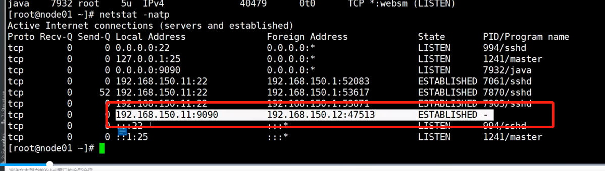

server accept 客户端链接，正式建立，用户程序接收到fd， socketclient，可以读取客户端发送的数据，也就是客户端发送数据和用户程序读取数据是异步的。

**Sokect**

四元组 sip_sport + cip_cport **唯一**  + buffer【客户端和服务端都有，这就是申请的资源】

四层传输控制层

四元组 映射到应用层就是FD , 应用访问FD

**ServeSokect** 和 **Sokect** 是不一样的

**创建监听**             **读写数据**

服务端最多创建65535个**listen**

**Sokect 就是四元组，表示谁和谁通信，已经需要的资源，buffer** 内存缓冲区

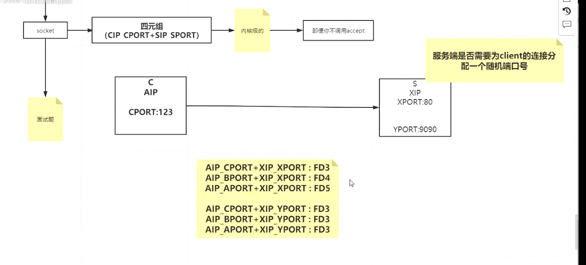

**总结应用层使用TCP 通信的过程**

1. 四元组
2. FD 映射到四元组，
3. 服务端监听，客户端链接到服务端，双方都分配资源，**四元组和buffer**


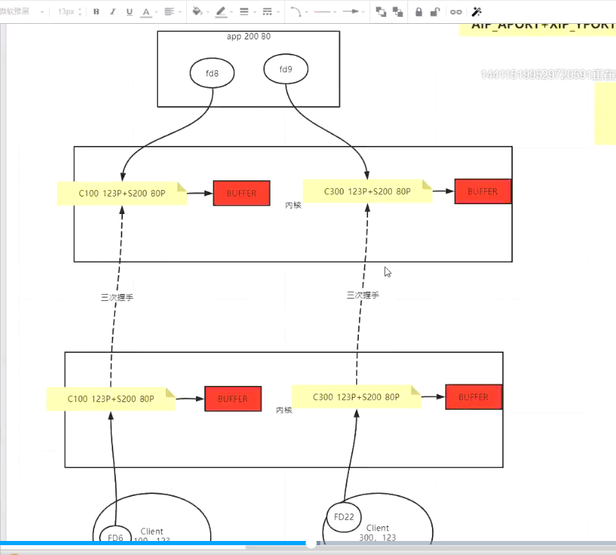

netstat -natp

tcpdump -p 00000

**内核攒链接，但是应用层不用，会怎样**

> 不会在答复客户端，SYN_RES,backlog = 2 ，第四个不恢复了
>
> 重点关注TCP 中的**backlog**这个参数，就是内核接受的链接数，等待应用层接受处理；
>
> 需要和应用处理的速度配合使用，如果应用层处理的比较慢，**有可能链接超时**，链接有问题了
>
> netty中有配置到 ？？

**Timeout** 

客户端和服务端都可以设置

服务端是在accept，accept 3s，会异常，再等待客户端连接

客户端也是

**TCP 数据发送**，**拥塞控制**

MTU:整个数据包的大小

MSS：数据大小

> 如果不控制发送的速度，如果发送的内容超出，服务端能接受的，会放弃
>
> nc localhost 9090 
>
> netstat -natp // 查看客户端已经发送的数据的多少，RECV-Q - 1920
>
> 一直发送，但是服务端就是不消费或者接受处理，接受处理后，accept，只能接受前面发送的数据，后面的数据已经丢弃

**TcpNOdelay** **SendBufferSize**

>  !vi !java

启动服务端

`tcpdump -nn -i eth0 port 9090`

启动客户端


TcpNOdelay  = false  // 优化 拼接一块发送

TcpNOdelay  = true //  不优化 有资源就发送

**keepalive** tcp 

控制层心跳


实验用到的服务端文件

**以上是TCP 参数相关的知识点**

## 网络IO 变化 模型

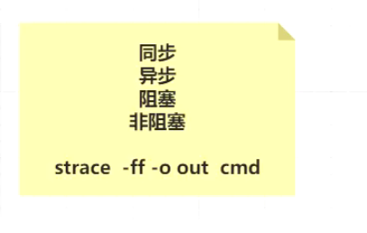

>  linux 异步没有实现

`strace -ff -o out cmd`

> 重点查看一个程序相关的线程和系统调用，网络通信的socket bind listen clone accept 等系统调用，都可以在输出的文件中获取

同步异步，自己干就是同步，内核干就是异步

阻塞和非阻塞

服务端

**实验描述**

1. 服务代码，启动服务端代码
2. 查看strace追踪输出的内容，查看相关的系统调用 socket bind listen accept 阻塞
3. 客户端链接，accept返回 生成新的fd
4. 创建新的线程，读取客户端发送的数据

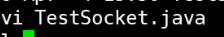

**strace 追踪 Java**程序和内核有哪些交互

当前服务端启动，使用strace追踪

lsof -op 可以看到所有的文件描述符

查看strace 输出的文件，pid最小的文件，就是主线程，如下

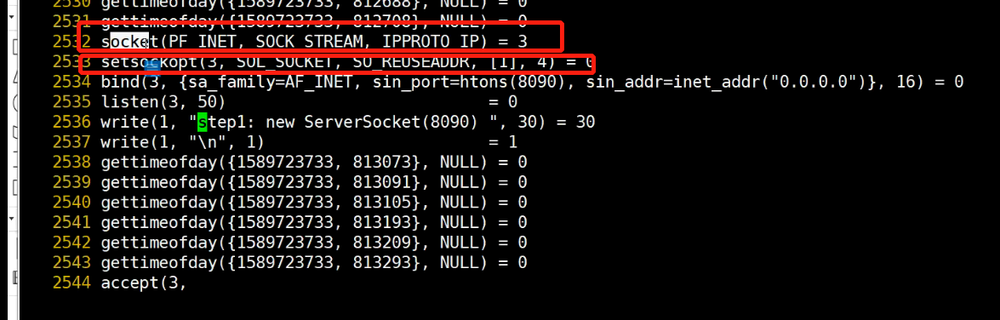

当客户端链接，accept 返回一个新的FD 5，**服务端阻塞是由内核调用导致的**

服务端启动新的线程 clone 8447 读取数据，共享数据 5 读取数据在新的线程

**客户端和服务通信的固定模式**

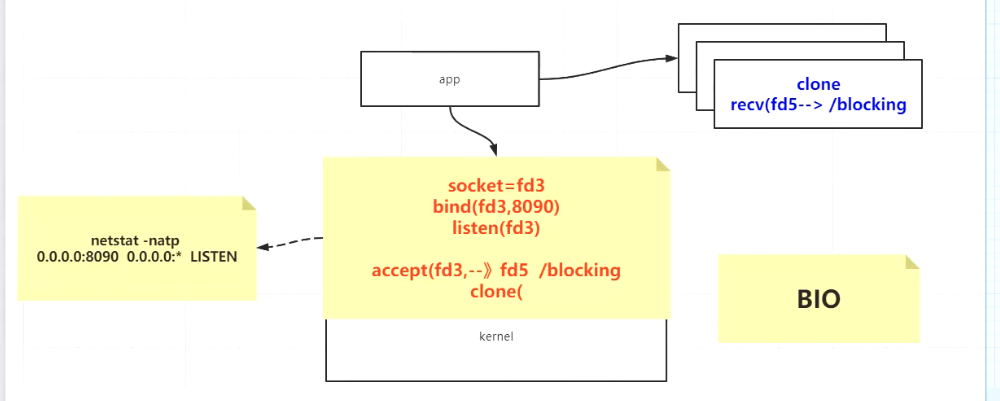

BIO ，多线程

服务端创建socket返回fd ，将创建fd绑定到指定的端口bind，listen 监听fd，accept fd 阻塞，等待客户端链接

当客户端链接，服务端accept返回一个新的fd，clone新的线程 给fd

在线程的线程读取数据，resv方法系统调用也是阻塞，等待客户端发送数据

## CentOS No entry for xxx in x section of the manual

问题：想查看系统调用的函数说明时，发现在centos上看不了
产生的原因：centos默认安装的manual是精简版
解决方法：安装man-pages

```shell
yum install man-pages
```

## 第四次 NIO C10K

### 参考

https://zhuanlan.zhihu.com/p/61785349

http://www.kegel.com/c10k.html

### 内容提纲

主要是通过发起100000个连接，对应到服务端不同的网络IO 模型，看看不同的

### TCP 路由相关的问题


### 四元组

创建连接


既能接受，也能读取

**这些阻塞都是和系统调用有关系的** accept 和 read 阻塞， 不返回

调用阻塞是怎么做到的？？

**阻塞和非阻塞IO 系统做了什么** 

答:**中断相关**

1. 使用各种IO模型测试

openfile  // 一个进程可以打开的文件

ulimit -a

ulimit -SHn 50000 // 设置每个

---

**都是和OS相关的**

各种IO 模型和客户端简历连接

BIO NIO 多路复用 

总结：

主要是通过演示从客户端发起11W个连接，到服务端，服务端，使用不同网络IO 模型和客户端创建连接，感性的看看创建连接的快慢，比较不同的网络

BIO : 阻塞当前线程accept和read ，所以需要多线程

NIO ：不阻塞当前线程，直接返回，client，accept，便利创建的client，读取数据

多路复用  ：还未讲，但是最快，基于事件或者epoll模型的

NIO 问题在哪

## 第五次 网络编程之多路复用器及Epoll精讲

NIO 的问题在哪

一次系统调用，知道多路IO的情况，复杂度是O(N)recv,无效的sc导致慢，主要是在sc上

IO 显示在内核，app通过sc便利IO，sc比较浪费时间，主要在内核态和用户态的切换

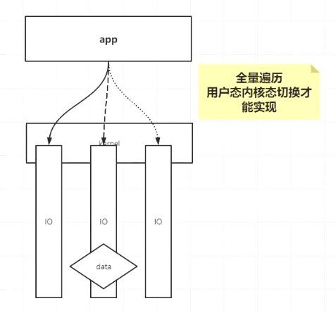

多路：IO 

复用：调用的复用，多个IO用一次sc

多路复用器只能获取状态，是否可读，还是使用app读取，sc，减少不必要的sc，只要是**自己读取**用户app，都是同步的

同步就是app R/W

异步：内核完成R/W

同步阻塞

同步非阻塞 select pool epool

linux 中没有异步，所以在linux中需要自己去调用R/W


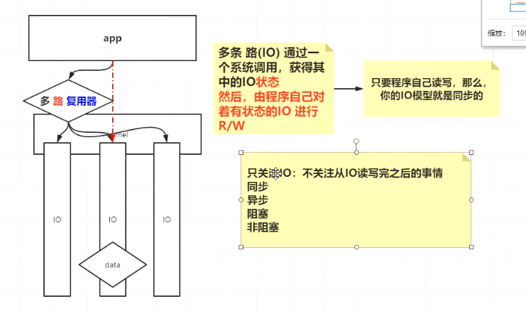

### Select 

man 2 select  查看文档

fd_setsize 1024  / poll epoll 没有1024 的限制

select 和 pool  基本相同

epoll不同

NIO 相对于 多路复用器，都是便利所有IO ，但是多路复用器发生在内核，一次sc调用

NIO 发生在用户态，上下文切换是成本，慢

### IO 中断和epool，回顾中断，cb，为epoll做准备

网卡触发中断

1. package
2. buffer
3. 轮训

> 网卡中有buffer

中断 -  中断号 - 中断回调

event 事件 -》 事件处理方法

**总结**

之前的的cb，只是将网卡的数据，走内核的协议栈，最终关联到FD的buffer，但是epoll，在这个基础上，将fd维护到了一个链表中，等待app直接获取，sc 读

### epool 内核实现

serverSocket bind listen fd

epoll_create epoll_wait 

epoll_create return fd6 ,开辟空间，存放传来的fd

epoll_ctl () // 在那个epoll 上关注那个fd的什么事件

epoll_wait  // 获取有事件的fd一个链表

**下面IO中断之后增加的内容，节省时间，时间分摊到每个中断，规避全量的便利**

epool_wait 约等于 select

都是获取有状态的fd，但是epoll是在中断时已经选择出有状态的，但是select是在select时才便利筛选出的

Java 中的**selector**就是epoll实现

> 1. epoll 中可以关注的事件

### Java对应的代码实现

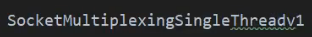

1. 创建ss，bind，listent
2. 创建selector
3. 注册ss
4. 循环，select 变化key
5. 根据类型分别处理

> 详细看代码，Java 抽象分装了select、poll、epoll

### 整个网络IO 的过程

1. 网络IO中断，cb中走内核协议，buffer内容更新fd
2. 等待app调用获取有事件的fd

select 是在用户发起调用时，根据传入的fds，便利查看之前fd中有状态的，返回给app，再SC R/W

epoll是在中断处理中，直接将有状态的fd，维护在一个链表中，等待app调用，直接返回，节省遍历时间。将遍历分摊在每次的cb中

>  单线程的redis IO threads， 在IO 线程中，accept，读取数据，但是不处理数据，所以，单线程能支持大量的IO 请求

### Epoll 流程

1. 创建epoll epoll_create 创建，返回epfd，epfd是内核的存储空间，红黑树

2. 将ss，bind，listent返回的fd注册到 epdf上，关注相关时间，accept或者R

3. 调用epoll_wait ,返回有事件的fd，可以设置时间，也就是在内核中等待的时间

   1. accept，返回fd，继续注册到epfd中，关注R事件
   2. R事件，读取
   3. 循环以上步骤

   > 包括 ss 的fd和client连接的fd，都是注册到epfd中，在线程中循环，获取有状态的fd，进一步操作，
   >
   > 1. 第一种是可以accept，**有连接**
   > 2. 第二种可以读，**可以读**

### select poll 多路复用

1. 在内核中维护fd
2. 将fds传递给内核，内核便利，返回fd，再发起sc，读取

> 主要浪费在fd的传递，epoll中直接注册，维护红黑树，cb中维护有状态的链表，等待获取

### NIO VS 多路复用

问题是sc浪费时间，在内核空间循环，sc浪费时间

> 多路复用，一次sc，遍历多个指定的fd，减少sc


这个阶段叫做IO thread ，读到数据之后，可以使用其他的线程的处理

## 第六次 网络编程java API 实战多路复用器开发

netty 也是 on select 的

> Java select 包括 poll epoll select ，都是多路复用
>
> 配置具体使用哪个多路复用器
>
> ```java
> -Djava.nio.channels.spi.SelectorProvider=sun.nio.ch.EPollSelectorProvider
> ```

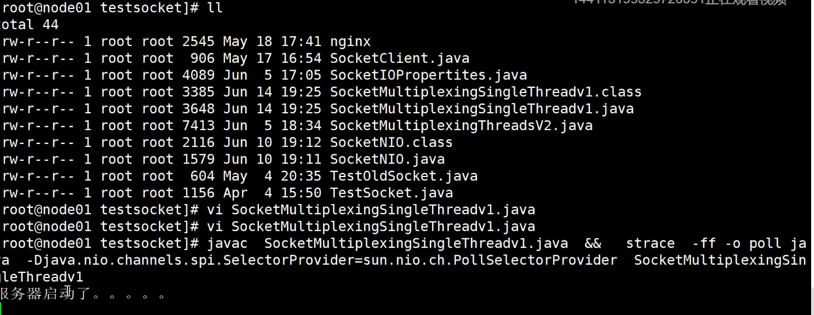

### **time_wait**  问题解释

修改close 方法

客户端已经断开，但是服务端没有断开，close_wait

**time_wait** 2MSL

### Java中select的实现，poll epoll 

> 验证不同多路复用器和Java代码中的对应关系

同一套代码： java NIO selector：poll epoll 的不同底层实现

strace 追踪 单线程多路复用，查看sc，验证，每个步骤涉及的系统调用,通过sc，**验证poll和epoll模型的关键点**

> 主要就是有状态fd的获取过程

**不带参数的时候选择epoll，实现多路复用器**

创建`epoll`，可以使用`lsof -op` 看到`epoll`文件描述

----

### 多线程和多路复用器

>  V1-1是在单线程中，首先是注册accept，当客户端链接是，是accept，注册读事件，当可读，注册写事件

v2 是多线程，读和写是在其他的线程

**key.cancel 是啥意思，蒙了？？**

df 约等于channel

**别蒙**,下面是解释

>  多线程情况下，不能阻塞执行，所以有可能同一个事件，重复消费，所以在处理之前，调用key.cancel,对应的系统调用就是epoll_ctl (n,del),注册是add

**再次解释**

我们为啥提出这个模型？

>  考虑资源利用，充分利用cpu核数
>
> 考虑有一个fd执行耗时，在一个线性里会阻塞后续FD的处理

**方案当有N个fd有R/W处理的时候：**

将N个FD 分组，每一组一个selector，将一个selector压到一个线程上

最好的线程数量是：cpu cpu*2

其实但看一个线程：里面有一个selector，有一部分FD，且他们是线性的

多个线程，他们在自己的cpu上执行，代表会有多个selector在并行，且线程内是线性的，最终是并行的fd被处理

但是，你得明白，还是一个selector中的fd要放到不同的线程并行，**从而造成canel调用嘛？ 不需要了**！！！

---


上边的逻辑其实就是分治，我的程序如果有100W个连接，如果有4个线程（selector），每个线程处理 250000

那么，**可不可以拿出一个线程的selector就只关注accpet ，然后把接受的客户端的FD，分配给其他线程的selector**

> 上面这个分治，不会导致cancel 吧 ？？？

IO thread 就是网络IO 数据的**读取和写**，其他的计算任务在其他的线程

**下节课，多线程对应多个selector**

### 总结

1. time_wait 问题，主要是客户端和服务端断开时的知识，通过启动和链接，使用netstat -natp lsof -op ，观察连接的状态，需要继续深入实验
2. 重点是理解，Java 中selector和os中的系统调用的关系，加深对poll和epool的系统
3. 单线程seletor处理accept 、read 、write
   1. 重点理解key.cancel 防止重复消费
   2. 为了减少cancel，将fd也就是链接，分配到不同的seletor，将selector分配到不同的线程，做到fd并行，在线程中不用cancel，减少sc
   3. 下节课多线程

### 问题

**边缘触发和水平触发 ？？netty ？？**

**衔接线程池 ？？？**

## 第七次 Netty之IO模型开发本质手写部分实现推导篇 

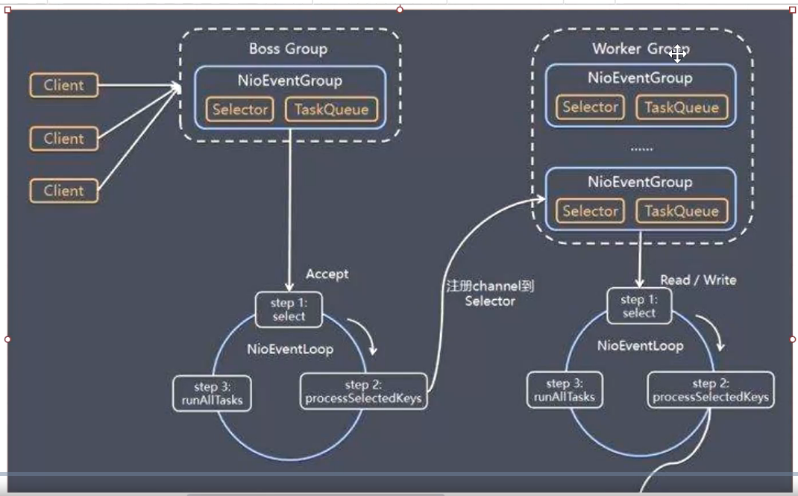

**IO Thread** 

**实现位置**


ByteBuf

什么是selector 

channel

**听不太明白**

**总结**

1. 多线程版本，Group，就是在一堆线程中，选择一个SelectorThread 添加监听事件或者，当有客户端连接的时候，从workGroup中选择一个SelectorThread，注册可读事件等等

2. BossGroup 和 WorkGroup的原型,一个线程组负责监听，一个线程组负责读写处理

3. 线程之间通信是通过LinkedBlockingQueued，完成交一个serveSokectChannel或者sokectChannel传递给其他的线程处理。

下面是代码的位置:

```Java
com.bjmashibing.system.io.testreactor
```

## 191 Netty之IO模型开发本质手写部分实现推导篇

MyNetty

简历可以添加精通IO

> 从NIO 多路复用  多线程 过度到 netty 的阶段，简单使用netty
>
> 使用netty 复习之前的概念，selector register handler
>
> 但是异步编程有点不理解需要回顾，reactor 模型

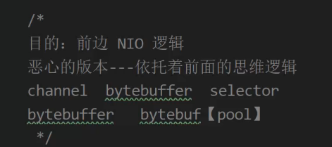


**reactor 模型 ，需要同步** ？？ 等待异步完成

**多路复用器和netty编程模式的比较**

**总体还是 accept ，client /  register client  TO selector  / 添加handler**

**NioEventLoopGroup ，就是线程池，能执行任务，也包含selector，能注册client和accept客户端链接**


## 196 全手写基于Netty的RPC框架自定义协议，连接池


##  问题

### 内存碎片化是什么意思

### MMU page 映射 

### 缺页异常处理过程

### 80 中断、上下文切换具体做了什么

### 操作加载和执行程序的过程

中断之后，内核处理，增加虚拟和物理的映射，用户态继续执行

## 推荐书籍

