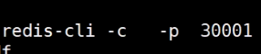

## 缓存和数据库的不同

之前都是在value上

**但是现在可以在key上**

## pipeline


## 冷启动

初始化redis中的数据

## 发布订阅


微信群的历史数据


实时的/历史的

redis的方案


## redis 事务

不能回滚，


多个客户端


单进程的事务比较好执行

exce 先到达，先执行

watch，乐观锁，相当于记录oldvalue


两个客户端同时操作一个key


## redis bloom 安装方式

下载 https://redis.io/modules


```
redis-server --loadmodule /path/to/redisbloom.so
```


## bf 、cf

多了 **bf**的命令

还有cf命令，可能是其他的过滤器

**redis 和 mysql 都没有的数据，都穿透到mysql**

bf解决这个问题

小空间解决大数据量，匹配的问题

## bloom 三种实现方式


## 其他的过滤器


> 需要真实有案例的支撑，这个缓存有啥区别

好像缓存是一部分

但是过滤器是全量的，过滤器的**构建和更新** ？？

什么时候初始化，更新过滤器？？

> 过滤器在真实的场景中的执行的时机？？持久层？？

## 过滤器的异常情况


出现了双写

## 缓存和数据库的区别

缓存知识**一部分**数据，数据库**全量**数据


> 查看配置文件

**有效期**，访问不会延长


### 过期淘汰的问题


**key的有效期**

可以在设置key是设置倒计时

也可以直接在exprire 或者exprireAT

**依靠redis的设置**

maxMemery 等等


**总结**

被动就是请求的时候，如果过期，则删除key，被动

主动轮训，上面说明


## 下节课


## 总结

1. redis也支持安装模块，在官网能找到很多，实例是bloom，过滤非法请求
2. 事务，开启和提交 mutil exec，发布和订阅
3. 过期的处理，主动和被动，配置

# 49 redis的持久化RDB、fork、copyonwrite、AOF、RDB&AOF混合使用

## RDB 的过程

阻塞，写入磁盘


非阻塞，还要能将数据落磁盘，问题是，增能保证快速将数据落到磁盘

1. 非阻塞，但是同时有主线程在修改数据，怎么解决？？
2. 主要是fork和cow机制，保证子线程的快速创建

> 但是不能让数据太大，如果太大，导致一次RDB需要很长的时间，失去这种意思，也就是一次同步还没有成功

### linux 中的管道

2. 前一个是后一个参数
3. 管道出发子进程

### 子进程是否能看到父进程的变量

父进程是可以让子进程看到


环境变量只是能看到

能看到但是能修改吗？？

子进程修改父进程的变量


**启动教程后台运行** ，在启动的命令后面添加 &，例如: `./test.sh`, 如下所示，子进程和父进程之间的变量管理

在子进程中修改父进程中的数据，是否能


**结论**：

父子进程中的数据是相互隔离的


创建子进程的速度应该是什么？**


1. 创建速度快，创建子进程时并不真实的复制父进程中的数据，只是父进程的指针数据
2. 隔离的实现

> **子进程创建的过程？？指针的作用，指针的cpoy**


RDB 的存储位置和存储名字


**弊端：**

1. 只有一个文件，不能保留历史数据，不支持拉链


>  主进程，对外服务，但是子进程负责将数据写到磁盘


## AOF

**redis的写操作记录到文件中**

优点

1. 丢失数据数少
2. AOF和RDB 可以同时开启，但是只用AOF恢复；AOF里包含RDB，增加新的AOF

缺点

1. 体量大，回复慢


## AOF 和IO 


**当子进程rewite的时候，主进程是否刷写磁盘**

## 实验

调整redis前台运行，查看文件

关闭RDB


- AOF文件协议解读
- 使用BGsave


RDB文件，以 REDIS开始的，二进制的


**BGREWRITEAOF,重写，AOF文件，**如果开启RDBM,则这个命令中，AOF在开始是RDB数据

增量明文，之后的数据

**如果FLUSHALL,之后再rewrite将丢失数据**，数据合并了

**删除FLUSHALL，恢复数据**，误操作恢复数据

**AOF rewrite 自动重写**


## 总结

1. 重点讲解两种Redis的持久化问题，AOF和RDB
2. AOF 保证数据不丢，但是还是受内核数据同步的影响，如果每次都同步，降低redis的高性能；可以配置
3. RDB，重点理解linxu中的fork和cow机制，子进程同步数据到磁盘，父进程在修改时cp数据在修改；
4. 各种命令bgsave / save/ 数据恢复

# 50 redis的集群：主从复制、CAP、PAXOS、cluster分片集群01


## 单机的问题


## AFK 


x:全量镜像

Y:按照功能存储数据

Z：优先级，逻辑在拆分，是在Y的基础上


问题：新的问题

一变多，数据的一致性的问题 ！！！


主阻塞，强一直性

强一致性破坏可用性

**为什么一变多**

解决，可用性的问题


**主从和主备的概念**

主从，从参与业务

主备，备不参与业务

42分钟

## CAP 原理

可用性和强一致性之间是不可能同时满足的

## Redis 复制

异步 高可用


## 实验

三个redis实例，

1. 前台阻塞运行，
2. 日志输出到屏幕
3. 使用RDB


启动的时候直接追随，增量追随


总结，

主和从之间的数据复制

挂掉之后，在启动需要自动追随，增量同步，这是在RDB模式

但是开启AOF模式，都是全量同步 在启动时添加参数，-- appendonly  yes

在主从模式的时候，主可以知道从的信息


**恢复为主**


另一个太在追随新的主。

所有的配置都是来自配置文件

**同步过程中是否对外服务**


右上角描述的是同步的过程，

1. 写磁盘，走网络同步
2. 直接走网络同步

**repl-diskless-sync no**  

yes表示直接走网络

no 表示走磁盘在走网络

**repl-backlog-size** 

表示队列的大小，方便增量同步


min-replicas-to-write  最小写成功事例

min-replicas-max-lag  不太清楚，

> 只是说，这两个配置，将整个集群向强一致性推


## 监控

http://redis.cn/topics/sentinel.html

**代替人去做监控**


**启动sentinel**


**server  --sentinel**

自动故障转移

一个sentinel 怎么知道其他的sentinel

**Psubsccribe** 


上面表示，sentinel之间的通信方式 ？？


这些只是集群方式的一种，没有解决容量的问题

## 总结

知识解决了单点故障的问题，但是没有解决容量的问题

# 53 redis的集群：主从复制、CAP、PAXOS、cluster分片集群02 

预期：spring.io spring-data-redis

单节点的三个问题，单点故障

**保证一个实例只需要管理几G的内存，保证轻盈**，主要是为了RDB的速度足够的快

故障转移

手动的故障转移，就是 no one ，+ 重新的追随

客户端融入逻辑，业务拆分，访问不同的人实例


无法按照业务拆分，取模，是**分片**或者数据**分治**


分片，sharing

取模，缺点，取模固定，模数固定，影响分布式的扩展问题

**modula**

---

**random/随机扔**


**场景说明，当做消息队列用，类似kafka**

客户端随机的添加到两个实例的同一个key中ooxx，每个都是list，每个都只有其中的一部分，lpush

另一端，随机从两个实例中rpop；

黄色说明

---

**一致性hash算法**，**另一种分片的方式**

> hash 算法 - 映射算法

hash环

**data和node同时参与运算 - 是和取模的区别**


hash 环的讲解


1. 映射node到环上，物理节点
2. hash的时候将data存储到距离最近的node

有自己的问题，新增节点，可能击穿到MYSQL，可以通过读取附近两个node解决

**虚拟节点：解决数据倾斜的问题**

在IP的后面增加 1 ,2,3,4等等


**上面 的方案都发生在客户端**，也有自己的问题


## server 端的链接大


将上面的客户端的逻辑迁移到了**proxy**中，客户端简单了

**proxy无状态，才能一边多**


**可以关注lvs**


**twemproxy** github 搜索

https://github.com/twitter/twemproxy 代理的实例，以上说明的实现


**代理实例**


## 小结

1. 容量问题的解决，在客户端，通过逻辑将数据分布到不同的实例
2. 重点是一致性hash算法分布数据，但是也有问题
3. 逻辑在客户端，所以服务端的链接的压力比较大
4. 通过VIP和proxy，将逻辑迁移到proxy中，proxy无状态，一边多


redis既能作为缓存也能作为数据库


## 预分区


**问题:但是这个槽位是怎么计算的呢？**


**hash tag**

自己将数据放在同一个节点，就可以完成聚合和事务

{xxx}k1 和 {xxx}k1 会hash 到同一个node，这样可以对{xxxx}**做聚合和事务

> redis的cluster 就可以实现

## 实验

https://blog.csdn.net/rebaic/article/details/76384028

git clone error

**yum install nss**


> 缺少文件，
>
> 1. epel ，阿里云，帮助，安装仓库
> 2. yum clean  cache


演示

1. twenproxy
2. predixy
3. redis cluster

> 前两个更向代理模式，第三个是可以连接到任何一个节点，如果没有，重定向到其他的节点
>
> 例如，发现当前节点没有，redirect到其他的节点，基于cluster中的每个节点都知道所有其他节点的槽位
>
> 需要是用redis-cliet -c 的客户端访问服务端，普通的直接报错





## 问题

1. PAXOS 好像没有怎么说
2. CAP又提，就是数据一致性和可用性，执行二选其一
3. cluster分片，重点是hash环算法，怎样将数据存储到每个节点，以及怎样读，如果新增节点会有穿透的问题
4. 预分配问题

# 54 redis开发：spring.data.redis、连接、序列化、high/low api 


## 击穿


>  背景，redis作为缓存，就再一个key刚好过期，高并发，同时访问一个key，导致大量的请求到达数据库 ？？

**问题：怎么防止击穿到数据库？**

1. redis 请求key，返回null
2. 客户端setnx ，锁争抢
3. 成功的到达数据，更新缓存
4. 如果获取锁的线程挂了，导致死锁；所以需要设置锁的过期时间；但是如果没有挂，锁超时，导致其他的线程继续请求
5. 所以多线程，一个请求，一个监控缓存是否更新，如果没有，更新锁的时间

**上面就是分布式协调**

## 穿透

>  条件：客户端查询的是DB中没有的，bloom

**解决方案：**

bloom 缺点，不能删除；删除设置为null

或者使用布谷鸟


在过滤器中知道DB中是否有这个信息

## 雪崩

大量的key同时失效，间接造成，大量的请求到达DB

**解决方案：**

随机过期时间


**注意：**

如果和时间没有关系，可以直接随机过期时间

但是如果必须在零点过期，可以使用击穿方案，第一个到达DB，更新缓存

或者业务中在零点随机sleep，等待缓存

## 总结

都是在各个环节，过滤流量，尽量不让流量到达DB

## 分布式锁


1. setnx
2. 过期时间
3. 多线程，更新过期时间

redisson。ZK 更合适作为分布式锁！！！

使用分布式，一定是关注一致性，而不是性能，所以zk比较合适


## 注意

搭建集群时


启动的时候添加cluster-enable yes 配置

## Spring data redis 使用方式

jedis

letucce

spring data redis


使用sentinel时需要制定主机名称

因为sentinel可以监控多套cluster 

### 链接配置

### API hight low

### 序列化


### redis 配置

`config get * ` 获取所有的配置

`config set  ` 零时设置属性，对是否支持远端访问

## 重点是序列化，对key的序列化和对hash value 的序列化

参考在实例代码中，需要重点关注

redis中存储的都是二级制，所谓的二进制安全还是需要安静的看看


secondaries.cn

