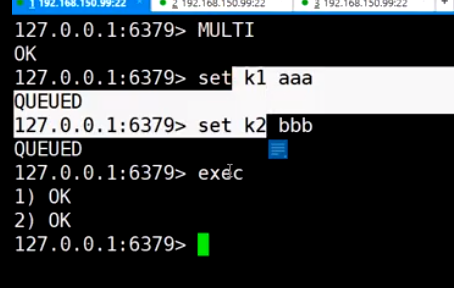
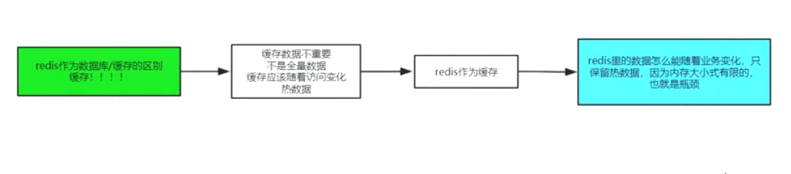

## 缓存和数据库的不同

之前都是在value上

**但是现在可以在key上**

## pipeline


## 冷启动

初始化redis中的数据

## 发布订阅


微信群的历史数据


实时的/历史的

redis的方案


## redis 事务

不能回滚，


多个客户端


单进程的事务比较好执行

exce 先到达，先执行

watch，乐观锁，相当于记录oldvalue




两个客户端同时操作一个key


## redis bloom 安装方式

下载 https://redis.io/modules


```
redis-server --loadmodule /path/to/redisbloom.so
```


## bf 、cf

多了 **bf**的命令

还有cf命令，可能是其他的过滤器

**redis 和 mysql 都没有的数据，都穿透到mysql**

bf解决这个问题

小空间解决大数据量，匹配的问题

## bloom 三种实现方式


## 其他的过滤器


> 需要真实有案例的支撑，这个缓存有啥区别

好像缓存是一部分

但是过滤器是全量的，过滤器的**构建和更新** ？？

什么时候初始化，更新过滤器？？

> 过滤器在真实的场景中的执行的时机？？持久层？？

## 过滤器的异常情况


出现了双写

## 缓存和数据库的区别

缓存知识**一部分**数据，数据库**全量**数据



> 查看配置文件

**有效期**，访问不会延长


### 过期淘汰的问题


**key的有效期**

可以在设置key是设置倒计时

也可以直接在exprire 或者exprireAT

**依靠redis的设置**

maxMemery 等等


**总结**

被动就是请求的时候，如果过期，则删除key，被动

主动轮训，上面说明


## 下节课


# 49 redis的持久化RDB、fork、copyonwrite、AOF、RDB&AOF混合使用

## RDB 的过程

阻塞，写入磁盘


非阻塞，还要能将数据落磁盘

### linux 中的管道

2. 前一个是后一个参数
3. 管道出发子进程

### 子进程是否能看到父进程的变量

父进程是可以让子进程看到


环境变量只是能看到

能看到但是能修改吗？？

子进程修改父进程的变量


后台运行 添加 &


**结论**：

**创建子进程的速度应该是什么？**


1. 创建速度快
2. 隔离的实现

