## 数据存储的发展

寻址或者读取速度常识：

- 磁盘：1，寻址：ms 2，带宽：G/M

- 内存：1，寻址：ns  2，带宽：很大

秒>毫秒>微秒>纳秒 `磁盘`比`内存`在寻址上慢了10W倍

I/O buffer：成本问题

磁盘与磁道，扇区，一扇区 `512Byte`带来一个成本变大：索引

`4K` 操作系统，无论你读多少，都是最少`4k`从磁盘拿，减少`IO`

> 4k 对齐的意义 ？？
>
> 8字节对齐的意义

>  磁盘格式化

## 文件系统 - MSYQL - redis

1. 文件系查询，需要全量便利整个文件

2. MYSQL创建索引，索引数据量较少，定位数据后才加载真正需要的数据，减少IO

3. Redis直接使用内存，存储，不需要IO；

4. 如果能将整个数据在内存中存储，且可以SQL存储，节省IO时间，比较完美，但是较贵，实例，HANA数据库

   > 但是redis只能存储部分的数据，没有全量的数据，所以不能使用SQL

### 随着文件变大，为什么访问会变慢（MYSQL）

> MYSQL 关系型数据库：创建表需要指定schema，提前指定了数据的存储字节宽度，存储倾向于行级存储。
>
> 1. 预占领空间，节省重新分配的时间
> 2. 构建索引，加速查询
> 3. 一次加载`4K`的数据


如果有索引，增删变慢，但是查询速度不一定

1. 如果是少量的查询，依然比较快
2. 但是大的并发下磁盘的带宽是瓶颈；【也就是请求到磁盘开始排队】

## 各种数据库介绍和排名的网站


**分类排名**


**详细介绍，各种参数，各种特性**

标书内容可以参考

**例如redis**


**每秒10w/ops**

##  redis 重要参考资料

https://redis.io/

http://www.redis.cn/

```
Redis 是一个开源（BSD许可）的，内存中的数据结构存储系统，它可以用作数据库、缓存和消息中间件。 它支持多种类型的数据结构，如 字符串（strings）， 散列（hashes）， 列表（lists）， 集合（sets）， 有序集合（sorted sets） 与范围查询， bitmaps， hyperloglogs 和 地理空间（geospatial） 索引半径查询。 Redis 内置了 复制（replication），LUA脚本（Lua scripting）， LRU驱动事件（LRU eviction），事务（transactions） 和不同级别的 磁盘持久化（persistence）， 并通过 Redis哨兵（Sentinel）和自动 分区（Cluster）提供高可用性（high availability）。
```

redis的数据类型指，key-value中value的数据类型


> memacache 只有String一种数据类型，所以他存储的是JSON??

## Redis中value类型的意义是什么？


`memcache`中获取数据需要将整个数据返回（必须经过`网络IO`），客户端解码，获取部分数据

但是`Redis`是将命令发送到`server`，`server`执行完，直接返回结果；

类型不重要，重要的是类型提供的方法

总结：`计算向数据移动`，计算方法在数据，只是返回少数的数据

> 1. memcache返回的value是所有的数据到客户端，server 网卡IO，client要有你实现的的代码去解码
> 2. 类型不是很重要，redis的server中对每种类型都有自己的方法，index，lpop

## Redis安装install

```
wget  http://download.redis.io/releases/redis-6.0.6.tar.gz
```

README ，查看安装方法

> 教程中使用5.X, centos6.x 当前不能安装6.x,报错；跳过，直接，yum install

参考 https://blog.csdn.net/luChenH/article/details/89947971

>  `tar  -vxf `; 缺少v,可以规避IO

redis 单进程 单线程 单实例

## **多个链接，一个线程能处理过来吗？**

连接数据走网卡，读写和内存差10w倍，所以除非每秒钟超过上线10W,所以一般是能处理的

如果算上走网卡，可能到7,8W

>  查看系统调用
>
> `man 2 socket `
>
> `yum install man man-page`

## Redis 中的 epoll

bio，调用bio阻塞线程，如果有多个请求，阻塞多个线程，等待客户端的数据发送；线程的成本1MB,

问题：

1. 调度成本
2. 内存成本


> 现在系统的条件都是有一下两个条件
>
> 1. 冯诺依曼架构
>
> 2. TCP和IP协议
>
>    以上限制，导致各种技术的出现


Socket 可以是`noblocking`的，IO ，调用之后不阻塞，还可以继续执行，一个线程就可以完成多个`fd`的读取；

在用户空间寻轮完成，多个`fd`的读写


**NIO ，同步非阻塞**

问题：socket调用不阻塞，nobloking

但是**系统调用**次数太多，内核发展，轮训放在内核中，select系统调用 【NIO问题】

**select** 系统调用，多路复用

`man 2 select `

select：`统一将所有的fds，传递给内核，返回有数据的fd，减少系统调用`；多路复用；减少内核态和用户态调用

问题:**内核和用户态调用，需要cp数据**【select 问题】

mmp【系统调用】，**内核和用户态共享，节省cp**

 


## sendfile


零CP的概念，**就是data不经过用户空间，直接在内核空间完成**

> 可以详细画图说明

## kafka 


1. 进入的数据使用mmap，将内核空间的数据映射到用户空间，节省cp的时间

2. 写出的时候使用的是sendfile（fd，fd2）**？？**

   > 可以详细了解这些系统调用

   

## Redis 架构


`Redis`单线程，从客户端发送的数据，会**被顺序的**执行；

**每连接内**，`多线程不能保证顺序`,对于一个key的操作在一个链接中完成

## 使用案例

默认16个库，0 1 2 使用  -n  配置链接的库

``` shell
[root@sec ~]# redis-cli -p 6379
127.0.0.1:6379> exit # 退出
[root@sec ~]# redis-cli 
127.0.0.1:6379> exit
[root@sec ~]# redis-cli
127.0.0.1:6379> set k1 aaa
OK
127.0.0.1:6379> get k1
"aaa"
127.0.0.1:6379> select 8 #选择8数据库
OK
127.0.0.1:6379[8]> get k1 # 在8 中获取不到k1
(nil)
127.0.0.1:6379[8]>
```


```shell
127.0.0.1:6379> help # 获取帮助
redis-cli 3.2.12
To get help about Redis commands type:
      "help @<group>" to get a list of commands in <group>
      "help <command>" for help on <command>
      "help <tab>" to get a list of possible help topics
      "quit" to exit

To set redis-cli perferences:
      ":set hints" enable online hints
      ":set nohints" disable online hints
Set your preferences in ~/.redisclirc

```

**help + tab** 查看帮助

获取分组的所有命令

```shell
127.0.0.1:6379> help @string

  APPEND key value
  summary: Append a value to a key
  since: 2.0.0
```

获取命令的帮助

```shell
127.0.0.1:6379> help GET

  GET key
  summary: Get the value of a key
  since: 1.0.0
  group: string
```


**NX后缀:没有出现才设置**     **XX后缀：只能更新**

多个线程使用一个redis的连接；

mset /mget

**正反向索引**

```shell
127.0.0.1:6379> get k1
"hello"
127.0.0.1:6379> APPEND k1 world
(integer) 10
127.0.0.1:6379> get k1
"helloworld"
127.0.0.1:6379> GETRANGE k1 0 -1
"helloworld"
127.0.0.1:6379> GETRANGE k1 5 -1
"world"
127.0.0.1:6379> 
```


```shell
127.0.0.1:6379> SETRANGE k1 5 " xiaoming"
(integer) 14
127.0.0.1:6379> get k1
"hello xiaoming"
127.0.0.1:6379
```


**key中有value的类型**

```shell
127.0.0.1:6379> STRLEN k1
(integer) 14
127.0.0.1:6379> get k1
"hello xiaoming"
127.0.0.1:6379> type k1
string
127.0.0.1:6379> set k2 99
OK
127.0.0.1:6379> type k2
string
127.0.0.1:6379>
```

注意：类型都是String

查看encoding

```shell
127.0.0.1:6379> object encoding k2
"int"
127.0.0.1:6379> object encoding k1
"raw"
127.0.0.1:6379>
```

>  object encoding k1

```shell
127.0.0.1:6379> INCRBY k2 1
(integer) 100
127.0.0.1:6379> get k2
"100"
127.0.0.1:6379> DECR k2
(integer) 99
127.0.0.1:6379> INCRBYFLOAT k2 0.3
"99.3"
127.0.0.1:6379> get k2
"99.3"
127.0.0.1:6379> 

```

https://blog.csdn.net/yunzhaji3762/article/details/109402082


## 二进制安全[??]

redis存储的是字节数据，没有编码信息 ？？

**字节**

https://www.jianshu.com/p/3e9ba97572ae/

https://segmentfault.com/a/1190000023130486

 ## MSETNX

```shell
127.0.0.1:6379> MSETNX k1 aa k3 44
(integer) 0
127.0.0.1:6379> get k1
"hello xiaoming"
127.0.0.1:6379> get k3
(nil)
127.0.0.1:6379>
```

>  原子，一个失败，所有失败

多连接会怎样 ??

## MYSQL

>  MYSQL 是使用BIO，磁盘IO 是瓶颈，所以不能让多个请求进入

## bitmap


## 为啥是ASCII，不是UTF-8 ??

``` shell
127.0.0.1:6379> get k1
(nil)
127.0.0.1:6379> setbit k1 1 1 # 设置第一位，为1
(integer) 0
127.0.0.1:6379> get k1
"@"
127.0.0.1:6379> setbit k1 7 1 # 设置第七位，为1
(integer) 0
127.0.0.1:6379> get k1
"A"
127.0.0.1:6379> set k1 9 1
(error) ERR syntax error
127.0.0.1:6379> setbit  k1 9 1 # 设置第九位，为1
(integer) 0
127.0.0.1:6379> get k1
"A@"
127.0.0.1:6379>
```

除了字符集 `ascii`，其他一般叫做扩展字符集

扩展： 其他字符集不在对`ascii`重编码 `0xxxxxxx`

你自己写一个程序，字节流读取，每字节判断

## redis-cli -raw 

似乎是使用客户端的编码解析字节数组，否则使用ascii

## BITCOUNT 

统计1出现次数，start和end指字节，字节 1出现的次数

```shell
127.0.0.1:6379> BITCOUNT k1 0 1
(integer) 3
127.0.0.1:6379> get k1
"A@"
127.0.0.1:6379> BITCOUNT k1 0 0
(integer) 2
127.0.0.1:6379> BITCOUNT k1 1 1
(integer) 1
127.0.0.1:6379> BITCOUNT k1 1 0
(integer) 0
127.0.0.1:6379> BITCOUNT k1 0 1
(integer) 3
127.0.0.1:6379> BITCOUNT k1 0 0
(integer) 2
```

## bitops


返回二进制位，是全量的，第一个出现的位置

## bitop

```shell
127.0.0.1:6379> HELP BITOP

  BITOP operation destkey key [key ...]
  summary: Perform bitwise operations between strings
  since: 2.6.0
  group: string

127.0.0.1:6379> setbit k2 2 1
(integer) 0
127.0.0.1:6379> BITOP and k3 k1 k2
(integer) 2
127.0.0.1:6379> get k3
"\x00\x00"
127.0.0.1:6379
```


## bitmap的应用场景

`setbit` `bitcount` `bitops` `bitop` 操作

1. 有用户系统，统计用户登录天数，且窗口随机

MYSQL: 一次登录日志记录至少需要8个字节

Redis：统计用户登录

```shell
127.0.0.1:6379> setbit sean 1 1 # 第一天
(integer) 0
127.0.0.1:6379> setbit sean 7 1 # 第七天
(integer) 0
127.0.0.1:6379> setbit sean 320 1 # 第320天
(integer) 0
127.0.0.1:6379> STRLEN sean
(integer) 41
127.0.0.1:6379> BITCOUNT sean -30 -1 # 后30天出勤天数
(integer) 1
```

**用户为key**

618做活动，登录送礼物，怎么备货

**活跃用户统计**，一段时间登录人

**日期为key**，每个人都是一个bit

```shell
127.0.0.1:6379> setbit 20200101 1 1 # 20200101 第一位表示的人出现
(integer) 0
127.0.0.1:6379> setbit 20200102 1 1 # 20200102 第一位表示的人出现
(integer) 0
127.0.0.1:6379> setbit 20200102 7 1 # 20200102 第七位表示的人出现
(integer) 0
127.0.0.1:6379> bitop or des 20200101 20200102 # 20200101 20200102 出现的人
(integer) 1
127.0.0.1:6379> BITCOUNT des
(integer) 2
127.0.0.1:6379> 
```

**key是天**


直接使用redis的位操作，代替MYSQL的记录，

1. 减少存储的量
2. 位运算速度快

## incr


incr 这种操作，可以在redis中完成，防止请求到达数据库，较少事务

## 了解不同的存储方式


## 总结

主要还是关于String相关的操作

bitmap的应用

## 第三课 list类型

value类型就是list

双向无环链表

`help @list`

## lrem 

``` shell
127.0.0.1:6379> lpush kk 2 a 
(integer) 2
127.0.0.1:6379> LRANGE kk 0 -1
1) "a"
2) "2"
127.0.0.1:6379> help LREM

  LREM key count value
  summary: Remove elements from a list
  since: 1.0.0
  group: list

127.0.0.1:6379> LREM kk 1 a
(integer) 1
127.0.0.1:6379> LRANGE kk 0 -1
1) "2"
127.0.0.1:6379>
```

## linsert

``` shell
127.0.0.1:6379> LRANGE kk 0 -1
1) "2"
127.0.0.1:6379> LINSERT kk after  2 00
(integer) 2
127.0.0.1:6379> LRANGE kk 0 -1
1) "2"
2) "00"
127.0.0.1:6379>
```

## llen

``` shell
127.0.0.1:6379> llen kk
(integer) 2
127.0.0.1:6379>
```

# Blpop

多个链接到一个server，如果执行blpop，如果不存在会阻塞

**支持，单播订阅**，FIFO


一个客户端

``` shell
127.0.0.1:6379> help blpop

  BLPOP key [key ...] timeout
  summary: Remove and get the first element in a list, or block until one is available
  since: 2.0.0
  group: list

127.0.0.1:6379> blpop cc 0
1) "cc"
2) "22"
(4.94s)
127.0.0.1:6379>
```

另一个客户端

``` shell
127.0.0.1:6379> lpush cc 22
(integer) 1
```


## LTRIM

删除两端的元素

# hash

对象存储

```shell
127.0.0.1:6379> set cc:name malome
OK
127.0.0.1:6379> set cc:age 99
OK
127.0.0.1:6379> get cc:name
"malome"
127.0.0.1:6379> get cc:age
"99"
127.0.0.1:6379> keys cc*
1) "cc:age"
2) "cc:name"
127.0.0.1:6379> hset cc name malone
(integer) 1
127.0.0.1:6379> hset cc age 22
(integer) 1
127.0.0.1:6379> hmget name age 
1) (nil)
127.0.0.1:6379> hmget cc age name
1) "22"
2) "malone"
127.0.0.1:6379> hkeys cc
1) "name"
2) "age"
127.0.0.1:6379> HVALS cc
1) "malone"
2) "22"
127.0.0.1:6379> hgetall cc
1) "name"
2) "malone"
3) "age"
4) "22"
127.0.0.1:6379> HINCRBYFLOAT cc age 0.5
"22.5"
127.0.0.1:6379> HVALS cc
1) "malone"
2) "22.5"
127.0.0.1:6379> HINCRBYFLOAT cc age -1
"21.5"
127.0.0.1:6379> hget cc age 
"21.5"
127.0.0.1:6379>
```

**应用场景，需要计算的**

# redis 主要应用

## 利用redis的sorted set实现排行榜功能

http://www.majianwei.com/archives/9279

https://zhuanlan.zhihu.com/p/29665317

http://blog.720ui.com/2016/redis_action_05_used/


## 缓存和数据库的不同

1. 缓存数据不重要；
2. 不是全量数据；
3. 缓存应该随着访问变化；
4. 热数据

**redis作为缓存**

redis里的数据怎么能随着业务变化，只保留热数据，因为内存大小式有限的，也就是瓶颈

**key的有效期**

1，会随着访问延长？**不对**！！

2，**发生写，会剔除过期时间** 对

3，倒计时，且，redis不能延长

4，定时

5，业务逻辑自己补全

> 设置key的过期时间，超过时间后，将会自动删除该key。在Redis的术语中一个key的相关超时是不确定的 超时后只有对key执行DEL命令或者SET命令或者GETSET时才会清除。
>
> 这意味着，从概念上讲所有改变key的值的操作都会使他清除。 例如，INCR递增key的值，执行LPUSH操作，或者用HSET改变hash的field所有这些操作都会触发删除动作 使用PERSIST命令可以清除超时，使其变成一个永久的key 如果key被RENAME命令修改，相关的超时时间会转移到新key上面 如果key被RENAME命令修改，比如原来就存在Key_A,然后调用RENAME Key_B Key_A命令，这时不管原来Key_A是永久的还是设置为超时的，都会由Key_B的有效期状态覆盖 对已经有过期时间的key执行EXPIRE操作，将会更新它的过期时间。有很多应用有这种业务场景，例如记录会话的session


> 过期判定原理：
>
> 1，被动访问时判定，
>
> 2，周期轮询判定（增量）?? ,少占用时间
>
> *，目的，稍微牺牲下内存，但是保住了redis性能为王！！！！

```shell
127.0.0.1:6379> set k1 aa
OK
127.0.0.1:6379> get k1
"aa"
127.0.0.1:6379> EXPIRE k1 20
(integer) 1
127.0.0.1:6379> ttl k1
(integer) 15
127.0.0.1:6379> set k1 dd
OK
127.0.0.1:6379> get k1
"dd"
127.0.0.1:6379> ttl k1 # 设置指清空时间
(integer) -1
127.0.0.1:6379>
```


**内存是有限，随着访问的变化，应该淘汰掉冷数据**

内存多大呢？通过  `maxmemory <bytes>` 设置

 `maxmemory-policy noeviction`  淘汰的策略

1. LFU  碰了多少次

2. LRU 多久没碰他


之前都是在value上

**但是现在可以在key上**

## pipeline

``` shell
[root@sec ~]# nc localhost 6379
keys * # 输入keys *
*1
$2
k1
^C
[root@sec ~]# echo -e "aa\nbb"
aa
bb
[root@sec ~]# echo -e "set dd 99\n incr dd\n get dd" | nc localhost 6379 # 注意空格
+OK
:100
$3
100
[root@sec ~]#
```


## 冷启

初始化redis中的数据

## 发布订阅


微信群的历史数据

实时的/历史的

redis的方案


通过监听

## redis 事务

不能回滚，


多个客户端

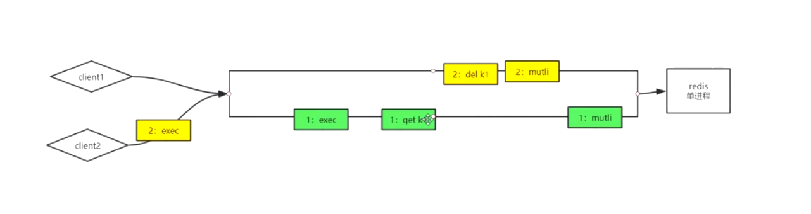

单进程的事务比较好执行

`exce` 先到达，先执行，`MULTI` 开启 `exec` 提交事务`


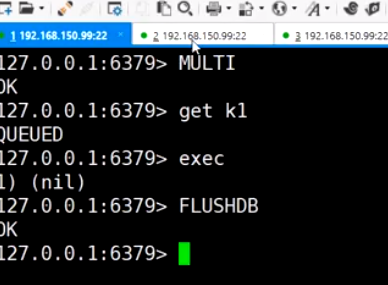

**两个客户端同时操作一个key**，实现类似cas乐观锁的功能

watch，乐观锁，相当于记录oldvalue


## Redis bloom 安装方式

下载 https://redis.io/modules  在redis的modules模块


```
redis-server --loadmodule /path/to/redisbloom.so
```

启动配置 `--loadmodule` 绝对路径

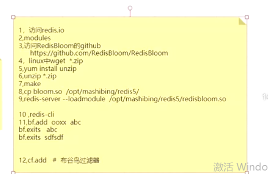

## 安装会后增加 bf 、cf命令

安装之后，多了 **bf**的命令；还有cf命令，可能是其他的过滤器

场景**redis 和 mysql 都没有的数据，都穿透到mysql**，bf解决这个问题

解释小空间解决大数据量，匹配的问题

## bloom 三种实现方式

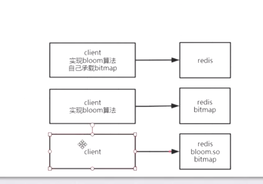

1. 完全在客户端完成
2. 算法在客户端，但是存储在redis bitmap
3. 算法和存储都在redis，bloom

## 其他的过滤器


> 需要真实有案例的支撑，这个缓存有啥区别

好像缓存是一部分

但是过滤器是全量的，过滤器的**构建和更新** ？？

什么时候初始化，更新过滤器？？

> 过滤器在真实的场景中的执行的时机？？持久层？？

## 过滤器的异常情况


出现了双写

## 缓存和数据库的区别

缓存知识**一部分**数据，数据库**全量**数据


> 查看配置文件

**有效期**，访问不会延长


### 过期淘汰的问题

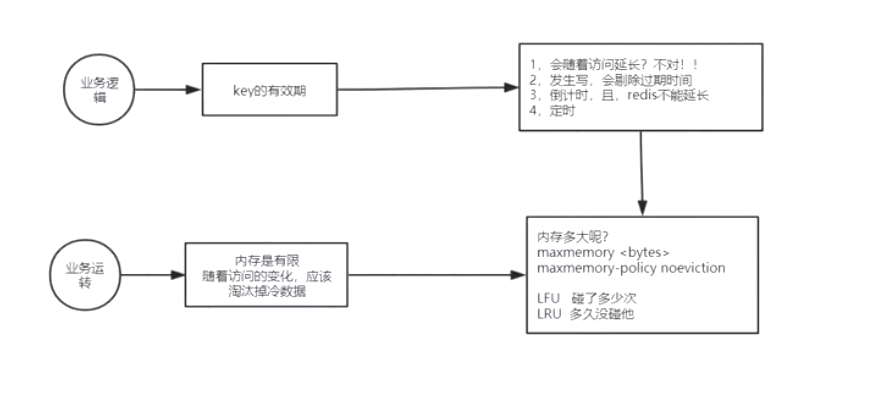

**key的有效期**

可以在设置key是设置倒计时

也可以直接在exprire【倒计时】 或者exprireAT【时间点】

**依靠redis的设置**

maxMemery 等等


**总结**

1. 被动就是请求的时候，如果过期，则删除key，被动

2. 主动轮训，上面说明，为了保住性能为王的目标，延迟key的删除，浪费一部分内存

   


## 下节课


## 总结

1. redis也支持安装模块，在官网能找到很多，实例是bloom，过滤非法请求
2. 事务，开启和提交 mutil exec，发布和订阅
3. 过期的处理，主动和被动，配置

# 49 redis的持久化RDB、fork、copyonwrite、AOF、RDB&AOF混合使用

## RDB 的过程

阻塞，写入磁盘

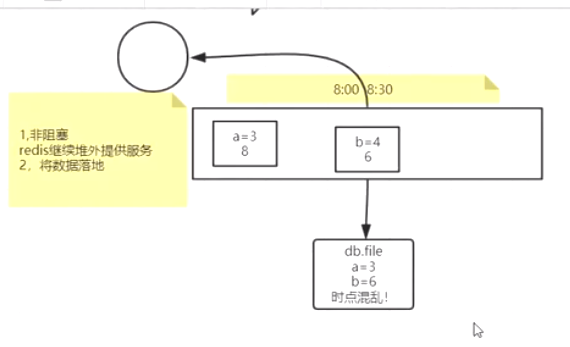

非阻塞，还要能将数据落磁盘，问题是，增能保证快速将数据落到磁盘

1. 非阻塞，但是同时有主线程在修改数据，怎么解决？？
2. 主要是fork和cow机制，保证子线程的快速创建

> 但是不能让数据太大，如果太大，导致一次RDB需要很长的时间，失去这种意思，也就是一次同步还没有成功

### linux 中的管道

2. 前一个是后一个参数
3. 管道出发子进程

### 子进程是否能看到父进程的变量

父进程是可以让子进程看到

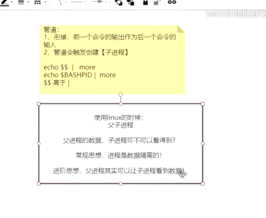

环境变量只是能看到

能看到但是能修改吗？？

子进程修改父进程的变量

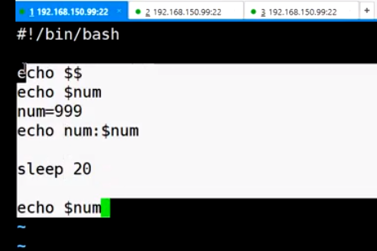

**启动教程后台运行** ，在启动的命令后面添加 &，例如: `./test.sh`, 如下所示，子进程和父进程之间的变量管理

在子进程中修改父进程中的数据，是否能


**结论**：

父子进程中的数据是相互隔离的


创建子进程的速度应该是什么？**


1. 创建速度快，创建子进程时并不真实的复制父进程中的数据，只是父进程的指针数据
2. 隔离的实现

> **子进程创建的过程？？指针的作用，指针的cpoy**

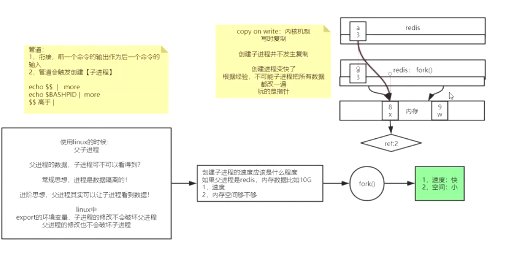


RDB 的存储位置和存储名字

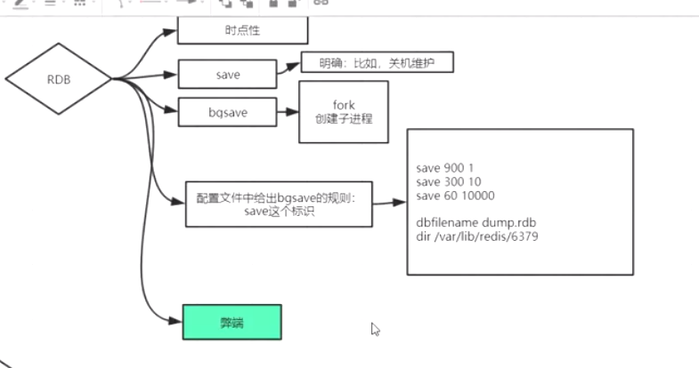

**弊端：**

1. 只有一个文件，不能保留历史数据，不支持拉链


>  主进程，对外服务，但是子进程负责将数据写到磁盘


## AOF

**redis的写操作记录到文件中**

优点

1. 丢失数据数少
2. AOF和RDB 可以同时开启，但是只用AOF恢复；AOF里包含RDB，增加新的AOF

缺点

1. 体量大，回复慢

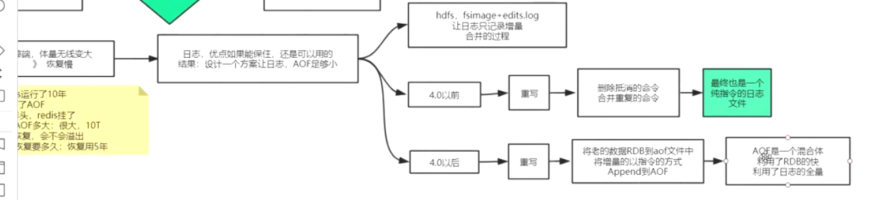


## AOF 和IO 


**当子进程rewite的时候，主进程是否刷写磁盘**

## 实验

调整redis前台运行，查看文件

关闭RDB


- AOF文件协议解读
- 使用BGsave

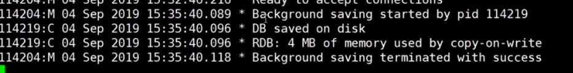

RDB文件，以 REDIS开始的，二进制的


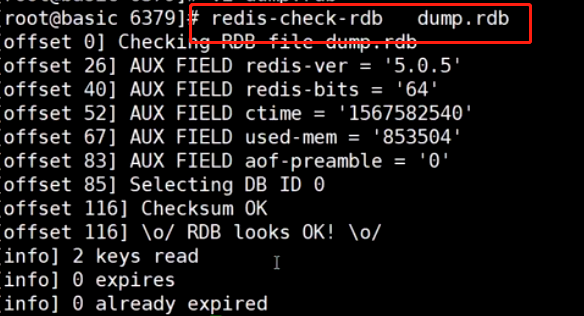

**BGREWRITEAOF,重写，AOF文件，**如果开启RDBM,则这个命令中，AOF在开始是RDB数据

增量明文，之后的数据

**如果FLUSHALL,之后再rewrite将丢失数据**，数据合并了

**删除FLUSHALL，恢复数据**，误操作恢复数据

**AOF rewrite 自动重写**


## 总结

1. 重点讲解两种Redis的持久化问题，AOF和RDB
2. AOF 保证数据不丢，但是还是受内核数据同步的影响，如果每次都同步，降低redis的高性能；可以配置
3. RDB，重点理解linxu中的fork和cow机制，子进程同步数据到磁盘，父进程在修改时cp数据在修改；
4. 各种命令bgsave / save/ 数据恢复

# 50 redis的集群：主从复制、CAP、PAXOS、cluster分片集群01


## 单机的问题

1. 单点故障
2. 容量有限
3. 压力太大

## AFK 拆分方法解决上面的问题


x:全量镜像，多部署几个实例

Y:按照功能存储数据，例如用户，商品等

Z：优先级，逻辑在拆分，是在Y的基础上，如果在一个功能，商品上继续分

问题：新的问题

一变多，数据的`一致性`的问题 ！！！


主阻塞，强一直性,但是强一致性破坏可用性

**为什么一变多** 为了解决可用性问题，又遇到了可用性问题，所以`可用性`和`一致性`不可兼得

CAP,所以只能是AP或者CP

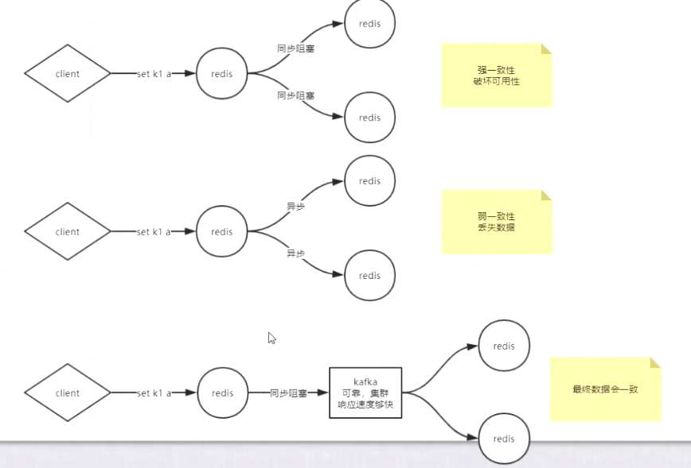


**主从和主备的概念**

主从，从参与业务

主备，备不参与业务

> 弱一致性表示

## CAP 原理

可用性和强一致性之间是不可能同时满足的

## Redis 复制

异步 高可用


## 实验

三个redis实例，

1. 前台阻塞运行，
2. 日志输出到屏幕
3. 使用RDB

`slaveof`  `replicaof`

**主从模式**

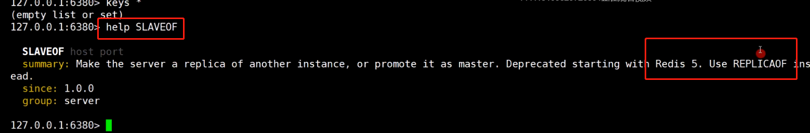

执行复制之后的日志

1. 显示罗RDB
2. 同步到另一台机器，6380

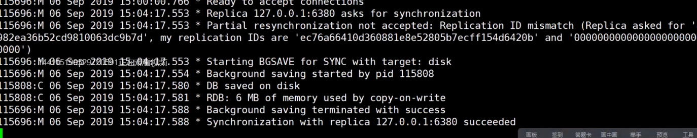

6379

1. flush 原来的数据
2. load 同步的RDB

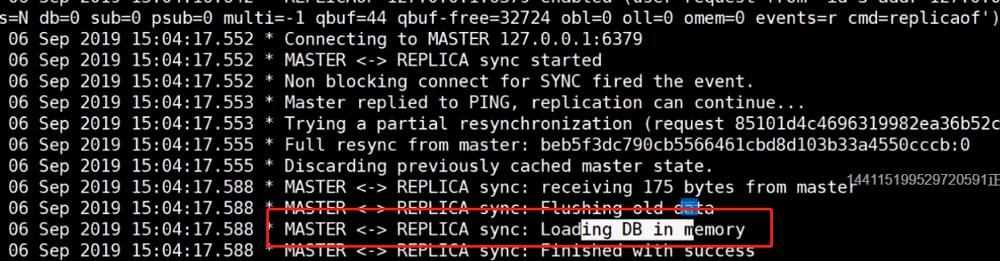

**启动的时候直接追随，增量追随**


总结，

主和从之间的数据复制

**挂掉之后**，再启动需要`自动`追随，增量同步，这是在`RDB`模式

但是开启`AOF`模式，都是全量同步 在启动时添加参数，`-- appendonly  yes`

在主从模式的时候，`主节点`可以知道从的信息

**将从变成主，故障转移**


**另一个节点追随新的主**。

所有的配置都是来自配置文件

**同步过程中是否对外服务**


右上角描述的是同步的过程，

1. 写磁盘，走网络同步
2. 直接走网络同步

**repl-diskless-sync no**  

yes表示直接走网络

no 表示走磁盘在走网络

**repl-backlog-size** 

表示队列的大小，方便增量同步


min-replicas-to-write  最小写成功事例

min-replicas-max-lag  不太清楚，

> 只是说，这两个配置，将整个集群向强一致性推


## 监控

http://redis.cn/topics/sentinel.html

**代替人去做监控**，监控的服务也是一个集群


**启动sentinel**


**server  --sentinel **# 添加 --sentinel参数启动服务时

目的是自动故障转移

一个sentinel 怎么知道其他的sentinel

**Psubsccribe** 


上面表示，sentinel之间的通信方式 ？？

因为一个sentinel可以监控多个redis集群或者主从，所以需要指定 分组的名字 `sentinel monitor mymaster 127.0.0.1 6381 2`

>  这些只是集群方式的一种，没有解决容量的问题

## 总结

知识解决了单点故障的问题，但是没有解决容量的问题

# 53 redis的集群：主从复制、CAP、PAXOS、cluster分片集群02 

预期：spring.io spring-data-redis

单节点的三个问题，单点故障、容量问题、压力问题

**保证一个实例只需要管理几G的内存，保证轻盈**，主要是为了`RDB`的速度足够的快

故障转移

手动的故障转移，就是 `no one`新主节点 ，+ `重新`的追随

> 以上步骤在sentinel中可以通过日志印证

客户端融入逻辑，业务拆分，访问不同的实例


无法按照业务拆分，取模，是**分片**或者数据**分治**


分片，sharing

取模，缺点，取模固定，模数固定，影响分布式的扩展问题，**增加节点需要重新取模**，重新确定节点，数据移动，每次都需要

**modula**

---

**random/随机扔**，随机放到一个实例

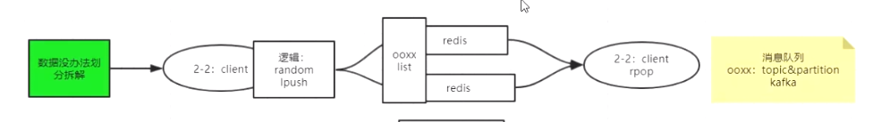

**场景说明，当做消息队列用，类似kafka**

客户端随机的添加到两个实例的同一个key中`ooxx`，每个都是list，每个都只有其中的一部分，lpush

另一端，随机从两个实例中rpop；

`黄色说明` ooxx 是kafka中的topic，而`partition`是分区的概念

---

**一致性hash算法**，**另一种分片的方式**

> hash 是一种算法 - 映射算法

hash环

**data和node同时参与运算 - 是和取模的区别**

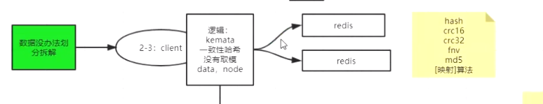

hash 环的讲解


1. 映射node到环上，物理节点
2. hash的时候将data存储到距离最近的node

有自己的问题，新增节点，可能击穿到MYSQL，可以通过读取附近两个node解决

**虚拟节点：解决数据倾斜的问题**

在`IP`的后面增加 1 ,2,3,4等等

**上面 的方案都发生在客户端**，也有自己的问题

## server 端的链接大


将上面的客户端的逻辑迁移到了**proxy**中，客户端简单了

连接数变少

**proxy无状态，才能一变多**

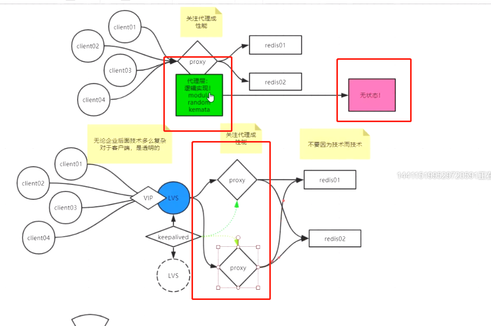

**可以关注lvs** VIP keepalived


**twemproxy** github 搜索 一种proxy

https://github.com/twitter/twemproxy 代理的实例，以上说明的实现


**代理实例**

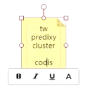


## 小结

1. 容量问题的解决，在客户端，通过逻辑将数据分布到不同的实例
2. 重点是一致性hash算法分布数据，但是也有问题
3. 逻辑在客户端，所以服务端的链接的压力比较大
4. 通过VIP和proxy，将逻辑迁移到proxy中，proxy无状态，一边多

redis既能作为缓存也能作为数据库

## 预分区


**问题:但是这个槽位是怎么计算的呢？**


**hash tag**

自己将数据放在同一个节点，就可以完成聚合和事务

{xxx}k1 和 {xxx}k1 会hash 到同一个node，这样可以对{xxxx}**做聚合和事务

> redis的cluster 就可以实现

## 实验

https://blog.csdn.net/rebaic/article/details/76384028

git clone error

**yum install nss**


> 缺少文件，
>
> 1. epel ，阿里云，帮助，安装仓库
> 2. yum clean  cache


演示

1. twenproxy
2. predixy
3. redis cluster

> 前两个更向代理模式，第三个是可以连接到任何一个节点，如果没有，重定向到其他的节点
>
> 例如，发现当前节点没有，redirect到其他的节点，基于cluster中的每个节点都知道所有其他节点的槽位
>
> 需要是用redis-cliet -c 的客户端访问服务端，普通的直接报错


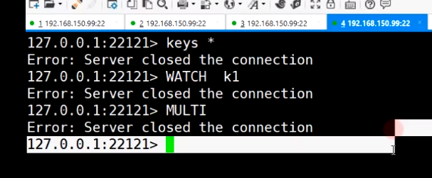


## 问题

1. PAXOS 好像没有怎么说
2. CAP有提，就是数据一致性和可用性，执行二选其一
3. cluster分片，重点是hash环算法，怎样将数据存储到每个节点，以及怎样读，如果新增节点会有穿透的问题
4. 预分配问题

# 54 redis开发：spring.data.redis、连接、序列化、high/low api 

>  面试常见问题：击穿、穿透、雪崩、分布式锁、API【序列化重点】

## 击穿

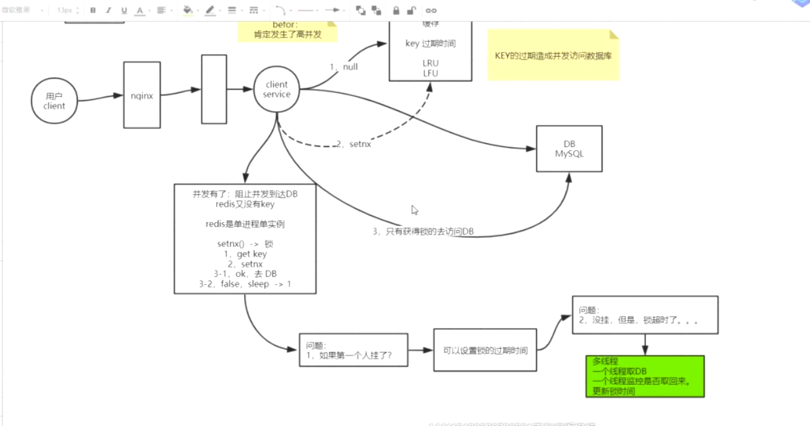

>  背景，redis作为缓存，就再一个key刚好过期，高并发，同时访问一个key，导致大量的请求到达数据库 ？？
>
>  目的是进过一些动作将所有的请求过滤，到达DB只是少部分请求

**问题：怎么防止击穿到数据库？**

1. redis 请求key，返回null
2. 客户端setnx ，锁争抢
3. 成功的到达数据，更新缓存
4. 如果获取锁的线程挂了，导致死锁；所以需要设置锁的过期时间；但是如果没有挂，锁超时，导致其他的线程继续请求
5. 所以多线程，一个请求，一个监控缓存是否更新，如果没有，更新锁的时间

**上面就是分布式协调**

## 穿透

>  条件：客户端查询的是DB中没有的，bloom

**解决方案：**

bloom 缺点，不能删除；删除设置为null

或者使用布谷鸟

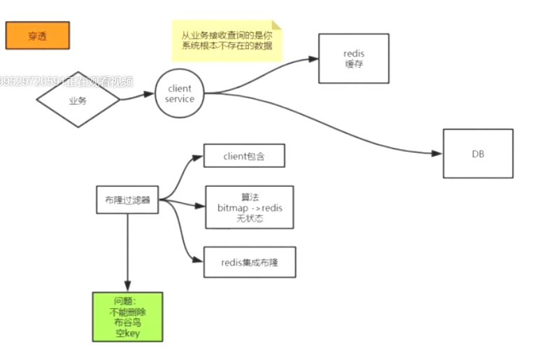

在过滤器中知道DB中是否有这个信息

## 雪崩

大量的key同时失效，间接造成，大量的请求到达DB

**解决方案：**

随机过期时间


**注意：**

如果和时间没有关系，可以直接随机过期时间

但是如果必须在零点过期，可以使用击穿方案，第一个到达DB，更新缓存

或者业务中在零点随机sleep，等待缓存

## 总结

都是在各个环节，过滤流量，尽量不让流量到达DB

## 分布式锁


1. setnx
2. 过期时间
3. 多线程，更新过期时间

redisson。ZK 更合适作为分布式锁！！！

使用分布式，一定是关注一致性，而不是性能，所以zk比较合适


## 注意

搭建集群时


启动的时候添加cluster-enable yes 配置

## Spring data redis 使用方式

jedis

letucce

spring data redis

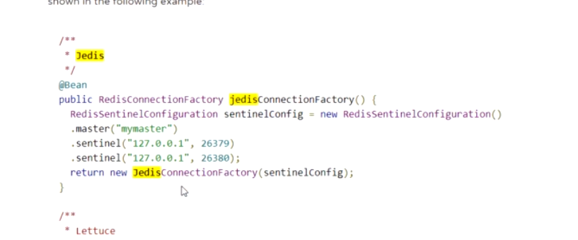

使用sentinel时需要制定主机名称

因为sentinel可以监控多套cluster 

### 链接配置

### API hight low

### 序列化

### redis 配置

`config get * ` 获取所有的配置

`config set  ` 零时设置属性，对是否支持远端访问

## 重点是序列化，对key的序列化和对hash value 的序列化

参考在实例代码中，需要重点关注

redis中存储的都是二级制，所谓的二进制安全还是需要安静的看看


##  敖丙系列

- [避免缓存击穿的利器之BloomFilter](https://juejin.im/post/6844903982209449991)
- nginx 对IP访问添加限制，防止攻击；参数校验防止放置击穿

## 常见问题

## 常见面试题

- http://www.gameboys.cn/article/57
- https://zhuanlan.zhihu.com/p/91539644 敖丙系列
- https://www.imooc.com/article/36399
- https://github.com/Snailclimb/JavaGuide/blob/master/docs/database/Redis/redis-all.md Javaguide

## 学习资料

https://kaiwu.lagou.com/course/courseInfo.htm?courseId=6&sid=60-h5Url-0&buyFrom=2&pageId=1pz4#/content?courseId=6&isShowSections=true

# 参考

- https://blog.csdn.net/truelove12358/article/details/105692909/  磁盘和内存的读写速度对比
- www.secondaries.cn 笔记
- https://blog.csdn.net/qq_42583242/category_10395561.html 详细整理笔记
- https://www.cnblogs.com/littlepage/category/1348327.html 更多笔记
- [敖丙redis笔记](https://aobing.blog.csdn.net/article/details/103004235?utm_medium=distribute.pc_relevant.none-task-blog-2%7Edefault%7EBlogCommendFromMachineLearnPai2%7Edefault-13.control&dist_request_id=1328740.25197.16169002725043873&depth_1-utm_source=distribute.pc_relevant.none-task-blog-2%7Edefault%7EBlogCommendFromMachineLearnPai2%7Edefault-13.control)
- https://blog.csdn.net/rebaic/article/details/76384028 predixy 介绍
- http://redis.cn/documentation.html 中文官网
- http://www.secondaries.cn/2019/09/03/Redis%E5%88%9D%E8%AF%86/#%E8%AF%BE%E5%89%8D%E5%9F%BA%E7%A1%80%E7%9F%A5%E8%AF%86  笔记
- 导入processon的图
- https://yuzhouwan.com/posts/2129/ 博客
- https://blog.csdn.net/gx17864373822/article/details/105412058 教程图
- https://blog.csdn.net/weixin_42174815/article/month/2020/08 redis的前生
- https://www.bilibili.com/video/av90121616 马士兵教育专属 周老师讲：炸天的分布式，redis、zk、kafka、hbase