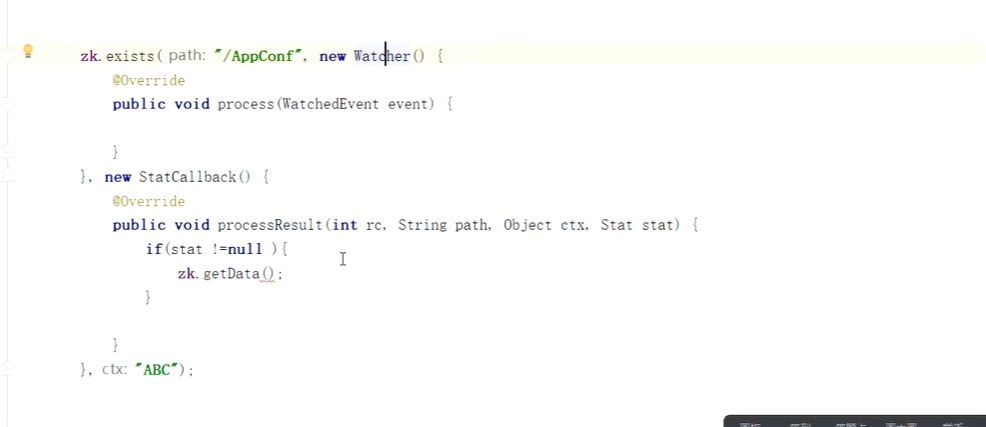

  

zk中分布式锁，是为了解决透传，redis中，分布式协调

# zk 分布式协调

https://zookeeper.apache.org/

一下内容来自

https://zookeeper.apache.org/doc/r3.7.0/zookeeperOver.html

原语:zk提供的,可以完成那些问题

集群要不是分片集群或者有主的集群

zk是有主的集群

zk中的集群的数据一样

`主从集群`架构，主从集群，写发生在主，读发生在从上

选主，过程

> leader 挂，不可用，不可靠，`zk`集群及其高可用
>
> 如果有一种方式可以快速的恢复一个leader

两种状态

1. 可用
2. 不可用

> 恢复为可用状态越快越好

官方压测，`200ms`恢复

**节点可以存储的数据为1M**，为了保证高性能

不把zk当做数据库用

zk是目录树结构；node可以存储数据1MB

1. 持久节点
2. 零时节点

zk 客户端有session关联；类似tomcat；session有创建和消亡

session 的目的是什么？

session 在锁就再，session不在锁就释放了，也就是节点，是零时节点

**两种节点**，都支持序列化

**顺序性**，简单地主从，主从模型保证

**最终一致性**

## 安装

安装java 

jps

wget zk ；基于java

zoo.cfg  默认配置文件名

配置文件的详细说明

在配置文件中完整的配置，集群的所有节点，但是Redis是通过发布订阅的模式知道其他的节点的

初始选主是钱让出来的，选择编号最大的，过半参与就可以， 3 或者4

node1 配置好了，直接scp -p 到其他的节点

在持久化的目录中写，myid文件，填id号

实验中一共是四台机器

每个node的myid不一样

添加zk到profile

`source profile`

## 启动

按照 1  2 3  4 启动

`zkServer.sh help `

zkServer.sh start // 前台启动，产看日志方便

zkServer.sh status 可以产看是否leader

> 启动后和leader同步，4最后启动，编号最大，但是是f

zkclient 默认连接本地

help 查看帮助

ls /

create  /xxx  ""

ls /

get /xxx

set /xxxx "aaa"

get /xxxx

czxid:create  64字节

前32：leader的纪元

后32：事务id

mzxid:修改编号

pzxid: 记录当前节点下最后一个节点创建的编号

create -e // 创建零时节点

owner id 和 session id 的关系

零时节点和session 同步，session消失，零时节点消失

 连接的sever 挂了，但是session继续存在，是因为session也是`统一视图`

> zk 内部的动作，比如同步也是消耗事务id的；连接同步session ，消耗id

session 也消耗 id

对一个节点创建

create -s  // 分布式下防止覆盖

`统一命名`

分布式id，分布式命名

rmr path

删除创建，继续递增

---

选举投票使用一个端口

zk的选举过程

1. 3888 两两通信
2. 只要任何人投投票，都会触发那个准leader发起自己的投票
3. 推选制：先比较zxid，如果zxid相同，在提交myid

> 不考虑网络演示，大部分是网络没有延迟，只选择myid最大的
>
> 如果因为技术而技术很难设计出来

zk 2 node 不可以对外服务，leader 选不出，

# watch

统一视图，数据一致

目录结构

同步两个客户端，代替心跳

通过session，消失，产生事件，create delete change children ，回到wathc的callback

> 方向性和时效性 -> 比心跳及时

**但是怎么实现的呢 ？**

**线程池和连接池的关系**

1. 验证，链接node，挂掉，session迁移，session id 不变，watch是session级别，所有事件都能监控到
2. wath 一次性的，需要重复注册
3. 回调方法，快速通过，再回调

# 分布式协调

> 分布式配置，分布式锁【热点】
>
> 通过分布式式锁，考察能力，很多的知识点，

## 分布式配置

> 配置变更
>
> 大量获取配置信息

1. get
2. watch，变化回调

回调嵌套

回调

删除node，回调，数据置空，cd初始化，客户端继续等待数据

喷喷

**分布式锁**

>  两个节点，两个线程，同步执行

分布式定时任务，redis 是有单点问题，持久化，导致慢等等

争抢锁，一个能获得所

> watch 

# 参考

- https://gitbook.cn/books/5ef47a1690c794640abd37d4/index.html gitchat