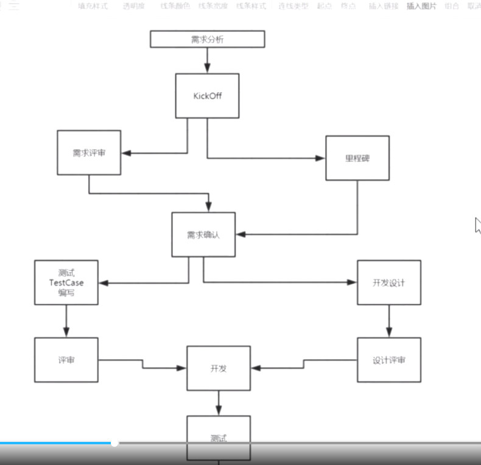
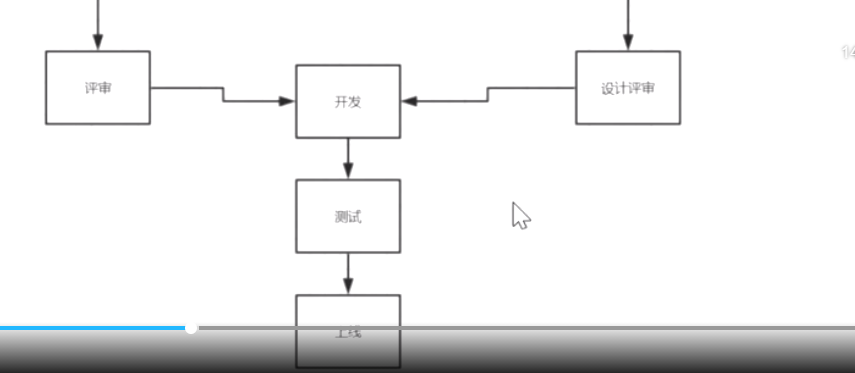
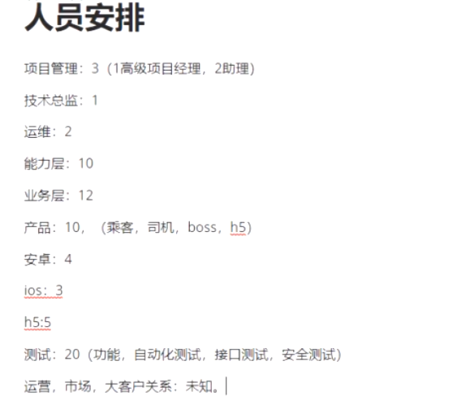
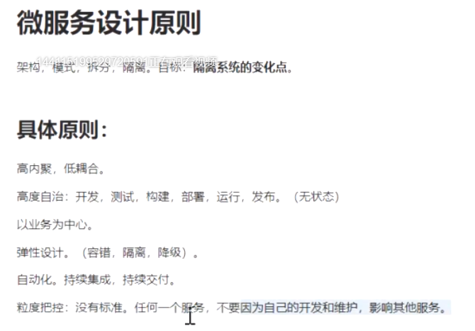
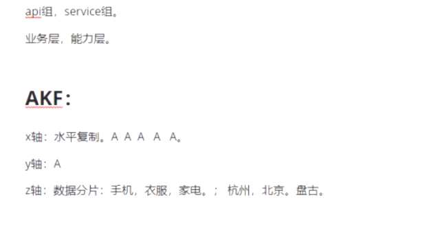
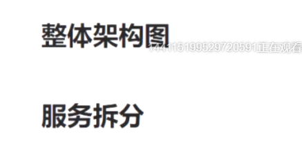

# 重点

最主要是找自己在项目中的亮点，可以分享的点，自己的思考

技术方面的尝试，人员管理方面的尝试

---

高并发在活动营销系统中，广告系统中，包括秒杀

其他的特殊的业务场景也可以引入技术

---

##  如何带团队

 https://xie.infoq.cn/article/85feabaaff3f9e1b128efed29

网约车，一个真实项目的过程

主要学习的内容

1. 学习需求的梳理过
2. 学习重要的技术点，哈哈哈
3. 学习单元测试的使用
4. 每天看两集争取月底看完，自己总结

---

41 项目概述-项目启动-人员安排-需求分析（乘客端、司机端、BOSS端）-设计原则 [地址](https://ke.qq.com/webcourse/index.html#cid=398381&term_id=100558952&taid=4185823587472429&type=1024&vid=5285890803030233222)

42 服务如何拆分-接口层设计-能力层设计-基础层设计-公共模块设计-第三方技术-接口设计-接口安全 [地址](https://ke.qq.com/webcourse/index.html#cid=398381&term_id=100558952&taid=4185827882439725&type=1024)

43 单体项目工程设计-异常处理-Spring Cloud技术架构图-网约车业务架构图-注册中心搭建-eureka生产优化（自我保护测算，三级缓存） [地址](https://ke.qq.com/webcourse/index.html#cid=398381&term_id=100558952&taid=4185832177407021&type=1024&vid=5285890803296934101)

---

# 需求分析

## 项目开发过程

**沟通不畅怎么办？？**

## 面试

1. 人员管理方式、绩效制定

## 人员安排

## 你在项目中的职责

## 项目中遇到的主要问题

- 恶意短信轰炸问题

## 项目拆分原则

**隔离系统变化点**

将变和不变的分开

**Z轴**，分片，数据分片，例如北京、上海的数据分开存储

> 详细了解

## 下节课预告

