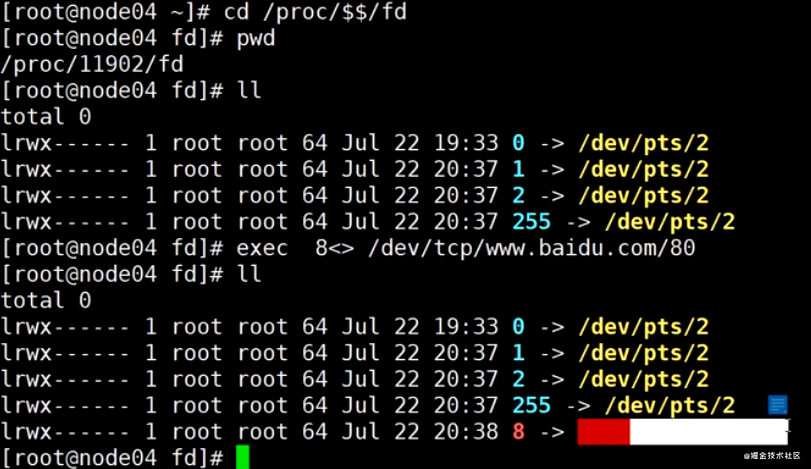
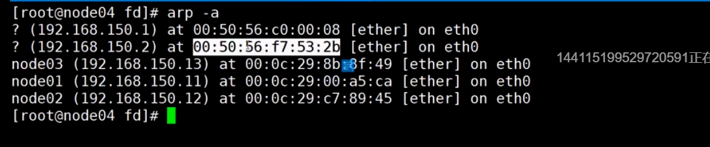

# 24 高并发负载均衡：网络协议原理

## 高并发发生在营销阶段

高并发时真的；统计投广告的地方，转化率

平台可以卖给商家数据，告诉他们为什么低，为什么

> 主要解决对高并发的迷信，以为小公司就没有高并发；在小的公司都有可能发生
>
> 1. 小公司也需要做营销，秒杀活动
> 2. 营销活动可能用到大数据，都是可以实践的点

##  网络通信 

软件工程学，分层解耦，**容易优化**，**单独进化** OSI参考模型

控制层协议：TCP/IP 协议

应用层协议：SMTP HTTP FTP

协议到底是什么意思

先建立连接
在这个基础上，传递规定的内容

输出到文件fd 8

`cat 0 <& 8`

---

每一层都有协议，TCP 是传输控制层;UDP

面向连接的，三次握手和四次分手，三次握手没有应用层的事，只是在内核中创建资源;

四次分手，消息 + ack + 消息 + ack

ACK 只是说我收到了消息，并不是说要**断开**，随机等一个时间，在断开连接

> 在内核中通过前期的通信，分配资源，这个叫面向连接，同时四次分手，确定销毁资源；

开辟资源之后用完要回收，**端口也是资源**，

三次握手 - 》 数据传输 -》 四次分手

>  以上过程是最小粒度，不可分割

## 连接的建立

> 建立链接是在内核中发生的，是在四层以下发生的，对应用层不可知，应用层等着使用就行；

`natstat -natp` 查看和本地创建的连接，如下如所示

上图客户端xshell 和 服务端建立三个连接，服务是同一个端22，服务端使用三个不同的端口，**IP:port - IP:port** 唯一

> 先建立连接，也就是通过三次发送数据，确认连接建立，也就是分配了对应的资源。应用层开始发送数据，发送完成释放分配的资源。

>  好像和我们没有关系，但是如果网络学习好，学习service mesh比较好

## 网络层

> 思科 CCIE CCNP

> IP ，点分字节 255.255.255.255 一共32位，四个字节，一个字节8位，每个字节能表示的最大二进制数就是255

上图是和网络通信中最相关IP 、netmask、gateway、DNS

netmask用来计算网络号，和IP做与运算。

>  掩码，和IP 与运算，得到网络号

下面是路由条目

`route -n`

> 网络通信模式，一种是知道所有节点的数据，计算一个路径，一种第只知道附近的数据，只计算下一跳的节点的，这个节点是在同一网络的，修改mac能到这个节点。一跳一跳的到达目标IP；
>
> 计算是继续下一跳还是进入某一个网络，是和网关的IP比较是发同一个网络，如果是说明已经到了，修改MAC，发送到目的地址

## **下一条的机制**

> 只需要存储自己周边的数据。实验，

不是在每一个节点存储所有的节点信息，在

默认网关，发送数据到，默认网关，先和genmask做与运算，找到默认网关

如上所列出的条目是计算网关，

出局域网:

局域网内：

`GateWay`， `0.0.0.0` 表示同一局域网

网络层就是找到下一跳

链路层，在`IP`之外，添加MAC地址

`arp  -a ` ARP协议，获取周围IP和MAC映射关系

**ARP**: 获取局域网中各个机器IP和mac地址对应关系，发生在网络通信之前

>  网络报中包括，目标IP,源IP,目标mac,源mac

**每一跳，IP不变，mac修改**

通过**IP**和**子网掩码**计算 **网关**，也就是下一跳

学习**配置路由表**，**创建虚拟网卡**

数据包在跳动时，**mac发生变化**，IP 和端口不发生变化

>  经过路由修改的是目标Mac，mac是链路层封装的，IP是网络层封装的，确定下一跳IP【路由表】，在通过链路层，确定下一跳mac地址

路由判断和配置

**网关**一定是同一局域网的一个主机

5G只是末端接入技术，塔和设备之间接入的速度高了

# 25 高并发负载均衡：LVS的DR,TUN,NAT模型推导

链路层

路由器有多个网口，一个对外，一个对内 多网卡

知道下一跳，是通过路由判定

知道IP怎么得到下一跳的mac地址

ARP协议，获得，周围机器的IP和mac地址

通过发送ARP包，包中的内容如下:

- 目标IP地址为网关，**mac地址为#FFFFFF**,原IP地址为自己，

- 交换机判断目标mac为#FFFFFF,会将这个包广播，收到包的机器判断是否发送给自己，如果是自己就回送mac地址。

- 解决点和点之间的通信
- 端口是找到节点之后具体给那个app
- IP表示服务器，寻找下一跳的节点
- mac表示下一跳mac，不能出局域网

**mac地址每一跳都变化**，目标和原mac都变化

---

负载均衡可能是个节点，四层负载均衡，负载**没有握手**，直接转发数据包；偷窥，只查看不修改

LVS 是 四层负载，没有握手，只是**转发数据包**，【根据什么转发】

为什么块，LVS 必须是快的？

LVS 是接受流量的，server是接受链接的hold链接？

LVS 【四层】							NGINX【七层】

**不是一个完整的四层，只是偷窥，因为没有回复四层的包**；

拓扑做物理实现，

语义和语境

VIP，虚拟IP，一个点，DIP【目标IP】，RIP【实际服务IP】，CIP【客户端IP】

CIP 固定访问VIP，CIP -> VIP

LVS 负载的过程，处理

---

##  怎么上网

NAT,在路由上，一口链接ISP，ISP分配一个IP，公网，运营商。

公网地址和私网地址，私网不会出现在公网

通过NAT，将私有系统翻译成功公网地址，路由地址

翻译之后的访问映射，可能相同，通过映射处理冲突

> 出局域网，原IP地址修改为gw，多个局域网服务，冲突，如何处理，NAT 路由器，映射局域

修改原地址，S-NAT，上网所用，SIP

**D-NAT** ,负载均衡，在LVS修改目标地址为,RIP,修改目标地址，做负载均衡

去的时候修改，**回的时候也是需要修改**，要不消息回不去

通信的时候是**非对称**的，**客户端给服务端是很小的，但是服务端给客户端是很大的**。

服务器带宽是瓶颈，算力也是

**如果回去不进过NAT转化，就可以？？**

直接从RIP 返回到CIP

要从VIP -> CIP

后面的机器也有VIP，但是不暴露

有IP，但是还不让其他人不知道

隐藏VIP，对外影藏，对内可见，为了直接构造VIP -> CIP

---

没有修改IP，修改MAC

**MAC 是节点节点的**，不能跨网络。

LVS 和 RIP 不能跨网络，基于二层的，**MAC地址欺骗**

速度极快，成本低

环形通信，直接回去

---

NAT 基于 修改IP

DR是基于二层，修改MAC

 

四层负载均衡，**只看IP**，直接转发，在第四层

CRC校验

修改原地址 S-NET

D-NET，目标地址转化

非对称

自行车 到 汽车

不经过D-NET 服务器

---

**直接返回，不经过D-NET 服务器，对外隐藏，对内可见**

**来和回不是一条路**

IP 是端到端的

mac是下一跳的

DR 模型，直接路由

---

**IP 包背着 IP 包**

**LVS**

# 26 高并发负载均衡：LVS的DR模型试验搭建 

NAT 转化

RS 的GW 必须是负载均衡

---

DR ,要在同一个局域网，数据中心，使用最多的

---

TUN 模型，不在同一个机房

> 理解隧道

想去旅游怎么去，门 到 西站， 隧道，背着你

DIP  -> RIP 数据包背着数据包，**解决物理位置限制的问题**

**IP 的数据包背着**,PPOE,VPN

---

LVS 1998年5月 

四层以下都是kernal

**一个网卡 多个IP**

**虚拟IP配置在lloopback接口上**

**内核也要调整**

## lvs 调度算法

**偷窥能力 - 只看不动手**

>  通过偷窥能知道和后端服务建立链接的个数，握手和分手包的偷窥知道的

自带ipvs

ipvsadm 

# 参考

- https://blog.csdn.net/sinat_42483341/category_10278149.html

## 趣谈网络协议

# 第1讲 | 为什么要学习网络协议？

是人类和计算机沟通的协议，只有通过这种协议，计算机才知道我们想让它做什么。

交给一台计算机做事，需要懂计算机语言，但是交给一群计算机需要懂网络协议

## 问题

- 当网络包到达一个城关的时候，可以通过路由表得到下一个城关的 IP 地址，直接通过 IP 地址找就可以了，为什么还要通过本地的 MAC 地址呢？

# 第2讲 | 网络分层的真实含义是什么？

- 网络分层的原因
- 网络不同之间的关系，已经每层到底是什么功能

## 网络为什么要分层

- 复杂的东西都需要分层
- 想象自己是一个处理网络数据Buffer的，有多个端口，从一个端口拿到数据，**自己处理之后**，在从另一个端口送出
- 这个处理的程序比较复杂时，就需要分层，分而治之，应用层的app也是分层

## 处理程序是如何工作的？

- MAC p2 是否发个自己

- p3 判断是转发还是发给自己的

  > IP 是自己就是发个自己的，不是就是要求转发

- P4  如果是发起或者应答，接下来可能要发送一个回复包；如果是一个正常的数据包，就需要交给上层了

- P5 通过端口号 交给app

---

TCP 添加原端口号和目标端口号

IP 添加sip 和 dip

mac Dmac和Smac

# 揭秘层与层之间的关系

这里要记住一点：**只要是在网络上跑的包，都是完整的。可以有下层没上层，绝对不可能有上层没下层。**

所以，**对 TCP 协议来说，三次握手也好，重试也好，只要想发出去包，就要有 IP 层和 MAC 层，不然是发不出去的**。

**上层带着下层**

## 问题

- 如果你也觉得总经理和员工的比喻不恰当，你有更恰当的比喻吗？

- 要想学习网络协议，IP 这个概念是最最基本的，那你知道如何查看 IP 地址吗？

# 第3讲 | ifconfig：最熟悉又陌生的命令行

## 无类型域间选路（CIDR）

**10.100.122.2/24**，这个 IP 地址中有一个斜杠，斜杠后面有个数字 24。这种地址表示形式，就是 CIDR

网络号。**将子网掩码和 IP 地址按位计算 AND，就可得到网络号**

## 公有 IP 地址和私有 IP 地址

不需要将十进制转换为二进制 32 位，就能明显看出 192.168.0 是网络号，后面是主机号。而整个网络里面的第一个地址 192.168.0.1，往往就是你这个私有网络的出口地址。

例如，你家里的电脑连接 Wi-Fi，Wi-Fi 路由器的地址就是 192.168.0.1，而 192.168.0.255 就是广播地址。一旦发送这个地址，整个 192.168.0 网络里面的所有机器都能收到

## MAC 地址

## 网络设备的状态标识

##  小结

怎么样，看起来很简单的一个命令，里面学问很大吧？通过这一节，希望你能记住以下的知识点，后面都能用得上：

IP 是地址，有定位功能；MAC 是身份证，无定位功能；

CIDR 可以用来判断是不是本地人；

IP 分公有的 IP 和私有的 IP。后面的章节中我会谈到“出国门”，就与这个有关。

# 第4讲 | DHCP与PXE：IP是怎么来的，又是怎么没的？

TODO 看不下去，以后在补

# 第5讲 | 从物理层到MAC层：如何在宿舍里自己组网玩联机游戏？

集线器直接将一个端口手段的数据赋值到其他的端口，实现物理层的通信

交换机是在集线器的基础上升级，学习转发规则，形成转发表。

> 发给MAC1的数据应该从那个口出

# 第6讲 | 交换机与VLAN：办公室太复杂，我要回学校

了解了，多个局域网，通过交换机链接，互相通信

# 第7讲 | ICMP与ping：投石问路的侦察兵

